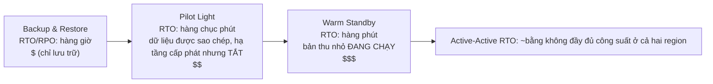

# Chương 18: Khi Mọi Thứ Bị Hỏng

Đèn tắt lúc 11:17 tối.

Không phải ở văn phòng Nimbus — Leo đang ở nhà, trên ghế sofa, laptop khép hờ. Đèn tắt trong một trung tâm dữ liệu ở Oregon mà anh chưa bao giờ ghé thăm, trong một tòa nhà anh chưa bao giờ thấy, trong một căn phòng đầy máy chủ mà anh chưa bao giờ chạm vào. Anh chưa biết. Có một khoảnh khắc — chỉ một khoảnh khắc — hoàn toàn im lặng trước khi các máy phát dự phòng khởi động ở đâu đó rất xa. Loại bóng tối mà bạn không thể biết mắt mình đang mở hay nhắm.

Rồi thông báo Slack đến.

---

Sau khi các hệ thống giám sát từ chương 17 đã được triển khai, cả nhóm cảm thấy như có chút tự tin. Cảnh báo đang kích hoạt. Dashboard đang xanh. Log đang chảy vào CloudWatch. Họ đã dành ba tuần đấu nối khả năng quan sát vào mọi ngóc ngách của hạ tầng Nimbus.

Điều mà không ai nói ra — điều mà giám sát không bảo vệ được — là khả năng quan sát và khả năng chống chịu là hai thứ khác nhau. Bạn có thể theo dõi một thứ hỏng đi với chi tiết hoàn hảo. Việc theo dõi không ngăn nó hỏng.

Bài học đó đến lúc 11:23 tối một ngày thứ Năm.

---

Leo nhận được thông báo Slack.

"us-west-2 — lỗi cụm trung tâm dữ liệu — dịch vụ suy giảm."

Anh mở console AWS. Các instance EC2 trong một Availability Zone đang báo status check thất bại. Auto Scaling Group của anh đã phát hiện các instance không lành mạnh và đang khởi tạo các instance thay thế — trong cùng zone đó.

Trong cụm đang lỗi.

Các instance mới cũng không khởi động được. Chúng nằm trong cùng zone lỗi phần cứng.

"Load balancer đang định tuyến lưu lượng đến cả hai AZ," Leo nói với chính mình. "Một nửa lưu lượng của chúng ta đang đi đến các instance không hoạt động."

Anh mở console EC2 và bắt đầu nhấp chuột. Dưới mục Load Balancers, Application Load Balancer hiển thị cả hai target group là lành mạnh — vì health check qua trên port 80, và ngay cả các instance lỗi cũng đang phản hồi check đó. Chúng chỉ là không thể xử lý các request thực.

Anh thử gỡ AZ lỗi khỏi target group. Console chấp nhận thay đổi. Nhưng Auto Scaling Group, được cấu hình để duy trì cân bằng, lập tức bắt đầu cố thay thế các instance đã bị chấm dứt — trong cùng zone lỗi.

Leo nhìn chằm chằm vào màn hình. Anh vừa làm cho mọi thứ tệ hơn.

Anh mở cấu hình ASG. Thiết lập "Balance capacity across Availability Zones" đang bật. Trong vận hành bình thường đây là thiết kế tốt. Lúc này nó đang chủ động chống lại anh.

Anh đổi ASG để chỉ dùng zone lành mạnh. Áp dụng thay đổi.

Console hiển thị thay đổi là "In Service."

Ba phút sau, các instance thay thế lành mạnh đầu tiên khởi động.

Load balancer bắt đầu định tuyến lưu lượng. Tỷ lệ lỗi giảm từ 52% xuống 4%. 4% còn lại là các request đã rơi vào vài instance không lành mạnh cuối cùng vẫn đang drain kết nối.

Đến 11:45 tối — hai mươi hai phút sau khi sự cố bắt đầu — lưu lượng đã ổn định.

Hai mươi hai phút dịch vụ suy giảm trước khi anh nhận thấy và chuyển ASG sang chỉ dùng zone lành mạnh một cách thủ công.

"Chuyện này xảy ra vì mọi thứ nằm trong một AZ," Priya nói sáng hôm sau.

"Không," Leo nói. "Tôi có instance ở hai AZ. Vấn đề là các instance thay thế sinh ra trong AZ lỗi."

"Còn database?"

Leo khựng lại.

"RDS primary nằm trong zone lỗi," anh nói. "Multi-AZ thực ra đã làm đúng việc của nó — nó failover sang standby trong zone lành mạnh trong khoảng chín mươi giây. Nhưng các máy chủ ứng dụng của chúng ta vẫn giữ các kết nối chết và thử lại địa chỉ IP đã cache thay vì phân giải lại tên DNS của endpoint. Database đã lành mạnh lúc 11:25. Ứng dụng của chúng ta không kết nối lại sạch sẽ cho đến khi tôi khởi động lại connection pool."

Hai mươi hai phút dịch vụ suy giảm đã trở thành ba mươi tám.

Khi Leo thiết lập Auto Scaling Group tám tháng trước, anh đã tích chọn thiết lập "balance capacity across AZs" và nghĩ vậy là đủ tốt. "Sẽ ổn thôi," anh nói với Maya lúc đó. "AWS xử lý phần AZ tự động." Anh đã đúng rằng AWS xử lý nó — và sai về ý nghĩa của "tự động."

"Điều gì sẽ xảy ra," Maya hỏi sáng hôm sau, "nếu chúng ta đã cấu hình mọi thứ đúng cách? Một thiết lập Multi-AZ đúng trông thế nào trong một sự cố thực?"

Leo nghĩ về nó. Anh đã nghĩ về nó từ lúc 11:45 tối.

Trong thiết lập đúng giả định: ASG sẽ có health check instance dựa trên health của ALB — không chỉ status EC2. Khi AZ lỗi, health check trên các instance đó sẽ thất bại trong vòng 30 giây. ASG sẽ phát hiện các thất bại và lập tức bắt đầu khởi chạy các instance thay thế — và khi việc khởi chạy liên tục thất bại trong một AZ, nhóm sẽ chuyển công suất sang các zone lành mạnh còn lại thay vì chống lại zone lỗi.

Load balancer sẽ đưa các target ở AZ lỗi ra khỏi vòng quay trong cùng 30 giây đó. Lưu lượng sẽ tập trung vào AZ lành mạnh.

Đối với database: bản thân quá trình failover Multi-AZ đã hoạt động — cái thiếu là kỷ luật phía client. Connection pool phân giải lại tên DNS của endpoint khi kết nối lại (thay vì cache IP), TTL cache DNS ngắn, và logic thử lại. Với những thứ đó, một lần failover RDS là một cú chớp 60–120 giây, không phải một cái đuôi 16 phút.

Tổng tác động mà khách hàng thấy: 60-90 giây độ trễ suy giảm trong khi database failover. Không phải 38 phút lỗi dây chuyền.

"Chúng ta đã có toàn bộ hạ tầng để sống sót qua chuyện này," Leo nói. "Chúng ta chỉ cấu hình nó sai."

Câu đó khó nói hơn cả bản thân sự cố ban đầu.

**Tương Tự Lưới Điện**

Hãy nghĩ về cách nhà bạn nhận điện. Điện không đến từ một sợi dây duy nhất chạy từ một máy phát. Nó đến từ một lưới — mạng lưới máy phát, trạm biến thế và đường dây truyền tải hỗ trợ lẫn nhau. Nếu một trạm biến thế cháy, các trạm khác định tuyến lại điện vòng qua nó. Bạn không nhận ra. Đèn vẫn sáng.

Availability Zone của AWS hoạt động theo cách tương tự. Thay vì một trung tâm dữ liệu khổng lồ mà mọi thứ phụ thuộc vào, AWS phân tán tài nguyên của bạn qua nhiều cơ sở tách biệt về mặt vật lý. Nếu một cơ sở mất điện hoặc gặp lỗi phần cứng, các cơ sở khác tiếp tục chạy. Lưu lượng định tuyến lại tự động. Ứng dụng của bạn vẫn hoạt động — vì chưa bao giờ có một sợi dây duy nhất để cắt.

Đây là **kiến trúc Multi-AZ**: phân tán tài nguyên của bạn qua các cơ sở tách biệt về mặt vật lý để một lỗi không bao giờ kéo đổ mọi thứ.

Multi-Region là cấp độ tiếp theo: hãy tưởng tượng có các máy phát dự phòng ở một thành phố hoàn toàn khác. Nếu toàn bộ lưới điện địa phương sập, thành phố từ xa tiếp quản. Phức tạp hơn để thiết lập, nhưng chống chịu tốt hơn với các sự cố thảm khốc.

Bạn có thể đang thắc mắc: nếu Multi-AZ chỉ nghĩa là phân tán tài nguyên qua hai trung tâm dữ liệu, tại sao AWS không làm cho đó là mặc định cho mọi thứ? Câu trả lời là chi phí. Multi-AZ gần như nhân đôi hạ tầng — và đối với môi trường phát triển hoặc một công cụ nội bộ lưu lượng thấp, chi phí thêm đó không đáng. Tuy nhiên, đối với workload production, câu hỏi đảo ngược: bạn có chịu nổi thời gian ngừng hoạt động nếu không có nó không?

**Từ Vựng Về Sự Cố**

Trước khi thiết kế cho khả năng chống chịu, bạn cần có từ ngữ cho những gì bạn đang thiết kế để chống lại.

"Làm sao chúng ta đo lường được liệu mình có đủ khả năng chống chịu hay không?" Priya hỏi.

"Hai con số," Leo nói. "Chúng ta có thể bị tắt bao lâu, và chúng ta có thể mất bao nhiêu dữ liệu."

**Tính khả dụng (Availability)**: Phần trăm thời gian một hệ thống hoạt động. "Bốn chín" (99,99%) có nghĩa là ít hơn 52 phút ngừng hoạt động mỗi năm. "Năm chín" (99,999%) có nghĩa là khoảng 5 phút mỗi năm.

**RTO (Recovery Time Objective)**: Hệ thống có thể bị tắt bao lâu trước khi nó trở thành vấn đề kinh doanh? Nếu RTO của bạn là 4 giờ, bạn có 4 giờ để khôi phục dịch vụ trước khi vi phạm SLA.

**RPO (Recovery Point Objective)**: Bạn có thể chịu mất bao nhiêu dữ liệu? Nếu RPO của bạn là 1 giờ, bạn có thể chấp nhận mất tới một giờ dữ liệu trong một sự cố thảm khốc. Mọi thứ được ghi trong giờ cuối cùng trước sự cố đều mất.

**Khả năng chịu lỗi (Fault tolerance)**: Khả năng tiếp tục hoạt động (ở một mức nào đó) khi một thành phần bị lỗi.

**Phục hồi thảm họa (DR — Disaster recovery)**: Quá trình phục hồi từ một sự cố thảm khốc — cháy trung tâm dữ liệu, mất điện toàn vùng, xóa hàng loạt do nhầm lẫn.

Năm khái niệm này dẫn dắt mọi quyết định kiến trúc trong chương này.

**RTO Và RPO Là Quyết Định Kinh Doanh, Không Phải Kỹ Thuật**

Các con số ít quan trọng hơn ai là người đặt chúng. Một kỹ sư có thể đoán RTO. Một bên liên quan kinh doanh biết một lần ngừng hoạt động 30 phút thực sự tốn bao nhiêu.

Hãy xem xét hai công ty có cùng ngăn xếp công nghệ:

Một công ty fintech xử lý giao dịch môi giới: RTO 4 phút, RPO bằng không. Một hệ thống giao dịch ngừng hoạt động bốn phút trong giờ thị trường có thể bỏ lỡ hàng nghìn giao dịch. Mỗi giao dịch bị bỏ lỡ có một giá trị bằng tiền trực tiếp. Mất dữ liệu bằng không không phải là triết lý — mất một giao dịch đã xác nhận đồng nghĩa với vấn đề tuân thủ và kiện tụng từ khách hàng. Chi phí kiến trúc để đạt được điều này: active-active Multi-AZ với sao chép đồng bộ, ngân sách hạ tầng hàng năm sáu chữ số.

Một nền tảng đặt món ăn nhà hàng: RTO 30 phút, RPO 5 phút. Một lần ngừng hoạt động 30 phút trong giờ cao điểm tối thực sự đau đớn và tốn tiền thật. Nhưng mất 5 phút đơn hàng cuối cùng trước một sự cố nghĩa là một nhóm nhỏ khách hàng cần đặt lại — phiền toái, không thảm khốc. Chi phí kiến trúc để đạt được điều này: warm standby Multi-AZ, một phần nhỏ của ngân sách fintech.

"Khoan — nhưng *tại sao* một nền tảng nhà hàng lại chấp nhận mất 5 phút dữ liệu?" Maya hỏi khi Leo giải thích điều này. "Đó chẳng phải vẫn là mất đơn hàng của khách sao?"

"Câu hỏi là liệu việc ngăn chặn mất dữ liệu đó có tốn nhiều hơn giá trị của nó không," Leo nói. "Giảm RPO từ 5 phút xuống 0 sẽ đòi hỏi sao chép đồng bộ giữa các region. Đó là một khoản chi phí và đầu tư kỹ thuật đáng kể. Đối với một ứng dụng nhà hàng ở quy mô của chúng ta, RPO 5 phút là sự đánh đổi đúng."

Bài học: RTO và RPO không phải là mức tối thiểu kỹ thuật. Chúng là những sự đánh đổi kinh doanh được biểu đạt bằng con số. Đặt chúng đòi hỏi cả nhóm kỹ thuật (biết điều gì khả thi) và các bên liên quan kinh doanh (biết điều gì chấp nhận được).

**Multi-AZ: Sống Sót Qua Lỗi Availability Zone**

Một Availability Zone (AZ) là một trung tâm dữ liệu tách biệt về mặt vật lý trong một Region. Các AZ được thiết kế để độc lập: nguồn điện riêng, làm mát riêng, hạ tầng mạng riêng. Nhưng chúng đủ gần để độ trễ mạng giữa chúng là 1-2 mili giây.

**Triển khai Multi-AZ** phân tán tài nguyên của bạn qua hai hay nhiều AZ trong một Region. Nếu một AZ bị lỗi:

- Load balancer dừng định tuyến đến các instance không lành mạnh trong AZ lỗi
- Auto Scaling Group thay thế các instance — nhưng trong AZ *lành mạnh*
- RDS failover sang standby trong AZ lành mạnh

Sai lầm của Leo: Auto Scaling Group của anh không được cấu hình để giới hạn các instance thay thế vào các AZ lành mạnh. Nó được cấu hình để duy trì cân bằng giữa các AZ. Khi zone lỗi, ASG cố cân bằng số lượng instance bằng cách khởi tạo các instance thay thế ở đó — trong zone lỗi.

Cách khắc phục: cấu hình ASG để chỉ khởi chạy vào các AZ lành mạnh, với tối thiểu hai AZ luôn hoạt động.

Bài học sâu hơn: kiểm thử các kịch bản sự cố của bạn trước khi chúng xảy ra trong production.

Nếu bạn chọn Multi-AZ, bạn nhận được failover tự động và RPO gần bằng không — nhưng bạn đang trả tiền cho hạ tầng không phục vụ lưu lượng nào trong vận hành bình thường. Instance RDS standby đó luôn chạy, luôn sao chép, và không bao giờ trả lời một truy vấn cho đến khi primary lỗi. Đó là sự đánh đổi: độ tin cậy tốn tiền ngay cả khi không có gì hỏng.

**Kỹ Thuật Hỗn Loạn: Lần Chạy Đầu Tiên Trông Thế Nào**

Lần chạy kỹ thuật hỗn loạn đầu tiên tại Nimbus không gọn gàng như tài liệu mô tả.

Leo chạy bước 2 của runbook: cưỡng ép một lần failover RDS Multi-AZ. Anh dùng AWS CLI:

```
aws rds reboot-db-instance \
    --db-instance-identifier nimbus-prod \
    --force-failover
```

Lệnh trả về ngay lập tức. Leo bắt đầu bấm giờ.

T+0s: Failover khởi tạo. Console RDS hiển thị trạng thái primary là "rebooting."

T+18s: Log ứng dụng bắt đầu hiển thị lỗi kết nối database. Connection pool đang thử primary cũ, vốn không còn là primary nữa.

T+34s: Console RDS hiển thị trạng thái là "backing-up." Primary mới đang được thăng cấp. CNAME DNS (endpoint database) đang được cập nhật.

T+52s: Log ứng dụng bắt đầu hiển thị các kết nối thành công trở lại. Connection pool đã hết lượt thử lại trên primary cũ và kết nối lại với CNAME, vốn giờ trỏ đến primary mới.

T+4:17: Tất cả kết nối được thiết lập lại. Tỷ lệ lỗi trở về không.

Tổng cộng: 4 phút 17 giây.

"Đó là 257 giây database không khả dụng," Tom nói. "Tablet của các đối tác nhà hàng của chúng ta hiển thị một biểu tượng quay tròn trong 4 phút."

"SLA của chúng ta nói 5 phút," Leo nói.

"Vậy là chúng ta đã vượt qua," Priya nói. "Sát nút thôi."

"Hai quan sát," Tom nói. "Thứ nhất: chúng ta vượt qua vì cam kết RTO của chúng ta rộng rãi, không phải vì kiến trúc của chúng ta đặc biệt nhanh. Thứ hai: hành vi thử lại của connection pool là cái đã mua thêm cho chúng ta 34 giây. Nếu ứng dụng bỏ cuộc sau 10 giây, chúng ta đã thất bại."

Leo cập nhật runbook để ghi lại các thời gian quan sát được. Mục tiêu cho quý tới: giảm thời gian phát hiện failover từ 52 giây xuống dưới 30 bằng cách tinh chỉnh các tham số connection pool và logic health check của ứng dụng.

"Kỹ thuật hỗn loạn không phải là một bài kiểm tra một lần," Priya nói. "Nó là một vòng lặp phản hồi. Bạn kiểm thử, bạn tìm ra con số thực, bạn cải thiện, bạn kiểm thử lại."

Lần thứ ba họ chạy bài kiểm tra failover, sáu tháng sau, thời gian phục hồi là 1 phút 44 giây. Không phải vì RDS nhanh hơn — mà vì họ đã tinh chỉnh ứng dụng.

**Mô Phỏng Sự Cố: Kỹ Thuật Hỗn Loạn**

"Làm sao chúng ta biết thiết lập Multi-AZ của mình thực sự hoạt động?" Maya hỏi.

"Chúng ta phá vỡ mọi thứ một cách cố ý," Leo nói.

"Khoan — nhưng *tại sao* chúng ta lại làm theo cách đó?" Maya nói. "Tại sao không chỉ tin rằng tài liệu AWS nói nó hoạt động?"

"Vì tài liệu mô tả cách dịch vụ hoạt động. Nó không mô tả cách *cấu hình của bạn* hoạt động. Đó là hai thứ khác nhau."

Priya nghiêng người về phía trước. "Chúng ta đã nghĩ về chuyện gì xảy ra khi health check của load balancer và health check của ASG bất đồng chưa? Load balancer có thể gỡ một instance khỏi vòng quay, nhưng ASG nghĩ instance lành mạnh và không thay thế nó. Chúng ta sẽ có công suất vô hình với load balancer."

"Đó chính xác là loại chuyện mà kỹ thuật hỗn loạn sẽ tìm ra," Leo nói.

Nghe có vẻ liều lĩnh. Thực ra đó là điều có trách nhiệm nhất mà một nhóm có thể làm.

**Kiểm Thử Cam Kết RTO**

Đây là sự thật khó chịu về RTO: hầu hết các nhóm đặt một RTO, rồi không bao giờ kiểm thử xem họ có thực sự đáp ứng được nó không.

Một RTO 30 phút không phải là một sự đảm bảo. Nó là một mục tiêu. Cách duy nhất để biết liệu bạn có đạt được nó không là mô phỏng sự cố và bấm giờ quá trình phục hồi.

Sau sự cố lúc 11:23 tối, nhóm Nimbus cam kết kiểm thử mỗi chế độ lỗi mỗi quý. Không chỉ thủ công — mà với tiêu chí chấp nhận được viết ra. Phục hồi từ lỗi AZ phải hoàn tất trong vòng 10 phút. Phục hồi từ failover RDS phải hoàn tất trong vòng 5 phút. Khôi phục database từ bản sao lưu (bài kiểm tra DR sao-lưu-và-khôi-phục) phải hoàn tất trong vòng 2 giờ.

Những con số này đến từ các cuộc trò chuyện với các đối tác nhà hàng, những người nói rằng một lần ngừng hoạt động trong giờ cao điểm tối dưới 10 phút là "đau đớn nhưng chấp nhận được." Trên 30 phút là một cuộc trò chuyện về hợp đồng.

"Việc đàm phán SLA nên diễn ra trước khi bạn đặt RTO," Maya nói. "Không phải sau."

Cô không sai. Họ đã làm ngược. Họ đã đặt RTO nội bộ rồi mới nhận ra họ cần kiểm tra nó so với những gì kinh doanh thực sự yêu cầu.

Đặt RTO và RPO theo thứ tự đúng: yêu cầu kinh doanh trước, kiến trúc để đáp ứng nó thứ hai, kiểm thử để xác minh thứ ba. Hầu hết các nhóm bắt đầu với kiến trúc và làm ngược lại. Các con số chịu thiệt vì điều đó.

**Kỹ thuật hỗn loạn (Chaos engineering)** là thực hành chủ động tiêm các lỗi vào hệ thống của bạn để xác minh rằng nó xử lý chúng đúng cách. Bạn cố ý chấm dứt một instance EC2. Bạn thủ công failover instance RDS. Bạn chặn một subnet khỏi load balancer.

Nếu hệ thống phục hồi tự động trong RTO của bạn, thiết kế của bạn hoạt động.

Nếu không, bạn đã học được điều đó trong một bối cảnh được kiểm soát — không phải trong một sự cố production lúc 2 giờ sáng.

Đối với Nimbus: Leo viết một runbook (một quy trình được ghi chép) để kiểm thử mỗi kịch bản sự cố. Mỗi quý một lần, họ cố ý làm lỗi một thành phần và đo thời gian phục hồi. Nếu phục hồi mất lâu hơn RTO, họ sửa thiết kế.

**Multi-Region: Sống Sót Qua Lỗi Khu Vực**

Hầu hết các sự cố AWS ảnh hưởng đến Availability Zone, không phải toàn bộ Region. Lỗi cấp Region hiếm — nhưng chúng vẫn xảy ra.

Trong một lỗi cấp khu vực (hoặc đối với các ứng dụng toàn cầu cần độ trễ rất thấp ở mọi nơi), **Multi-Region** là câu trả lời: triển khai ứng dụng của bạn ở hai hay nhiều AWS Region.

Multi-Region đưa ra sự phức tạp căn bản:

**Sao chép dữ liệu**: Database của bạn cần đồng bộ giữa các region. Bất kỳ dữ liệu nào được ghi ở us-east-1 cuối cùng phải đến eu-west-1. "Cuối cùng" là vấn đề — trong khoảng thời gian trễ, các region có cái nhìn hơi khác nhau về thế giới.

**Active-passive so với active-active**:

- **Active-passive**: Một region phục vụ toàn bộ lưu lượng. Region kia là warm standby. Khi lỗi, DNS chuyển lưu lượng sang standby. Đơn giản hơn, nhưng standby nhàn rỗi và đắt đỏ.
- **Active-active**: Cả hai region phục vụ lưu lượng đồng thời. Phức tạp hơn để xây dựng (đòi hỏi giải quyết xung đột cho các lần ghi đồng thời), nhưng độ trễ thấp hơn trên toàn cầu và không có tài nguyên nhàn rỗi.

Active-active nghe hấp dẫn cho đến khi bạn nghĩ kỹ về các lần ghi. Nếu một khách hàng đặt đơn ở us-east-1 và đồng thời nhà hàng cập nhật thực đơn của họ ở eu-west-1, và có một phân vùng mạng giữa các region, lần ghi nào thắng? Đây là định lý CAP trong thực tế: trong một hệ thống phân tán, trong một phân vùng mạng, bạn phải chọn giữa tính nhất quán (cả hai region đồng ý trên cùng dữ liệu) và tính khả dụng (cả hai region tiếp tục nhận request ngay cả khi chúng bất đồng). Active-active không loại bỏ lựa chọn này. Nó đòi hỏi bạn đưa ra lựa chọn đó một cách tường minh, trong mô hình dữ liệu của bạn.

Đối với Nimbus: active-passive. Họ không muốn phải lý luận về các xung đột ghi đồng thời trong dữ liệu thực đơn và đơn hàng của họ. Một region primary có thẩm quyền duy nhất đơn giản hơn và an toàn hơn ở giai đoạn này.

**Thời gian failover**: Các thay đổi DNS cần thời gian để lan truyền (tùy thuộc vào TTL). Trong cửa sổ lan truyền, một số người dùng vẫn truy cập region đã lỗi. Thiết kế cho RTO rất thấp đòi hỏi làm ấm trước standby và giảm thiểu TTL trước các lần chuyển đổi có kế hoạch.

**Route 53 DNS Failover: Lớp Mạng Của DR**

Trước khi đến phổ đầy đủ các chiến lược DR, đáng để hiểu cách DNS phù hợp vào failover — vì nó thường là thứ thực sự chuyển lưu lượng giữa các region.

**Amazon Route 53** hỗ trợ định tuyến dựa trên health check. Bạn cấu hình:

1. Một health check giám sát endpoint primary của bạn (thường là một endpoint HTTP trả về 200 nếu lành mạnh)
2. Một bản ghi DNS primary trỏ đến region primary của bạn
3. Một bản ghi DNS thứ cấp (failover) trỏ đến DR region của bạn

Khi Route 53 phát hiện health check primary đang thất bại, nó tự động chuyển các phản hồi DNS sang bản ghi thứ cấp. Người dùng phân giải tên miền của bạn giờ nhận được IP của DR region.

"Và nếu có ai cố đột nhập trong cửa sổ failover thì sao?" Priya hỏi. "Chứng chỉ SSL cho tên miền của chúng ta — nó hoạt động ở cả hai region, hay HTTPS bị hỏng?"

"Chứng chỉ cần được cấp phát ở cả hai region," Leo xác nhận. "Nếu bạn dùng ACM (AWS Certificate Manager), điều đó nghĩa là yêu cầu một chứng chỉ ở mỗi region một cách độc lập."

Cơ chế của Route 53 failover:

- Các health check chạy từ nhiều địa điểm AWS trên toàn thế giới mỗi 30 giây
- Sau 3 lần thất bại liên tiếp (90 giây), Route 53 đánh dấu endpoint là không lành mạnh
- Các phản hồi DNS lập tức chuyển sang bản ghi failover
- Nhưng: TTL DNS vẫn áp dụng. Nếu TTL của bạn là 300 giây, các client đã cache IP primary tiếp tục truy cập region lỗi tới 5 phút

Đây là lý do tại sao giảm TTL là một phần của chuẩn bị trước thảm họa. Bạn không thể đổi TTL trong một sự cố (thay đổi sẽ không lan truyền kịp). Thay đổi TTL phải được thực hiện vài ngày hoặc vài tuần trước khi cần đến, để các cache của resolver đã đang dùng TTL ngắn khi một sự cố xảy ra.

"Vậy giảm TTL DNS không phải là một hành động phục hồi," Leo nói. "Nó là một hành động định vị trước."

"Chúng ta đã làm chưa?" Maya hỏi.

Họ chưa làm.

Sau cuộc trò chuyện đó, Leo giảm TTL cho eatnimbus.com từ 300 giây xuống 60 giây. Thay đổi không tốn gì và cải thiện thời gian failover trong trường hợp xấu nhất của họ từ khả năng 8 phút xuống còn dưới 3.

**Các Chiến Lược Phục Hồi Thảm Họa: Một Phổ**

Có bốn chiến lược DR phổ biến, được sắp xếp từ rẻ nhất (và phục hồi chậm nhất) đến đắt nhất (và phục hồi nhanh nhất):



**Sao lưu và Phục hồi (Backup and Restore)** (RPO/RTO hàng giờ):

- Sao lưu mọi thứ vào S3 ở một region khác
- Khi thảm họa: cấp phát hạ tầng từ đầu, khôi phục từ bản sao lưu
- Chi phí: rất thấp (bạn chỉ trả cho lưu trữ)
- Thời gian phục hồi: hàng giờ

**Pilot Light** (RPO/RTO từ phút đến 1 giờ):

- Sao chép dữ liệu liên tục và giữ hạ tầng cốt lõi *được cấp phát nhưng tắt* trong DR region — template, AMI, các tài nguyên đã dừng hoặc kích thước bằng không. Không có gì phục vụ lưu lượng; chỉ có việc sao chép dữ liệu được "thắp sáng" (đó là đèn pilot)
- Dữ liệu cốt lõi được sao chép (RDS read replica trong DR region)
- Khi thảm họa: khởi động/mở rộng compute của DR region, thăng cấp read replica thành primary, chuyển DNS
- (Tương phản với Warm Standby bên dưới: ở đó, một bản thu nhỏ của ứng dụng thực sự *đang chạy*)
- Chi phí: vừa phải (bạn trả cho việc sao chép dữ liệu và các tài nguyên đã cấp phát nhưng tắt, không phải cho compute đang chạy)
- Thời gian phục hồi: hàng chục phút

**Warm Standby** (RPO/RTO từ giây đến phút):

- Chạy một phiên bản thu nhỏ của toàn bộ ứng dụng trong DR region
- Hoàn toàn vận hành được nhưng ở công suất giảm
- Khi thảm họa: mở rộng quy mô, chuyển DNS
- Chi phí: cao hơn (luôn chạy toàn bộ ngăn xếp ở quy mô giảm)
- Thời gian phục hồi: hàng phút

**Active-Active / Multi-Site** (RPO/RTO gần-bằng-không):

- Đầy đủ công suất ở hai hay nhiều region, phục vụ lưu lượng đồng thời
- Không cần phục hồi — nếu một region lỗi, lưu lượng định tuyến đến region kia tự động
- Chi phí: cao nhất (hai lần triển khai đầy đủ ở quy mô đầy đủ)
- Thời gian phục hồi: hàng giây (chỉ lan truyền DNS)

Một dịch vụ tự động hóa phần giữa của phổ này: **AWS Elastic Disaster Recovery (DRS)** liên tục sao chép các máy chủ của bạn — on-premises hay EC2 — từng block một vào một khu vực staging chi phí thấp, và có thể khởi chạy các instance phục hồi đầy đủ trong vài phút khi thảm họa ập đến. Trên thực tế, nó là một *pilot light được quản lý*: thời gian phục hồi gần như warm-standby ở mức giá gần như sao-lưu-và-khôi-phục. Tín hiệu thi: "giảm thiểu thời gian ngừng hoạt động và mất dữ liệu cho các workload dựa trên máy chủ với một dịch vụ DR được quản lý" → Elastic Disaster Recovery.

Đối với Nimbus ở giai đoạn này: warm standby. Họ không đủ khả năng chi cho active-active, nhưng backup và restore quá chậm cho các yêu cầu kinh doanh của họ.

**Amazon RDS: Multi-AZ so với Read Replica so với Multi-Region**

Ba thứ này khác biệt và thường bị nhầm lẫn:

| Tính năng        | Multi-AZ                        | Read Replica       | Multi-Region Read Replica |
|------------------|---------------------------------|--------------------|---------------------------|
| Mục đích         | Tính sẵn sàng cao (failover)    | Mở rộng đọc        | Mở rộng đọc + DR          |
| Đồng bộ dữ liệu  | Đồng bộ                         | Bất đồng bộ        | Bất đồng bộ               |
| Failover         | Tự động                         | Thăng cấp thủ công | Thăng cấp thủ công        |
| Đọc được?        | Không (standby thụ động)        | Có                 | Có                        |
| Liên region?     | Không (cùng region)             | Có (tùy chọn)      | Có                        |
| Dùng cho         | HA, RPO~0                       | Tải đọc            | Phục hồi thảm họa         |

Hiểu biết chính: standby Multi-AZ là **đồng bộ** — mỗi lần ghi vào primary được xác nhận trên standby trước khi lần ghi được công nhận. Điều này nghĩa là nếu primary lỗi, không mất dữ liệu. RPO = 0.

Read replica là **bất đồng bộ** — có độ trễ sao chép. Nếu primary lỗi và bạn thăng cấp một read replica, bạn có thể mất vài giây hoặc vài phút các lần ghi gần đây. RPO > 0.

**Aurora Global Database: Multi-Region Cho Production**

Đối với các nhóm cần khả năng chống chịu đa region thực sự, **Aurora Global Database** thay đổi bài toán. Một RDS read replica chuẩn ở một region khác dùng sao chép bất đồng bộ với độ trễ thường đo bằng giây — nghĩa là một lỗi cấp khu vực sẽ mất những giây ghi đó. Aurora Global Database dùng một hạ tầng sao chép chuyên dụng đạt độ trễ sao chép dưới 1 giây giữa region primary và các region thứ cấp.

Khi nhóm thảo luận nó trong buổi review sau sự cố, Leo mở bảng so sánh:

- RDS cross-region read replica chuẩn: độ trễ sao chép thường 1-10 giây, lên đến vài phút dưới tải nặng. Việc thăng cấp thành database độc lập mất vài phút và liên quan đến các bước thủ công.
- Aurora Global Database thứ cấp: độ trễ sao chép thường dưới 1 giây. Việc thăng cấp từ thứ cấp lên primary mất dưới 1 phút.

"Điều đó nghĩa là nếu us-west-2 sập hoàn toàn," Leo giải thích, "chúng ta có khả năng mất dữ liệu dưới 1 giây và có thể phục vụ lưu lượng từ us-east-1 trong vòng một phút."

"Cái đó tốn bao nhiêu mỗi tháng?" Tom hỏi ngay.

Nhiều hơn Multi-AZ chuẩn. Aurora Global Database thêm một khoản phí I/O trên mỗi lần ghi cho việc sao chép giữa các region. Đối với khối lượng hiện tại của Nimbus, nó sẽ thêm $40-60/tháng trên chi phí Aurora hiện có.

"Đó là sự đánh đổi," Leo nói. "Trả tiền cho tốc độ. Hoặc chấp nhận việc thăng cấp chậm hơn và RPO hơi cao hơn của một cross-region read replica chuẩn."

Hiện tại, Nimbus vẫn giữ warm standby. Aurora Global Database được đưa vào danh sách mong muốn về kiến trúc cho vòng gọi vốn tiếp theo.

"Cùng cửa sổ failover, lớp tiếp theo bên dưới," Priya nói. "Chúng ta đã lo về chứng chỉ. Giờ là thông tin xác thực — chúng đang được xoay vòng trên một instance. Standby có đồng bộ không?"

Leo mở tài liệu. Đó là một câu hỏi hay. RDS Multi-AZ sao chép dữ liệu, không phải cấu hình bí mật — việc xoay vòng của Secrets Manager phải được kiểm thử như một phần của runbook failover.

## Điểm Mạnh Và Hạn Chế

**Multi-AZ**:

- Thiết yếu cho các workload production — single-AZ là một điểm lỗi đơn lẻ
- Được hỗ trợ tốt bởi các dịch vụ AWS (RDS, ElastiCache, EKS, ALB đều hỗ trợ Multi-AZ)
- Chi phí phụ trội tương đối thấp so với sự bảo vệ mà nó cung cấp
- Lỗi AZ là loại lỗi AWS phổ biến nhất — Multi-AZ bao phủ các kịch bản có khả năng nhất

**Multi-Region**:

- Phức tạp để triển khai đúng, đặc biệt với database
- Các yêu cầu về cư trú/chủ quyền dữ liệu thực sự có thể đòi hỏi nó (dữ liệu người dùng EU phải ở lại EU)
- Lợi ích về độ trễ cho người dùng toàn cầu đến từ định tuyến, không phải từ bản thân multi-region (dùng CloudFront cho nội dung tĩnh)
- Hầu hết các tổ chức không cần active-active; hầu hết đầu tư thiếu vào warm standby
- Chi phí của Multi-Region warm standby không phải là tầm thường, nhưng chi phí của một lỗi cấp khu vực mà không có nó có thể cao hơn nhiều

**Khi nào bỏ qua Multi-AZ** (các trường hợp hiếm):

- Môi trường phát triển và staging nơi ngừng hoạt động chấp nhận được
- Các công cụ nội bộ thực sự không quan trọng không có yêu cầu SLA
- Các workload theo lô có thể đơn giản chạy lại khi lỗi

Áp lực bỏ qua Multi-AZ gần như luôn là về chi phí. Trước khi chấp nhận lập luận đó, hãy tính chi phí của các chế độ lỗi có khả năng: khách hàng rời bỏ, phạt SLA, thời gian kỹ thuật để phục hồi. Trong hầu hết các môi trường production, Multi-AZ tự trang trải chi phí của nó ngay lần đầu tiên nó cứu bạn khỏi một cuộc gọi báo động lúc 3 giờ sáng.

## Tóm Tắt

Công việc giám sát ở chương 17 làm cho các sự cố trở nên hiển thị. Chương này nói về việc làm cho hạ tầng sống sót qua chúng. Cả hai đều quan trọng; không cái nào là đủ nếu thiếu cái kia.

Sự cố Nimbus vào đêm thứ Năm đó tốn 38 phút dịch vụ suy giảm. Ba sai lầm cấu hình kết hợp lại: ASG không loại trừ AZ lỗi khỏi các lần khởi chạy thay thế, RDS standby tình cờ nằm trong zone lỗi, và không ai đã kiểm thử quá trình failover trước khi dựa vào nó trong production.

Cả ba đều sửa được trong một buổi chiều. Sự cố làm cho các sửa chữa trở nên khẩn cấp theo một cách mà "tài liệu thực hành tốt nhất" không bao giờ làm được hoàn toàn.

Đó là lập luận trung thực cho kỹ thuật hỗn loạn: không phải vì nó là thực hành kỹ thuật nghiêm túc (dù đúng là vậy), mà vì nó phơi bày các sai lầm cấu hình tưởng như lý thuyết cho đến cái đêm một trung tâm dữ liệu Oregon gặp lỗi phần cứng.

- **RTO** (Recovery Time Objective): bạn có thể bị tắt bao lâu. **RPO** (Recovery Point Objective): bạn có thể mất bao nhiêu dữ liệu.
- **Multi-AZ** phân tán tài nguyên qua các Availability Zone trong một Region. Bảo vệ chống lỗi AZ.
- **Multi-Region** triển khai ở nhiều AWS Region. Bảo vệ chống lỗi cấp khu vực và phục vụ người dùng toàn cầu với độ trễ thấp hơn.
- Chiến lược DR (rẻ nhất đến đắt nhất): Backup & Restore → Pilot Light → Warm Standby → Active-Active.
- Standby RDS Multi-AZ: đồng bộ, failover tự động, RPO = 0 trong region. Read replica: bất đồng bộ, thăng cấp thủ công, RPO > 0.
- Kiểm thử các sự cố của bạn một cách cố ý (kỹ thuật hỗn loạn) trước khi chúng xảy ra trong production.

## Mẹo Thi

*Lĩnh vực SAA-C03: Thiết Kế Kiến Trúc Có Khả Năng Chống Chịu (Lĩnh vực 2, Nhiệm vụ 2.2)*

- **RTO so với RPO**: Hãy chờ đợi đề thi cho bạn các yêu cầu ("tổ chức có thể chịu không quá 1 giờ ngừng hoạt động và không mất dữ liệu") và yêu cầu bạn chọn chiến lược DR đúng. Ánh xạ: không mất dữ liệu = sao chép đồng bộ = Multi-AZ hoặc active-active. 1 giờ ngừng hoạt động = backup-and-restore quá chậm; warm standby có thể hoạt động.
- **Multi-AZ RDS so với Read Replica**: Đề thi sẽ hỏi về HA (Multi-AZ) so với mở rộng đọc (read replica). Standby Multi-AZ không đọc được. Read replica có thể được thăng cấp thành primary (thủ công) cho DR.
- **Pilot Light so với Warm Standby**: Pilot Light có hạ tầng tối thiểu đang chạy (chỉ việc sao chép dữ liệu). Warm Standby có một ứng dụng thu nhỏ nhưng hoạt động được đang chạy. Sự khác biệt là bạn có thể mở rộng quy mô nhanh đến mức nào.
- **Aurora Global Database**: Tính năng dành riêng cho Aurora cho multi-region active-passive. Region primary phục vụ ghi; các region thứ cấp phục vụ đọc với độ trễ sao chép <1 giây. Khi failover, thứ cấp có thể được thăng cấp trong <1 phút. Tín hiệu thi: "Aurora, multi-region, RTO < 1 phút."
- **AWS Backup**: Dịch vụ sao lưu tập trung cho EBS, RDS, DynamoDB, EFS, Storage Gateway. Đề thi dùng nó cho các kịch bản backup-and-restore.
- **Elastic Disaster Recovery (DRS)**: "DR được quản lý với thời gian ngừng hoạt động/mất dữ liệu tối thiểu cho máy chủ (on-premises hoặc EC2)," "pilot light mà không tự xây dựng nó" → DRS (sao chép cấp block liên tục + khởi chạy phục hồi theo yêu cầu).
- **Route 53 failover**: Lớp DNS của DR. Health check primary thất bại → Route 53 định tuyến đến thứ cấp. Thời gian lan truyền nghĩa là điều này không tức thời.

## Bài Tập

**Bài tập 1 — Ôn lại**

Giải thích sự khác biệt giữa RTO và RPO. Tại sao một tổ chức có thể có RTO thấp (không thể bị tắt lâu) nhưng RPO cao (có thể chấp nhận mất dữ liệu gần đây)?

*(Gợi ý: Hãy nghĩ về một doanh nghiệp mà việc phục vụ khách hàng nhanh chóng quan trọng hơn việc bảo tồn từng giao dịch.)*

**Bài tập 2 — Kịch bản SAA-C03**

*Kịch bản*: Một công ty chăm sóc sức khỏe chạy một hệ thống hồ sơ bệnh nhân trên một database tương thích PostgreSQL ở `us-east-1`. Các yêu cầu quy định bắt buộc rằng hệ thống phải sống sót qua một **lỗi toàn vùng hoàn toàn** với RPO đo bằng **giây** (mất dữ liệu gần bằng không) và RTO dưới 30 phút. Trong region primary, không chấp nhận mất dữ liệu.

Kiến trúc nào đáp ứng TỐT NHẤT các yêu cầu này?

A) RDS Multi-AZ ở `us-east-1` với sao lưu tự động hàng ngày vào S3 ở `us-west-2`  
B) RDS Multi-AZ ở `us-east-1` với một read replica ở `us-west-2` được cấu hình để thăng cấp thủ công  
C) RDS ở `us-east-1` với một warm standby ở `us-west-2` và sao chép active-active  
D) Aurora Global Database với primary ở `us-east-1` và thứ cấp ở `us-west-2`

**Gợi ý 1**: Tách hai phạm vi. *Trong* một region, RPO = 0 nghĩa là sao chép đồng bộ (Multi-AZ — và lớp lưu trữ của Aurora là đồng bộ qua 3 AZ). *Qua* các region, tất cả các lựa chọn thực tế đều sao chép bất đồng bộ — câu hỏi là độ trễ nhỏ đến mức nào.

**Gợi ý 2**: RTO = 30 phút nghĩa là bạn có thời gian cho một lần thăng cấp được kiểm soát. Bạn không cần failover hoàn toàn tự động ở mức mili giây.

**Gợi ý 3**: So sánh RPO liên region của mỗi lựa chọn: sao lưu hàng ngày (hàng giờ), RDS cross-region read replica (giây đến phút, không giới hạn dưới tải), Aurora Global Database (thường dưới 1 giây).

**Đáp án**: D

**Giải thích**: Aurora Global Database sao chép đến region thứ cấp ở lớp lưu trữ với độ trễ thường dưới một giây — thỏa mãn "RPO trong vài giây" cho một thảm họa cấp khu vực — và một thứ cấp có thể được thăng cấp trong dưới một phút, thoải mái trong RTO 30 phút. Trong region primary, lưu trữ của Aurora được sao chép đồng bộ qua ba AZ, đáp ứng yêu cầu không mất dữ liệu trong region. **Hãy ghi nhớ sắc thái**: Aurora Global là *bất đồng bộ* qua các region — RPO liên region của nó là *gần* bằng không, không bao giờ chính xác bằng không. Nếu một câu hỏi thi đòi RPO tuyệt đối = 0, điều đó ánh xạ tới sao chép *đồng bộ* (Multi-AZ, một region) — không có lựa chọn cross-region chuẩn nào cung cấp nó.

**Tại sao không phải A?** Sao lưu S3 hàng ngày cho RPO liên region tới 24 giờ. Đó là hàng giờ dữ liệu bệnh nhân bị mất trong một lỗi cấp khu vực.

**Tại sao không phải B?** RDS cross-region read replica dùng sao chép bất đồng bộ chuẩn mà độ trễ có thể tăng không giới hạn dưới tải — "giây" có thể thành phút. Khả thi, nhưng không phải TỐT NHẤT khi tồn tại một lựa chọn với sao chép dưới-giây, cấp lưu trữ.

**Tại sao không phải C?** "Sao chép active-active" cho PostgreSQL qua các region không phải là một tính năng RDS chuẩn. Lựa chọn này mô tả một khả năng đòi hỏi kỹ thuật tùy chỉnh đáng kể.

*Lĩnh vực SAA-C03: Thiết Kế Kiến Trúc Có Khả Năng Chống Chịu — Nhiệm vụ 2.2*

**Bài tập 3 — Thử thách kiến trúc** *(Tùy chọn)*

Nimbus được chọn để cung cấp dịch vụ đặt món cho một lễ hội ẩm thực lớn ở Seattle. Trong 72 giờ, họ dự kiến lưu lượng gấp 50 lần bình thường, với không khoan nhượng đối với ngừng hoạt động (hợp đồng của ban tổ chức lễ hội quy định phạt tài chính cho bất kỳ thời gian ngừng hoạt động nào trong sự kiện).

Thiết kế một chiến lược DR riêng cho cửa sổ lễ hội. Bạn có chuyển sang active-active cho 72 giờ đó không? Bạn sẽ kiểm thử trước failover thế nào? RTO của bạn sẽ là gì, và bạn sẽ xác thực nó thế nào trước sự kiện?

*(Không có câu trả lời đúng duy nhất. Mục tiêu là thực hành thiết kế DR cho các yêu cầu SLA cụ thể.)*

## Cảnh Sau Tín Dụng

Leo đã xây dựng runbook kỹ thuật hỗn loạn.

Mỗi quý, trong một cửa sổ bảo trì được lên kế hoạch, cả nhóm sẽ:

1. Chấm dứt một instance EC2 trong một AZ và xem ASG thay thế nó đúng cách trong zone lành mạnh
2. Thủ công cưỡng ép một failover RDS Multi-AZ và xác minh ứng dụng kết nối lại trong vòng 60 giây
3. Mô phỏng một lỗi AZ hoàn toàn bằng cách điều chỉnh các availability zone của ASG
4. Khôi phục một bản sao lưu một tuần tuổi vào một instance RDS mới và xác minh dữ liệu trông đúng

Lần chạy đầu tiên — lần failover 4-phút-17-giây vừa sát vượt qua SLA 5 phút của họ — đã cho họ thấy lề biên mỏng manh đến mức nào.

"Có một khoản phạt tài chính trong hợp đồng nếu chúng ta không đạt được nó," Tom nói.

"Vậy chúng ta cần làm cho nó nhanh hơn," Leo nói. Và anh bắt đầu đọc tài liệu về một database được quản lý hứa hẹn các lần failover trong vài giây, không phải vài phút.

Trong chương tiếp theo: máy phát số cho phép mỗi phần của Nimbus làm việc theo tốc độ riêng của mình.
