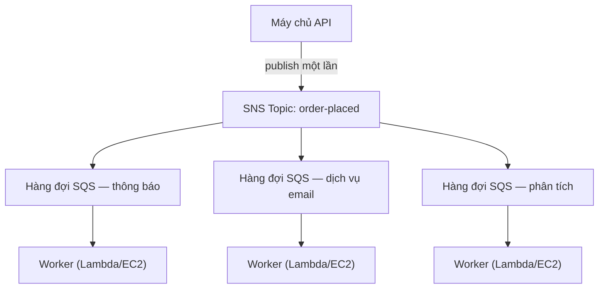

# Chương 19: Máy Phát Số

Máy phát số lấy số là một cuộc cách mạng thầm lặng. Lấy một số, chờ được gọi. Dòng người trở thành một hàng đợi. Người ta có thể ngồi xuống. Quầy dịch vụ làm việc theo tốc độ riêng. Không ai chặn ai.

Trước máy phát số, bạn phải đứng xếp hàng. Vị trí của bạn trong hàng đòi hỏi sự hiện diện vật lý của bạn. Bạn không thể làm gì khác trong khi chờ. Và nếu người ở đầu hàng chậm chạp, mọi người phía sau họ đều dừng lại.

Máy phát số tách việc đến khỏi việc phục vụ. Bạn đến, lấy một số, và hệ thống ghi nhớ vị trí của bạn. Bạn có thể đi ngồi xuống. Quầy dịch vụ xử lý các số theo bất kỳ tốc độ nào nó có thể quản lý. Nếu quầy tạm thời đóng, những người mới đến vẫn lấy được số. Họ chờ. Công việc không biến mất — nó xếp hàng.

Phát minh nhỏ bé này là một trong những ví dụ lâu đời nhất về tách rời (decoupling) trong các hệ thống của con người. Đến cuối chương này, Nimbus sẽ đã xây dựng máy phát số của riêng mình — bằng phần mềm — và lý do nó cần một cái bắt đầu từ mười sáu phút ngừng hoạt động vào một tối thứ Sáu.

---

Cả nhóm đã sống sót qua lỗi AZ. Leo đã sửa quy trình kỹ thuật hỗn loạn, và runbook đã vững chắc. Lưu lượng đã phục hồi và đang tăng trở lại — thực ra là nhanh hơn trước. Tài liệu Aurora mà Leo đang đọc khuya vẫn còn vài chương ở phía trước nơi Nimbus thực sự đang đứng.

Nhưng khi lưu lượng tăng và nhiều nhà hàng tham gia hơn, một loại nút thắt cổ chai khác đang trở nên hiển thị. Không phải trong hạ tầng. Trong chính mã ứng dụng. Chuỗi request hoạt động tốt ở 200 đơn hàng mỗi giờ đang bắt đầu căng thẳng ở 800.

Và rồi đến tối ngày 14.

---

Nó đã bắt đầu với dashboard phân tích. Lúc 6:47 tối một ngày thứ Sáu, một lần deploy lên dịch vụ phân tích đưa vào một lỗi timeout. Dịch vụ bắt đầu phản hồi trong 8 giây thay vì 200 mili giây thường lệ.

Luồng đặt hàng là đồng bộ. Mỗi đơn hàng chờ dịch vụ phân tích trước khi xác nhận với khách hàng. Tám giây trở thành 12 khi tải tăng lên. Connection pool của API bắt đầu đầy lên với các request chờ bước phân tích hoàn tất.

Lúc 6:53 tối, connection pool chạm giới hạn. Các request mới bắt đầu lỗi ngay lập tức — không phải vì đơn hàng không thể xử lý được, mà vì không có kết nối nào sẵn để bắt đầu xử lý nó.

"Dịch vụ phân tích đã kéo đổ luồng đặt hàng," Leo nói, nhìn vào log sáng hôm sau. "Chúng chẳng liên quan gì đến nhau. Dịch vụ phân tích chỉ tính toán dashboard."

"Nhưng chúng nằm trong cùng chuỗi request," Priya nói.

"Mười sáu phút ngừng hoạt động," Maya nói. "Và ba khách hàng bị tính tiền hai lần."

Việc tính tiền hai lần còn tệ hơn việc ngừng hoạt động. Trong sự hỗn loạn của tình trạng connection pool bão hòa, một cơ chế thử lại đã kích hoạt cho một số request thực ra đã thành công — bước thanh toán hoàn tất, rồi request timeout trước khi trả về, và lần thử lại đã thử thanh toán lần nữa. Cùng thẻ, cùng số tiền, hai lần tính tiền.

"Cơ chế thử lại lẽ ra phải giúp ích," Leo nói.

"Nó giúp ích theo hướng sai," Priya nói. "Và chúng ta đã nghĩ về chuyện gì xảy ra khi cố hoàn tiền cho những khách hàng đó chưa? Quy trình hoàn tiền dùng cùng luồng đặt hàng đã lỗi."

Mười sáu phút ngừng hoạt động và ba lần tính tiền kép. Đó là cái giá kinh doanh của chuỗi request đồng bộ.

---

Nimbus có một vấn đề không cảm thấy như vấn đề cho đến khi các đơn hàng trở nên phổ biến.

Mỗi khi một đơn hàng được đặt, máy chủ API phải:

1. Lưu đơn hàng vào cơ sở dữ liệu
2. Gửi thông báo đến máy tính bảng của nhà hàng
3. Gửi email xác nhận đến khách hàng
4. Cập nhật dashboard phân tích của nhà hàng
5. Ghi nhật ký sự kiện để thanh toán

Ở một quầy bán đồ nguội bận rộn, người ở quầy thu ngân không chờ người thái xong miếng thịt trước khi chuyển sang khách tiếp theo. Họ nhận đơn, đưa cho bếp, và bắt đầu phục vụ người tiếp theo. Bếp xử lý các đơn theo tốc độ riêng của nó. Khách hàng được phục vụ nhanh hơn. Bếp không bị quá tải bởi những đợt bùng nổ đột ngột. Nếu bếp có một lúc chậm, các đơn chất đống sau quầy thay vì gây lỗi ở quầy thu ngân.

Đó là phép so sánh. Nimbus không có một quầy và một bếp. Nó có một người làm mọi thứ theo thứ tự trước khi khách hàng có thể rời đi.

Và vào ngày 14, người thái thịt gặp một vấn đề. Nên quầy dừng lại. Nên mọi khách hàng sau đó đều chờ. Bếp, quầy thu ngân, các khách hàng — tất cả tạm dừng vì một bước trong chuỗi đã chậm lại.

Cách khắc phục không phải là làm cho việc thái thịt nhanh hơn. Cách khắc phục là tách các bước. Nhận đơn ở quầy thu ngân, đưa một phiếu, để bếp làm việc.

"Chúng ta bị ghép chặt chẽ," Priya nói. "Nếu bất kỳ bước nào ở dưới bị lỗi, toàn bộ đơn hàng bị lỗi. Chúng ta đã nghĩ về chuyện gì xảy ra nếu dịch vụ phân tích bị xâm phạm và bắt đầu tiêu thụ các tin nhắn dị dạng chưa? Toàn bộ đơn hàng lỗi — vì chúng ta đang chờ nó."

"Nếu chúng ta có thể lưu đơn hàng và xác nhận ngay với khách hàng," Leo nói, "rồi xử lý phần còn lại ở nền thì sao?"

"Đó là một hàng đợi," Priya nói.

Hiểu biết chính: khách hàng không cần biết rằng dashboard phân tích đã được cập nhật trước khi họ nhận được xác nhận. Họ cần biết đơn hàng của họ đã được nhận. Đó là những thứ khác nhau. Chuỗi đồng bộ đã trộn lẫn chúng.

**Mô Hình Tách Rời**

Đây là **tách rời (decoupling)**: tách thành phần nhận công việc khỏi các thành phần xử lý nó.

Tất cả các bước trong luồng đặt hàng của Nimbus phải xảy ra đồng bộ trước khi API có thể phản hồi khách hàng. Nếu dịch vụ email chậm (đôi khi nó chậm), khách hàng phải chờ. Nếu dashboard phân tích bị tắt (đôi khi nó tắt), đơn hàng bị lỗi.

Sự đổ vỡ dây chuyền vào ngày 14 cho thấy chính xác tại sao điều này quan trọng. Dịch vụ phân tích chẳng liên quan gì đến việc đơn hàng của khách có được nhận hay không. Nhưng vì nó nằm trong cùng chuỗi đồng bộ, lỗi của nó trở thành lỗi của mọi người.

Trong các hệ thống phần mềm, hàng đợi thường là một message broker — một dịch vụ nhận tin nhắn từ các producer và giao chúng đến các consumer.

Bạn có thể đang thắc mắc: nếu luồng đặt hàng giờ là bất đồng bộ, làm sao khách hàng biết đơn hàng của họ thực sự đã được nhận? Câu trả lời nằm trong thiết kế kiến trúc: API lưu đơn hàng vào database (đồng bộ — đây là xác nhận có thẩm quyền), rồi publish các sự kiện vào hàng đợi. Xác nhận với khách hàng dựa trên việc ghi vào database thành công, không phải trên việc các dịch vụ ở dưới hoàn tất. Nếu dịch vụ email chậm, khách hàng đã có xác nhận của họ rồi. Email chỉ là một thứ theo sau "có thì hay."

**Amazon SQS: Hàng Đợi**

**Amazon SQS (Simple Queue Service)** là dịch vụ hàng đợi tin nhắn được quản lý của AWS. Nó lưu trữ tin nhắn một cách bền bỉ cho đến khi chúng được xử lý bởi một consumer.

Luồng cơ bản:

1. **Producer** (máy chủ API) đặt một tin nhắn vào hàng đợi: `{ "orderId": "ORD-5532", "restaurantId": "47", "items": [...] }`
2. API ngay lập tức phản hồi khách hàng: "Đơn hàng đã xác nhận!"
3. **Consumer** (các worker service riêng biệt) đọc tin nhắn từ hàng đợi và xử lý chúng: gửi thông báo cho nhà hàng, gửi email xác nhận, cập nhật phân tích

Trải nghiệm khách hàng: xác nhận tức thì. Việc xử lý ở dưới: xảy ra bất đồng bộ, theo tốc độ của các worker.

**Khái Niệm Chính Của SQS**

**Visibility timeout của tin nhắn**: Khi một consumer đọc một tin nhắn từ SQS, tin nhắn trở nên *vô hình* với các consumer khác trong một khoảng thời gian (mặc định: 30 giây). Điều này cho consumer thời gian để xử lý nó. Nếu consumer hoàn tất thành công, nó xóa tin nhắn. Nếu consumer sập, visibility timeout hết hạn và tin nhắn trở nên hiển thị lại để một consumer khác thử lại.

Điều này đảm bảo giao hàng ít nhất một lần (at-least-once): mọi tin nhắn sẽ được xử lý ít nhất một lần, ngay cả khi một consumer lỗi giữa chừng quá trình xử lý.

Bạn có thể đang thắc mắc: nếu tin nhắn trở nên vô hình trong khi đang được xử lý nhưng không bị xóa khi consumer sập, chẳng phải nó có thể bị xử lý hai lần sao? Đúng — và điều này gọi là giao hàng ít nhất một lần. Nó nghĩa là mọi consumer phải được thiết kế để xử lý việc nhận cùng một tin nhắn nhiều hơn một lần mà không gây ra vấn đề. Một email xác nhận đơn hàng trùng lặp thì phiền toái. Một lần tính tiền trùng lặp thì là một ticket hỗ trợ. Hãy thiết kế các consumer của bạn cho phù hợp.

Visibility timeout phải dài hơn thời gian xử lý dự kiến dài nhất của bạn. Nếu xử lý thường mất 20 giây nhưng thỉnh thoảng mất 90 giây, và visibility timeout của bạn là 30 giây, thì lần xử lý 90 giây thỉnh thoảng đó sẽ trông như một lỗi đối với SQS. Tin nhắn trở nên hiển thị lại. Một consumer thứ hai nhặt nó lên. Giờ hai worker đang xử lý cùng một tin nhắn. Nếu việc xử lý của bạn không idempotent, bạn có một vấn đề.

Một sai lầm phổ biến: đặt visibility timeout bằng thời gian xử lý trung bình. Cách tiếp cận đúng: đặt nó bằng thời gian xử lý ở phân vị thứ 99, với một lề an toàn. Nếu thời gian xử lý P99 là 45 giây, đặt visibility timeout là 90 giây.

**Dead-letter queue (DLQ)**: Nếu một tin nhắn xử lý thất bại quá nhiều lần (có thể cấu hình — ví dụ, 5 lần thử lại), SQS chuyển nó sang một dead-letter queue. Bạn kiểm tra DLQ để hiểu tại sao các tin nhắn đang thất bại mà không mất chúng.

DLQ là nơi bạn học được điều gì thực sự đang thất bại trong production. Không có nó, các tin nhắn lỗi đơn giản biến mất và bạn không có cách nào để điều tra.

Ba tuần sau khi chuyển sang SQS, Leo nhận thấy 23 tin nhắn đã tích tụ trong DLQ của dịch vụ thông báo. Anh đã không kiểm tra DLQ (anh đã thiết lập nó đúng cách rồi giả định nó sẽ luôn rỗng).

Anh kéo ra một tin nhắn và nhìn vào payload:

```json
{
  "orderId": "ORD-9821",
  "restaurantId": "12",
  "customerMessage": "Extra spicy please 🌶️🔥",
  "timestamp": "2024-01-18T19:43:11Z"
}
```

Cái emoji. Dịch vụ thông báo nhà hàng đang mã hóa các payload tin nhắn thành Latin-1 trước khi gửi đến API máy tính bảng cũ kỹ của nhà hàng. Các ký tự emoji — mỗi cái bốn byte trong UTF-8 — đang bị hỏng, khiến API máy tính bảng từ chối request. Tin nhắn sẽ thử lại, lại thất bại, lại thử lại, lại thất bại. Sau 5 lần thử lại, SQS chuyển nó sang DLQ.

"Tất cả 23 tin nhắn đều có emoji trong trường ghi chú của khách hàng," Leo nói.

"Vậy mọi khách hàng thêm một emoji vào ghi chú đơn hàng của họ đều bị ghi chú thất bại âm thầm không đến được nhà hàng," Maya nói.

"Đúng vậy."

"Trong bao lâu?"

Leo kiểm tra dấu thời gian của tin nhắn cũ nhất. "Ba tuần."

Priya im lặng. "Và nếu có ai phát hiện ra rằng thêm một emoji vào ghi chú đơn hàng gây ra một lỗi âm thầm thì sao? Bạn có thể đặt đơn với emoji và đảm bảo nhà hàng không bao giờ thấy chỉ dẫn. Rồi phàn nàn về đơn hàng sai."

Không ai đã khai thác điều này. Nhưng đó là câu hỏi đúng để hỏi.

Leo sửa lỗi mã hóa. Sau đó anh viết một script để phát lại tất cả 23 tin nhắn bị mắc kẹt từ DLQ. Các nhà hàng nhận được các chỉ dẫn emoji cay (ba tuần tuổi) của họ. Các khách hàng không bao giờ biết.

Bài học: DLQ phải được giám sát tích cực, không phải thiết lập rồi quên. Một DLQ đang lớn lên là một tín hiệu âm thầm rằng có điều gì đó đang thất bại lặp đi lặp lại.

**Loại hàng đợi**:

**Hàng đợi Standard**: Thông lượng tối đa (không giới hạn tin nhắn mỗi giây). Thứ tự giao hàng là best-effort (không được đảm bảo). Giao hàng ít nhất một lần (rất hiếm khi, một tin nhắn có thể được giao hai lần).

**Hàng đợi FIFO**: Thứ tự vào-trước-ra-trước nghiêm ngặt. **Xử lý** đúng một lần — khử trùng lặp dựa trên `MessageDeduplicationId` trong cửa sổ 5 phút. Thứ tự được đảm bảo *theo từng* `MessageGroupId`: các tin nhắn trong cùng nhóm đến theo thứ tự; các nhóm khác nhau có thể được xử lý song song, đó là cách FIFO mở rộng quy mô. Thông lượng cơ bản là 3.000 tin nhắn mỗi giây với batching (300 không có batching); bật **chế độ high-throughput** nâng con số này lên hàng chục nghìn mỗi giây bằng cách phân vùng qua các nhóm tin nhắn. Dùng FIFO khi thứ tự quan trọng (giao dịch tài chính, thay đổi trạng thái tuần tự).

Nếu bạn cần thông lượng tối đa và có thể chịu được các tin nhắn trùng lặp thỉnh thoảng, dùng SQS Standard — nhưng bạn phải thiết kế mọi consumer để xử lý các bản trùng lặp mà không gây vấn đề. Nếu bạn cần thứ tự nghiêm ngặt và xử lý đúng một lần, dùng SQS FIFO — và thiết kế các `MessageGroupId` của bạn cho tốt, vì tính song song (và do đó thông lượng) đến từ việc có nhiều nhóm.

Đối với Nimbus, hầu hết các hàng đợi dùng hàng đợi standard. Hàng đợi thanh toán dùng FIFO để đảm bảo các lần tính tiền được xử lý theo thứ tự.

**Auto Scaling Theo Độ Sâu Hàng Đợi: Mở Rộng Worker Để Khớp Với Tồn Đọng**

Một trong những ứng dụng mạnh mẽ nhất của SQS là dùng độ sâu hàng đợi làm trigger Auto Scaling. Thay vì mở rộng dựa trên CPU hoặc bộ nhớ, bạn mở rộng dựa trên lượng công việc đang chờ.

Đối với dịch vụ thông báo của Nimbus: độ sâu hàng đợi SQS (số tin nhắn đang chờ xử lý) được kết nối với một policy Application Auto Scaling cho dịch vụ ECS chạy các worker thông báo.

Policy: khi hàng đợi có hơn 50 tin nhắn trên mỗi task worker, thêm một task. Khi hàng đợi có ít hơn 10 tin nhắn trên mỗi task worker, gỡ một task.

Hiệu quả thực tế: khi 1.200 đơn hàng ập đến trong giờ cao điểm tối thứ Sáu, độ sâu hàng đợi thông báo tăng vọt và đội worker mở rộng từ 2 task lên 8 task trong vòng 3 phút. Đến nửa đêm, hàng đợi rỗng và đội trở về 2.

"Cái đó tốn bao nhiêu mỗi tháng?" Tom hỏi, nhìn vào biểu đồ Auto Scaling.

"Không tốn thêm gì cho bản thân Auto Scaling," Leo nói. "Nhưng 6 task ECS thêm trong 3 giờ vào tối thứ Sáu — cái đó có ý nghĩa."

Tom tính toán. "Khoảng $14/tháng cho những đỉnh đó. Và trước đây, chúng ta chạy 8 task liên tục ở chi phí đầy đủ?"

"Đúng vậy."

"Vậy chúng ta trả cho đợt bùng nổ khi cần và không gì khác."

Đây là mẫu mở rộng theo độ sâu hàng đợi: hàng đợi trở thành một bộ đệm hấp thụ các đợt tăng vọt lưu lượng, và đội worker mở rộng để rút cạn bộ đệm. Người dùng không trải nghiệm sự chậm chạp — họ đã nhận được xác nhận ngay khi đơn hàng được nhận. Các worker chỉ mất thêm chút thời gian để bắt kịp. Và vì bạn không chạy công suất đỉnh 24/7, chi phí thấp hơn đáng kể.

**Amazon SNS: Nhà Phát Sóng**

**Amazon SNS (Simple Notification Service)** là một dịch vụ tin nhắn publish/subscribe (pub/sub). Thay vì một producer, một consumer (hàng đợi), SNS hỗ trợ một tin nhắn được giao đến *nhiều* subscriber đồng thời.

Mô hình:

1. Một **publisher** gửi một tin nhắn đến một **topic** SNS
2. Tất cả **subscriber** của topic đó nhận tin nhắn đồng thời (fan-out)

Các subscriber có thể là:

- Hàng đợi SQS (đẩy tin nhắn vào một hàng đợi để xử lý bất đồng bộ)
- Hàm Lambda (kích hoạt hàm trực tiếp)
- Endpoint HTTP/HTTPS (giao webhook)
- Địa chỉ email
- SMS (số điện thoại)

Đối với Nimbus, sự kiện đơn hàng được đặt được publish đến một topic SNS tên là `order-events`:

- Dịch vụ thông báo nhà hàng đăng ký (nhận trên hàng đợi SQS của nó)
- Dịch vụ email đăng ký (nhận trên hàng đợi SQS của nó)
- Dịch vụ phân tích đăng ký (nhận trên hàng đợi SQS của nó)
- Dịch vụ thanh toán đăng ký (nhận trên hàng đợi SQS FIFO của nó)

Một sự kiện đơn hàng. Bốn subscriber. Tất cả được thông báo đồng thời. Mỗi cái xử lý theo tốc độ riêng.

"Vậy SNS là lời thông báo," Maya nói, "và SQS là hộp thư đến nơi mỗi đội xử lý lời thông báo theo tốc độ riêng của họ. Vậy tại sao dùng cả hai? Tại sao không để mọi người đăng ký trực tiếp với topic SNS?"

"Vì giao SNS trực tiếp là fire-and-forget," Leo nói. "Nếu dịch vụ phân tích bị tắt khi SNS kích hoạt, tin nhắn đó mất rồi. Với một hàng đợi SQS ở giữa, tin nhắn chờ cho đến khi dịch vụ phục hồi."

"Chính xác," Priya nói. "Fan-out SNS/SQS là mẫu tiêu chuẩn."

**Mẫu Fan-Out SNS/SQS**

Sự kết hợp này — topic SNS cấp cho nhiều hàng đợi SQS — là một trong những mẫu kiến trúc quan trọng nhất trong AWS:



Mỗi hàng đợi độc lập. Dịch vụ phân tích có thể chậm — hàng đợi của nó đầy lên, nhưng các dịch vụ thông báo và email tiếp tục không bị ảnh hưởng. Nếu dịch vụ phân tích bị tắt, các tin nhắn của nó chờ trong hàng đợi cho đến khi nó hoạt động trở lại. Không có gì bị mất.

Đây là thuộc tính chính: **lỗi độc lập**. Các vấn đề ở một consumer không lan sang những consumer khác.

**Lọc Tin Nhắn: Không Phải Mọi Tin Nhắn Cho Mọi Subscriber**

Khi các hệ thống lớn lên, bạn không muốn mọi subscriber xử lý mọi tin nhắn. Một dịch vụ phân tích không nên nhận các tin nhắn về xử lý thanh toán thất bại nếu nó chỉ quan tâm đến các đơn hàng đã hoàn tất.

**Lọc tin nhắn SNS** cho phép các subscriber chỉ định các filter policy — chỉ giao các tin nhắn khớp với các thuộc tính nhất định.

Dịch vụ thông báo nhà hàng đăng ký với một bộ lọc: chỉ các tin nhắn có `status = "confirmed"`.

Dịch vụ cảnh báo lỗi đăng ký với một bộ lọc: chỉ các tin nhắn có `status = "failed"`.

Mỗi subscriber chỉ nhận được những gì nó cần.

Không có lọc, mọi subscriber nhận mọi tin nhắn và phải bỏ qua những gì không liên quan. Điều này lãng phí xử lý, lãng phí tiền (SQS tính phí trên mỗi tin nhắn), và đưa vào tiếng ồn. Một hệ thống đơn hàng khối lượng cao không có lọc sẽ làm ngập hàng đợi cảnh báo lỗi với các đơn hàng thành công — khiến các lỗi thực sự khó tìm.

Các filter policy trông như:

```json
{
  "status": ["confirmed"],
  "region": ["us-west-2", "us-east-1"]
}
```

Subscriber này chỉ nhận các tin nhắn có status là "confirmed" VÀ region là "us-west-2" hoặc "us-east-1". Các tin nhắn không khớp với policy hoàn toàn không được giao đến hàng đợi của subscriber này — chúng thậm chí không bao giờ đến SQS.

"Vậy việc lọc xảy ra ở lớp SNS," Priya nói, "trước khi các tin nhắn được ghi vào SQS?"

"Đúng. Hàng đợi SQS cho dịch vụ thông báo nhà hàng chỉ từng thấy các tin nhắn nó cần hành động."

"Và nếu có ai cố đột nhập bằng cách publish một tin nhắn được chế tạo đặc biệt đến topic SNS khớp với tất cả các bộ lọc của subscriber thì sao?" Priya hỏi.

Topic SNS có một IAM resource policy: chỉ dịch vụ order API (theo IAM role của nó) được phép publish. Các access policy của SNS và các queue policy của SQS tạo thành lớp kiểm soát truy cập — lọc chỉ để định tuyến, không phải bảo mật.

**Khi Nào Dùng SQS so với SNS**

**SQS một mình**: Một producer, một consumer (hoặc nhiều consumer cạnh tranh trên cùng hàng đợi). Tin nhắn cần được xử lý một lần, theo thứ tự (FIFO) hay không (standard). Mẫu worker queue — một hàng đợi, nhiều worker tiêu thụ từ nó.

**SNS một mình**: Thông báo fire-and-forget. Đẩy đến email, SMS, hoặc endpoint HTTP. Không cần xếp hàng tin nhắn — chỉ thông báo và đi tiếp.

**SNS + SQS (fan-out)**: Một sự kiện, nhiều consumer độc lập. Mỗi consumer có hàng đợi riêng, xử lý độc lập, và có thể lỗi độc lập.

## SNS FIFO Topic

Mọi thứ ở trên về SNS dùng các standard topic — chúng có thông lượng gần như không giới hạn, giao đến các subscriber gần như đồng thời, và hoàn thành công việc cho đại đa số các trường hợp sử dụng.

Nhưng các standard SNS topic không đảm bảo thứ tự. Nếu bạn publish mười tin nhắn theo trình tự, các subscriber có thể nhận chúng theo một thứ tự hơi khác. Đối với các thông báo đơn hàng Nimbus, điều đó ổn — một bản cập nhật phân tích đến một phần nhỏ của giây trước một xác nhận email thì không quan trọng.

Đối với một số kịch bản, nó quan trọng. Hãy xem xét một sổ cái tài chính: nếu hai sự kiện — một khoản có và rồi một khoản nợ — được giao theo thứ tự ngược, các phép tính số dư trong khi xử lý sẽ sai ngay cả khi cả hai sự kiện cuối cùng được xử lý đúng.

**SNS FIFO topic** áp dụng cùng nguyên lý như các SQS FIFO queue cho mô hình fan-out. Các tin nhắn được giao đến các subscriber theo đúng thứ tự chúng được publish, và mỗi tin nhắn được giao đúng một lần.

Sự đánh đổi: các SNS FIFO topic có thông lượng cơ bản tương tự SQS FIFO (3.000 tin nhắn mỗi giây mỗi topic; 300 mỗi giây mỗi nhóm tin nhắn — với một chế độ high-throughput có sẵn từ 2025 cho mức cao hơn nhiều), và chúng chỉ fan out đến các **hàng đợi SQS** — FIFO hoặc, từ 2023, Standard. Đăng ký một hàng đợi Standard hữu ích cho các consumer không quan tâm đến thứ tự (một feed phân tích, chẳng hạn), nhưng thứ tự và đúng-một-lần tồn tại từ đầu đến cuối **chỉ** vào các hàng đợi FIFO. Bạn không thể dùng một SNS FIFO topic để giao đến các endpoint HTTP hoặc địa chỉ email.

Đối với pipeline thanh toán của Nimbus — nơi một chuỗi các cập nhật giá phải được áp dụng cho các tài khoản nhà hàng theo thứ tự — topic SNS thanh toán được chuyển từ standard sang FIFO. Hàng đợi SQS thanh toán đã là FIFO. Việc fan-out giờ đảm bảo rằng một sự kiện tăng giá sẽ không bao giờ đến bộ xử lý thanh toán trước sự kiện bắt-đầu-kỳ mà nó phụ thuộc vào.

> **Mẹo Thi — SNS FIFO**
>
> Nếu một kịch bản đòi hỏi **giao fan-out có thứ tự** qua nhiều subscriber, câu trả lời là **SNS FIFO**. SNS Standard không đảm bảo thứ tự. SNS FIFO chỉ fan out đến các hàng đợi SQS — để giữ thứ tự và đúng-một-lần từ đầu đến cuối, subscriber phải là một hàng đợi SQS **FIFO** (các đăng ký hàng đợi Standard được cho phép nhưng nhận thứ tự best-effort và giao hàng ít nhất một lần). Thông lượng mặc định là 3.000/giây mỗi topic — nếu kịch bản mô tả khối lượng cao hơn nhiều *và* thứ tự nghiêm ngặt, đó là một tín hiệu để xem xét các kiến trúc thay thế (Kinesis, chẳng hạn, được trình bày trong một chương sau).

## Khi Hàng Đợi Cũ Không Chịu Buông

Nimbus sắp sửa đóng thương vụ mua lại lớn nhất từ trước đến nay: Barato, một đối thủ cạnh tranh về giao đồ ăn với 200 nhà hàng và lợi thế hai năm về vận hành. Đội ngũ kỹ thuật lên lịch một cuộc gọi lập kế hoạch tích hợp.

Cuộc gọi kéo dài hai mươi phút trước khi Leo im lặng.

"Hệ thống xử lý đơn hàng của họ," anh nói. "Nó chạy trên cái gì?"

"ActiveMQ," kỹ sư Barato ở đầu dây bên kia nói. "Broker on-prem. Ứng dụng là Java. Nó đã chạy từ 2018. Mọi thứ nói AMQP."

"AMQP," Leo nói.

"Đúng."

Anh nhìn vào sơ đồ kiến trúc trên màn hình. Nimbus chạy SQS và SNS. SQS không nói AMQP. SNS không nói AMQP. Ứng dụng Barato không nói gì khác.

"Viết lại nó sẽ mất sáu tháng," Leo nói với cả nhóm sau cuộc gọi. "Tối thiểu."

"Chúng ta không thể trì hoãn thương vụ mua lại sáu tháng," Maya nói.

"Và chúng ta không thể chạy một broker ActiveMQ bare-metal trong AWS," Priya thêm. "Chúng ta đã nghĩ về điều đó trông thế nào từ góc độ bảo mật và độ tin cậy chưa? Một message broker tự quản lý, ngồi trong production, không có vá lỗi được quản lý, không có failover tự động, kết nối với hạ tầng của chúng ta?"

"Có một lựa chọn được quản lý," Leo nói chậm rãi. Anh đã đọc trong khi họ nói chuyện. "Amazon MQ."

**Amazon MQ: Broker Được Quản Lý**

**Amazon MQ** là một dịch vụ message broker được quản lý cho Apache ActiveMQ và RabbitMQ. Nó chạy broker hiện có của bạn — chính broker mà các ứng dụng của bạn đã kết nối tới trong nhiều năm — nhưng như một dịch vụ AWS được quản lý. AWS xử lý hạ tầng bên dưới: cấp phát, vá lỗi, failover, sao lưu.

Thuộc tính chính làm cho Amazon MQ khác với SQS và SNS: nó nói các giao thức mà các message broker cũ nói. AMQP, STOMP, MQTT, OpenWire, NMS. Các giao thức mà SQS và SNS đơn giản là không hiểu.

Đối với việc tích hợp Barato, kế hoạch rất đơn giản. AWS sẽ chạy một broker Amazon MQ được cấu hình như ActiveMQ. Ứng dụng Java của Barato sẽ được trỏ đến endpoint broker mới thay vì cái on-premises. Thay đổi ở phía ứng dụng: cập nhật một file cấu hình với connection string mới. Chỉ vậy thôi. Ứng dụng không cần biết nó đang nói chuyện với một broker đám mây được quản lý thay vì một máy chủ trong văn phòng Barato.

"Khoan đã," Maya nói. "Nếu chúng ta cuối cùng sẽ tích hợp họ vào Nimbus, chẳng phải chúng ta nên chuyển họ sang SQS ngay từ đầu sao?"

"Vì con đường di chuyển tồn tại," Leo nói. "Và đáng làm cho đúng — cuối cùng. Nhưng ngay bây giờ, chúng ta cần Barato vận hành được trên hạ tầng AWS trong ba mươi ngày, không phải sáu tháng. Amazon MQ làm cho ứng dụng chạy mà không thay đổi ứng dụng. Rồi chúng ta có thời gian để lên kế hoạch di chuyển SQS như một dự án có chủ đích, không phải một điều kiện tiên quyết vội vã cho thương vụ mua lại."

"Cái đó tốn bao nhiêu mỗi tháng?" Tom hỏi.

Broker Amazon MQ — một cặp active/standby đơn cho độ tin cậy — ở khoảng $200/tháng cho một broker phù hợp với khối lượng của Barato. So với chi phí của sáu tháng thời gian viết lại, không có gì để tranh luận.

Priya phê duyệt kế hoạch với một điều kiện: instance Amazon MQ sẽ sống trong một private subnet, với các quy tắc security group chỉ cho phép kết nối từ các máy chủ ứng dụng Barato. Không có phơi bày công khai. Bật ghi log audit.

Việc di chuyển mất mười hai ngày. Ứng dụng Barato kết nối với Amazon MQ vào ngày thứ mười ba. Vào ngày thứ mười bốn, nó xử lý đơn hàng đầu tiên của mình trên hạ tầng AWS mà không một thay đổi mã nào.

---

> **Mẹo Thi — Amazon MQ**
>
> *Lĩnh vực SAA-C03: Thiết Kế Kiến Trúc Có Khả Năng Chống Chịu (Lĩnh vực 2)*
>
> Đề thi phân biệt Amazon MQ với SQS và SNS trên một trục duy nhất: **tính tương thích giao thức**. Nếu kịch bản mô tả một ứng dụng đã dùng một message broker và nói một giao thức cụ thể, Amazon MQ gần như chắc chắn là câu trả lời.
>
> Các tín hiệu chính: **"ActiveMQ," "RabbitMQ," "AMQP," "STOMP," "MQTT," "OpenWire,"** hoặc bất kỳ cụm từ nào tương đương với **"mà không thay đổi mã ứng dụng."** Nếu bạn thấy những cụm từ đó, câu trả lời là Amazon MQ — không phải SQS, không phải SNS.
>
> Nếu kịch bản mô tả một ứng dụng *mới* cần tách rời, hoặc không đề cập đến một broker cũ hoặc giao thức cụ thể, dùng SQS/SNS.
>
> Một tín hiệu nữa: "di chuyển message broker on-premises hiện có sang AWS." Nếu ứng dụng cần tiếp tục nói cùng giao thức với cùng loại broker, Amazon MQ là câu trả lời lift-and-shift.

## Điểm Mạnh Và Hạn Chế

**Tại sao SQS và SNS mạnh mẽ**:

- SQS cung cấp giao tin nhắn bền bỉ, đáng tin cậy — các tin nhắn được lưu trữ qua nhiều AZ
- Tách rời cho phép mở rộng và triển khai độc lập các dịch vụ producer và consumer
- Các dead-letter queue đảm bảo không tin nhắn nào bị mất âm thầm khi lỗi
- Mẫu fan-out SNS cho phép thêm các consumer mới mà không thay đổi producer

**Khi nào nó trở nên phức tạp**:

- Giao hàng ít nhất một lần nghĩa là các consumer phải *idempotent* — xử lý cùng một tin nhắn hai lần không nên gây vấn đề (đơn hàng trùng lặp, tính tiền trùng lặp)
- Các hàng đợi FIFO đắt hơn và có giới hạn thông lượng
- Gỡ lỗi các tin nhắn thất bại qua nhiều hàng đợi và dịch vụ đòi hỏi log và khả năng quan sát tốt
- Các đảm bảo về thứ tự tin nhắn bị giới hạn — nếu thứ tự nghiêm ngặt quan trọng qua nhiều dịch vụ, thiết kế trở nên phức tạp

**Idempotency: Một Phân Tích Sâu Thực Tế**

Idempotency nghe trừu tượng cho đến khi bạn đã có ba khách hàng bị tính tiền hai lần.

Một thao tác là **idempotent** nếu chạy nó nhiều lần tạo ra cùng kết quả như chạy nó một lần. Một thao tác tính tiền không tự nhiên idempotent: chạy nó hai lần tính tiền hai lần. Một thao tác tính tiền idempotent kiểm tra xem khoản tính tiền đã được xử lý chưa trước khi cố thực hiện nó.

Mẫu: mỗi tin nhắn mang một ID duy nhất (ID đơn hàng, hoặc một message ID riêng). Trước khi xử lý, consumer kiểm tra một kho lưu trữ (DynamoDB hoạt động tốt cho việc này) để xem message ID này đã được xử lý thành công chưa. Nếu rồi: không làm gì, xóa tin nhắn. Nếu chưa: xử lý, ghi lại ID, xóa tin nhắn.

```python
def process_charge(message):
    order_id = message['orderId']
    
    # Kiểm tra idempotency
    if already_processed(order_id):
        logger.info(f"Order {order_id} already charged, skipping duplicate")
        return  # Tin nhắn sẽ bị xóa khỏi hàng đợi
    
    # Xử lý khoản tính tiền
    charge_result = payment_service.charge(
        amount=message['amount'],
        card_token=message['cardToken'],
        idempotency_key=order_id  # Cũng truyền cho payment processor
    )
    
    # Ghi lại rằng chúng ta đã xử lý cái này
    mark_as_processed(order_id, charge_result)
```

Idempotency key cũng nên được truyền cho các dịch vụ ở dưới (payment processor, hệ thống email) hỗ trợ nó. Stripe, chẳng hạn, chấp nhận một header `Idempotency-Key` ngăn các lần tính tiền trùng lặp ngay cả khi cùng một API call được thực hiện hai lần.

"Còn về correlation ID?" Priya hỏi. "Khi một tin nhắn di chuyển qua nhiều dịch vụ, làm sao chúng ta truy vết request nào gây ra hành động ở dưới nào?"

**Correlation ID: Truy Vết Qua Các Dịch Vụ**

Khi một khách hàng đặt một đơn hàng, request chảy qua: API → SNS → SQS → worker thông báo → API máy tính bảng nhà hàng → SQS → worker email → SES.

Không có correlation ID, nếu API máy tính bảng nhà hàng trả về một lỗi ở bước 6, các log trong mỗi dịch vụ hiển thị sự kiện, nhưng không có cách nào để truy vết nó về đơn hàng cụ thể của khách hàng từ đầu.

Một **correlation ID** là một định danh duy nhất được gắn vào request ban đầu và truyền qua mọi tương tác dịch vụ. Mỗi dịch vụ bao gồm correlation ID trong các log của nó.

Khi Priya tìm kiếm CloudWatch cho một correlation ID cụ thể, cô nhận được mọi dòng log — qua mọi dịch vụ — vốn là một phần của việc xử lý đơn hàng duy nhất đó.

"Một lưu ý," Priya nói. "Các correlation ID đến từ bên ngoài. Liệu có ai tiêm một ID độc hại và phá rối việc ghi log của chúng ta không?"

Các correlation ID là nội bộ — chúng không ảnh hưởng đến logic xử lý, chỉ ảnh hưởng đến việc ghi log. Làm sạch chúng (chữ và số, độ dài cố định) ngăn các cuộc tấn công injection trong các đầu ra log.

**Khi Nào Tách Rời Là Lựa Chọn Sai**

"Khoan — nhưng *tại sao* chúng ta lại không tách rời mọi thứ?" Maya hỏi.

Đó là một câu hỏi công bằng. Nếu tách rời ngăn các lỗi dây chuyền và làm cho các hệ thống có khả năng chống chịu, tại sao không áp dụng nó ở mọi nơi?

Vì tách rời có chi phí. Và có những kịch bản nơi những chi phí đó vượt quá lợi ích.

**Khi bạn cần tính nhất quán tức thì**: Nếu một khoản thanh toán phải được xác nhận trước khi một đơn hàng có thể tiến hành — và người dùng đang chờ trên màn hình để biết kết quả — bạn không thể đặt khoản thanh toán vào một hàng đợi bất đồng bộ và trả về một xác nhận trước khi bạn biết liệu khoản tính tiền có thành công không. Người dùng có thể đặt hàng hai lần trước khi khoản tính tiền đầu tiên hoàn tất. Tách rời bất đồng bộ không hoạt động cho các thao tác mà phản hồi phụ thuộc vào kết quả.

**Khi quy trình vốn dĩ tuần tự**: Nếu bước 3 phải thấy kết quả của bước 2 để đưa ra quyết định, chúng không thể chạy song song từ một hàng đợi. Ép chúng vào một hàng đợi tạo ra một cơ chế truyền-kết-quả vụng về thường rốt cuộc phức tạp hơn phiên bản đồng bộ.

**Khi thứ tự tin nhắn quan trọng và khối lượng thấp**: SQS Standard không đảm bảo thứ tự. SQS FIFO thì có, nhưng giới hạn ở 3.000 tin nhắn/giây với batching theo mặc định (chế độ high-throughput nâng con số đó lên đáng kể). Nếu bạn có một quy trình khối lượng thấp, thứ tự nghiêm ngặt, một hàng đợi đồng bộ đơn giản (như một khóa hàng database) có thể đơn giản hơn và đáng tin cậy hơn.

**Khi chi phí phụ trội vượt quá lợi ích**: Một công cụ nội bộ nhỏ với một người dùng và không có SLA có lẽ không cần các topic SNS fan-out và các DLQ. Chi phí vận hành phụ trội của việc giám sát các hàng đợi và DLQ là có thật. Hãy điều chỉnh kích thước kiến trúc cho phù hợp với vấn đề.

Câu hỏi không phải là "tôi có nên tách rời cái này không?" Mà là "chi phí của sự ghép nối này là gì, và việc tách rời có giảm chi phí đó nhiều hơn lượng nó thêm vào không?"

## Tóm Tắt

Tách rời là nguyên lý chống chịu của Chương 18 áp dụng vào kiến trúc nội bộ: cùng cách Multi-AZ loại bỏ các điểm lỗi đơn lẻ trong hạ tầng, SQS và SNS loại bỏ các điểm lỗi đơn lẻ trong các chuỗi request.

- **Tách rời** tách các thành phần tạo ra công việc khỏi các thành phần xử lý nó.
- **SQS** cho các producer một nơi bền bỉ để đặt công việc khi các consumer chậm, ngoại tuyến, hoặc đang mở rộng quy mô.
- **SNS** cho một sự kiện đến được nhiều consumer độc lập mà publisher không biết họ là ai.
- **SNS + SQS fan-out** cho mỗi dịch vụ ở dưới xử lý cùng một sự kiện theo tốc độ riêng của nó.
- **DLQ, idempotency, và correlation ID** là kỷ luật vận hành làm cho các hệ thống bất đồng bộ có thể gỡ lỗi được thay vì bí ẩn.
- **Không tách rời một cách mù quáng**: các quy trình đồng bộ, các yêu cầu nhất quán tức thì, và các công cụ nhỏ rủi ro thấp có thể không biện minh cho diện tích vận hành tăng thêm.

## Mẹo Thi

*Lĩnh vực SAA-C03: Thiết Kế Kiến Trúc Có Khả Năng Chống Chịu (Lĩnh vực 2, Nhiệm vụ 2.1)*

- **SQS Standard so với FIFO**: Đề thi phân biệt theo các đảm bảo về thứ tự và giao hàng. "Phải xử lý theo thứ tự" → FIFO. "Thông lượng tối đa" → Standard.
- **Auto Scaling theo độ sâu hàng đợi**: "Mở rộng worker dựa trên độ sâu hàng đợi" → metric SQS (ApproximateNumberOfMessagesVisible) dùng với Application Auto Scaling hoặc ECS Service Auto Scaling.
- **Visibility timeout**: Khái niệm chính cho giao hàng ít nhất một lần. Nếu một consumer lỗi, tin nhắn trở nên hiển thị lại sau timeout. Kịch bản thi: "các tin nhắn đang bị xử lý hai lần" → visibility timeout quá ngắn (consumer mất lâu hơn timeout để xử lý).
- **Dead-letter queue**: Các tin nhắn thất bại sau N lần thử lại được chuyển đến đây. Kịch bản thi: "đảm bảo không tin nhắn nào bị mất, ngay cả khi xử lý thất bại lặp đi lặp lại" → DLQ.
- **SNS fan-out**: Mẫu thi kinh điển cho một sự kiện kích hoạt nhiều consumer. "Thông báo đơn hàng đã đặt phải kích hoạt email, SMS, và cập nhật tồn kho đồng thời" → topic SNS với các đăng ký SQS.
- **SQS + Lambda**: Lambda có thể được cấu hình để poll một hàng đợi SQS và kích hoạt trên mỗi batch tin nhắn. Đề thi dùng cái này cho xử lý hướng sự kiện ở quy mô.
- **SQS long polling**: Thay vì các consumer poll mỗi vài giây (short polling, lãng phí API call), long polling chờ tới 20 giây cho một tin nhắn. Giảm chi phí và các phản hồi rỗng sai.
- **SQS extended client library**: Đối với các tin nhắn lớn hơn giới hạn payload của hàng đợi (256KB theo mặc định; có thể nâng lên 1MB từ 2025), dùng SQS Extended Client Library, vốn lưu trữ thân tin nhắn trong S3 và gửi một tham chiếu qua SQS. Đề thi vẫn coi 256KB là giới hạn SQS — "tin nhắn SQS quá lớn" → Extended Client Library + S3.
- **Lọc tin nhắn SNS**: Các subscriber chỉ nhận các tin nhắn khớp với filter policy của họ. Kịch bản thi: "chỉ gửi các thông báo khớp tiêu chí cụ thể cho một subscriber" → lọc tin nhắn SNS.
- **Lưu ý**: Fan-out SNS/SQS cũng xuất hiện trong các kịch bản Lĩnh vực 3 về các kiến trúc xử lý bất đồng bộ thông lượng cao. Hãy biết mẫu này cho cả các câu hỏi về khả năng chống chịu lẫn hiệu năng.
- **Tín hiệu Amazon MQ**: "ActiveMQ," "RabbitMQ," "AMQP," "STOMP," "MQTT," "OpenWire," hoặc "mà không thay đổi mã ứng dụng" → Amazon MQ, KHÔNG phải SQS. Nếu kịch bản nói ứng dụng mới cần tách rời → SQS/SNS.
- **SNS FIFO so với Standard**: SNS Standard không đảm bảo thứ tự. Nếu kịch bản đòi hỏi **fan-out có thứ tự** → topic SNS FIFO cấp cho các hàng đợi SQS FIFO. Hãy nhớ: SNS FIFO không thể giao đến các endpoint HTTP hoặc email — chỉ đến các hàng đợi SQS (FIFO cho thứ tự/đúng-một-lần; các đăng ký Standard hoạt động nhưng hạ cấp xuống thứ tự best-effort và giao hàng ít nhất một lần).

## Bài Tập

**Bài tập 1 — Ôn lại**

Giải thích mẫu fan-out SNS/SQS. Tại sao mẫu này dùng các hàng đợi SQS thay vì để các dịch vụ đăng ký trực tiếp với topic SNS bằng các endpoint HTTP?

*(Gợi ý: Hãy nghĩ về chuyện gì xảy ra nếu một trong các endpoint HTTP bị tắt khi SNS publish một tin nhắn.)*

**Bài tập 2 — Kịch bản SAA-C03**

*Kịch bản*: Một nền tảng thương mại điện tử xử lý 10.000 đơn hàng mỗi giờ. Khi một đơn hàng được đặt, hệ thống phải: (1) lưu đơn hàng vào database, (2) trừ tồn kho, (3) gửi một email xác nhận, và (4) cập nhật dashboard phân tích. Hiện tại, cả bốn bước xảy ra đồng bộ — nếu dịch vụ phân tích chậm, khách hàng phải chờ. Đội ngũ muốn cải thiện thời gian phản hồi đối mặt với khách hàng trong khi đảm bảo không đơn hàng nào bị mất.

Kiến trúc nào giải quyết TỐT NHẤT yêu cầu này?

A) Dùng các hàng đợi SQS FIFO để xử lý cả bốn bước theo trình tự  
B) Để API lưu đơn hàng và xác nhận ngay với khách hàng; publish một sự kiện đến một topic SNS; để các dịch vụ tồn kho, email, và phân tích đăng ký qua các hàng đợi SQS  
C) Dùng các instance EC2 song song để xử lý mỗi bước đồng thời, đồng bộ  
D) Dùng một API Gateway với xác thực request để tăng tốc xử lý đơn hàng

**Gợi ý 1**: Xác nhận với khách hàng nên là tức thì. Những bước nào phải xảy ra trước phản hồi, và những bước nào có thể xảy ra sau?

**Gợi ý 2**: Dịch vụ phân tích chậm không nên ảnh hưởng đến các dịch vụ email hoặc tồn kho.

**Gợi ý 3**: Fan-out SNS cho phép cả ba dịch vụ ở dưới nhận sự kiện đồng thời.

**Đáp án**: B

**Giải thích**: API lưu đơn hàng vào database (đồng bộ — phải được làm trước khi xác nhận) và ngay lập tức trả về một xác nhận. Sau đó nó publish một sự kiện `order-placed` đến một topic SNS. Các dịch vụ tồn kho, email, và phân tích mỗi cái đăng ký qua các hàng đợi SQS độc lập. Chúng xử lý theo tốc độ riêng — nếu phân tích chậm, hàng đợi của nó tăng lên nhưng các dịch vụ khác không bị ảnh hưởng. Nếu bất kỳ dịch vụ nào lỗi, các tin nhắn của nó vẫn còn trong hàng đợi SQS và được thử lại; sau số lần thử lại thất bại được cấu hình, chúng được chuyển đến DLQ.

**Tại sao không phải A?** Các hàng đợi FIFO xử lý các tin nhắn theo trình tự — điều này không giúp gì với sự chậm chạp đồng bộ. Ngoài ra, xử lý tuần tự nghĩa là phân tích chậm vẫn chặn email.

**Tại sao không phải C?** "Các instance EC2 song song xử lý đồng bộ" vẫn đòi hỏi tất cả các bước hoàn tất trước khi phản hồi khách hàng. Thêm instance không giải quyết được sự ghép nối đồng bộ.

**Tại sao không phải D?** API Gateway tăng tốc định tuyến và xác thực API, nhưng không tách rời các bước xử lý ở dưới.

*Lĩnh vực SAA-C03: Thiết Kế Kiến Trúc Có Khả Năng Chống Chịu — Nhiệm vụ 2.1*

**Bài tập 3 — Thử thách kiến trúc** *(Tùy chọn)*

Nimbus đang xây dựng một hệ thống thông báo cho các đối tác nhà hàng. Khi một khách hàng đặt một đơn hàng, nhà hàng cần được thông báo qua:

- Ứng dụng máy tính bảng của họ (push notification)
- Một hệ thống màn hình hiển thị bếp (HTTP webhook đến phần cứng tại chỗ của họ)
- Một SMS dự phòng (nếu thông báo máy tính bảng thất bại)

Dịch vụ thông báo máy tính bảng đáng tin cậy. Webhook bếp đôi khi bị tắt (các nhà hàng tắt phần cứng của họ vào giờ đóng cửa). SMS chỉ nên kích hoạt nếu thông báo máy tính bảng thất bại.

Thiết kế kiến trúc dùng SNS và SQS. Bạn sẽ xử lý yêu cầu "SMS chỉ khi máy tính bảng thất bại" thế nào? Bạn sẽ đảm bảo webhook bếp không chặn thông báo máy tính bảng khi nó ngoại tuyến thế nào?

Cân nhắc thêm: visibility timeout nào phù hợp cho việc giao webhook bếp nếu thời gian phản hồi webhook trung bình là 2 giây nhưng các nhà hàng với phần cứng chậm có thể mất tới 30 giây? Policy DLQ nào sẽ kích hoạt SMS dự phòng sau khi các lần thử lại webhook đã cạn?

*(Không có câu trả lời đúng duy nhất. Mục tiêu là thực hành thiết kế fan-out với định tuyến có điều kiện.)*

## Cảnh Sau Tín Dụng

Luồng đặt hàng mới đã hoạt động.

Leo đã triển khai nó vào một chiều thứ Ba mà không chạy một bài kiểm thử tải đầy đủ trước. "Sẽ ổn thôi," anh nói với Priya. "Kiến trúc vững chắc."

Khách hàng đặt hàng. API phản hồi trong 95 mili giây. Xác nhận hiện trên điện thoại của họ ngay lập tức.

Đằng sau hậu trường: bốn dịch vụ xử lý bất đồng bộ. Dịch vụ phân tích có một lỗi khiến nó sập trên các đơn hàng chứa một số ký tự đặc biệt trong tên món. Hàng đợi của nó tăng lên 3.200 tin nhắn trong hai giờ.

Khách hàng không bao giờ nhận thấy.

Khi Leo sửa lỗi và dịch vụ phân tích khởi động lại, nó xử lý phần tồn đọng trong 18 phút. Không dữ liệu nào bị mất. DLQ rỗng.

Anh làm mới dashboard CloudWatch. Độ sâu hàng đợi: 0. Tin nhắn đã xử lý: 3.200. Lỗi: 0 (sau khi sửa).

"Đây chính xác là cái mà ngày 14 lẽ ra trông như vậy," anh nói. "Phân tích có một vấn đề. Hàng đợi hấp thụ nó. Mọi thứ khác vẫn hoạt động."

"Đây là ý nghĩa của tách rời," Priya nói.

"Cái đó tốn bao nhiêu mỗi tháng?" Tom hỏi, đã ở trang giá rồi.

"Ở khối lượng hiện tại của chúng ta, khoảng mười hai đô la một tháng cho SQS." Anh nhìn chằm chằm vào màn hình. "Tôi đã mong đợi nhiều hơn."

Anh có vẻ mặt của một người đang phát hiện ra rằng một thứ rẻ một cách bất ngờ cũng tốt một cách bất ngờ.

"Thiết lập các cảnh báo DLQ," Priya nhắc Leo. "Chúng ta không muốn thêm ba tuần lỗi âm thầm nữa."

"Đã làm rồi," Leo nói.

Lần này anh đã làm.

Trong chương tiếp theo: hàm chỉ chạy khi có ai đó gõ cửa — và không tốn gì khi không có.
