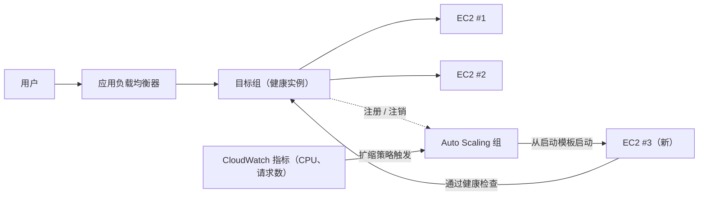

# 第7章：越忙越大的餐厅

那是一个周五晚上的 7 点 43 分。

Tom 的椅子稍稍向后推开，那是他全神贯注盯着什么东西时的姿势——专注到你跟他说话他也不会回答。办公室一小时前就空了。他留了下来。

他开着一个指标仪表盘的标签页，刷新它的方式像别人刷社交媒体——反射性地、不停地、几乎不是有意为之。

存储危机已经过去了。数据库有了自己的磁盘。照片住进了 S3。系统已经稳定了两周——算不上激动人心，只是稳定。这本该让人感觉不错。

然后错误率突破了 12%。

"Leo，" Tom 说。

Leo 已经在看了。响应时间：攀升中。排队请求：攀升中。那台单独的 EC2 实例——即便经过了上个月那次细致的规格调整——CPU 已经到了 94%。

"我们在把顾客往外赶，" Tom 说。

"不是我们在赶，" Leo 说。"是服务器在赶。"

"那是一回事。"

确实是。而且这种事已经连续三个周五发生了。Nimbus 熬过了存储危机——数据库有了自己的磁盘，照片住在 S3 里——但"稳定"和"可扩展"是完全不同的两个问题。系统能运转。它只是不能生长。

Maya 发来一条 Slack 消息：*仪表盘显示订单比上周五降了 40%。怎么回事？*

Tom 回复：*服务器满负荷了。正在处理。*

三分钟过去了。

Maya：*有个餐厅老板打到客服热线，说应用坏了。*

Leo 双手已经放在键盘上。他在调整实例规格——这个修复方法的手动版本，需要停掉服务器、更换实例类型的那种。也就意味着停机。

"重启要多久？" Tom 问。

"七分钟，" Leo 说。

"我们要在周五晚上多承受七分钟的故障，" Tom 说。这不是在问。他给 Maya 打了一条 Slack 消息。她回了一个字符：*k*

重启完成。实例恢复上线。CPU 降到了 60%。错误率下降。Tom 一言不发地盯着指标看了十五分钟。

9 点 15 分，流量回落。危机过去了。

Leo 看了看自己的双手——8 点的时候它们一直在微微发抖，现在不抖了。

"我们不能每个周五都来这么一次，" 他说。

"对，" Tom 说。"不能。"

团队需要他们的系统自动应对可变负载。而不是为最坏情况买够服务器、在安静时段浪费钱。也不是在流量尖峰来袭时手忙脚乱地救火。

这种问题有一个成熟的模式。AWS 有两个服务来实现它。

**概念：水平扩展**

让系统处理更多负载有两种方法。

**垂直扩展**意味着把单台服务器做大。更多 CPU。更多 RAM。我们在第4章从 `t3.micro` 升到 `t3.large` 时就这样做过。它有帮助。但它有极限：你只能做到那么大，实例必须重启才能改规格，而且你仍然有单点故障。

**水平扩展**意味着添加更多服务器。不是一台大服务器，而是运行五台中等服务器。流量下降时，跑两台。流量激增时，跑十台。

水平扩展有垂直扩展没有的优势：

- 没有单点故障。一台服务器挂了，其他的继续提供服务。
- 增加容量不需要重启。
- 只为用到的部分付费——需要时加服务器，不需要时减掉。
- 线性扩展：服务器翻倍，吞吐量大致翻倍。

还有一个可靠性维度是垂直扩展无法匹敌的。当你有五台服务器、其中一台故障时，容量降到 80%——足以在故障实例被替换期间继续承接流量。当你只有一台服务器、它故障时，容量降到 0%。冗余性是水平扩展与生俱来的，垂直扩展无论做到多大都给不了。

这对维护也很重要。当一个安全补丁需要重启服务器时，水平扩展让你可以一台一台地重启实例——保持服务连续性的滚动重启。一台大型单机服务器则要么在重启期间接受停机，要么去实现蓝绿部署的复杂方案。

问题在于：如果你有多台服务器，用户怎么知道该和哪一台对话？

而且水平扩展还强加了一个设计约束：你的应用程序必须能同时运行在多台完全相同的服务器上，且服务器之间互不干扰。这就是**无状态**要求——每个请求必须自包含，不依赖存放在某台特定服务器上的状态。等我们遇到粘性会话问题时，就能确切地看到为什么这一点很重要。

**应用负载均衡器：一扇门，多个房间**

想象一家大型餐厅，门口有一个领位台。食客到来，领位员把他们引导到一张空桌。领位员知道哪些桌子忙、哪些桌子空。食客不需要知道一共有多少张桌子——他们只管走进来，由领位员负责分配。

**应用负载均衡器**（Application Load Balancer，ALB）对 Web 请求做的就是这件事。

用户连接到负载均衡器。负载均衡器把传入请求分发到你的 EC2 实例机群。每个用户只看到一个地址（负载均衡器的 URL）。在那个地址背后，请求被分散到当前正在运行的全部服务器上。

ALB 本身运行在 AWS 托管的基础设施上，分布在你所在区域的多个可用区中。它不是一台服务器——它是一个托管的分布式服务。当你启用跨可用区负载均衡（ALB 的默认设置）时，每个 ALB 节点会把请求均匀地分发到所有已注册的目标上，无论它们在哪个可用区。这避免了一种常见的故障模式：某个可用区的健康实例数是另一个的两倍，导致负载不均。

它接收每个传入的 HTTP 请求，并根据以下因素决定由哪台 EC2 实例（称为**目标**）处理它：

- 轮询（每台服务器轮流接收）
- 最少未完成请求（在途请求最少的服务器接收下一个请求）
- 健康状况——只有健康的目标才接收流量

**健康检查**至关重要。ALB 定期向每个目标发送测试请求。如果目标没有正确响应，ALB 把它标记为不健康，停止向它发送流量。当目标恢复时，流量恢复。

这是自动的。你配置健康检查参数；ALB 负责执行。

健康检查有三个关键配置参数：要检查的**路径**（例如 `/health`）、**间隔**（多久检查一次——5 到 300 秒之间；默认 30 秒），以及**阈值**（连续多少次成功或失败的检查才改变目标的健康状态）。

激进的健康检查间隔能更快地发现问题，但会给目标增加更多流量。30 秒间隔、3 次失败阈值，意味着一个出故障的目标会在 90 秒内被移出轮换。10 秒间隔、2 次失败阈值，意味着 20 秒内移除——代价是更多的健康检查流量。

对 Nimbus，Priya 选择了 30 秒间隔，配 3 次失败阈值（90 秒判定不健康）和 2 次成功阈值（恢复后 60 秒判定重新健康）。这在快速故障检测与避免短暂网络抖动造成误报之间取得了平衡。

**健康检查配置：不只是"它还活着吗？"**

Leo 的第一个健康检查是一个简单的 TCP ping："80 端口在接受连接吗？"这是最低限度。服务器可能 80 端口照常接受连接，而数据库已经挂了、应用程序陷在错误循环里、磁盘已经满了。

Priya 对"健康"应该意味着什么有不同的看法。

"我们想过健康检查通过、但应用程序其实是坏的会怎样吗？" 她问。"一台能接受连接却查不了数据库的服务器不叫健康。它只是有响应而已。"

Leo 在应用代码里做了一个 `/health` 端点。这个端点做三件事：
1. 确认应用进程在运行
2. 向数据库发起一次测试查询（一个简单的 `SELECT 1`）
3. 确认 S3 连接可访问

三项都通过，端点返回 HTTP 200。任何一项失败，返回 HTTP 503。

ALB 的健康检查被配置为每 30 秒调用一次这个端点。如果连续收到三次 503 响应，该实例被标记为不健康并移出轮换。

"也就是说如果数据库宕了，" Priya 说，"健康检查会发现它，并在 90 秒内把受影响的服务器从负载均衡器中移除。"

"即使服务器本身还在运行，" Tom 说。

"即使它们从外面看起来一切正常。"

指向了真实应用健康检查的 ALB，成了一个可靠得多的真实问题探测器——而不只是探测服务器是不是活着。

**Auto Scaling：会加开桌位的餐厅**

ALB 把流量分发到你已有的服务器上。但当你需要更多服务器时，它不会去添加。

**Auto Scaling** 会。

**Auto Scaling 组**（ASG）是一份配置，它告诉 AWS：

- 始终保持运行的最少实例数
- 允许的最大实例数
- 在什么条件下扩展（添加实例）或缩减（移除实例）

扩缩条件称为**策略**。最常见的四种类型：

**目标跟踪**："把平均 CPU 利用率保持在 70%。"当平均 CPU 超过 70%，AWS 启动新实例。降到该值以下时，实例被终止。这是大多数工作负载最简单、也最推荐的策略——设定一个目标指标，让 AWS 自己算需要多少台实例。目标可以是 CPU 利用率、每个目标的请求数，或任何自定义 CloudWatch 指标。

**步进扩展**：为特定阈值定义特定响应。"当 CPU 超过 60% 时，加 1 台实例。当 CPU 超过 80% 时，加 3 台实例。当 CPU 降到 30% 以下时，减 1 台实例。"比目标跟踪控制得更细，但需要更多配置和持续调优。

**计划扩展**："每周五下午 6 点 45 分，确保至少有 4 台实例在运行。"这是针对可预测事件的主动式扩展。它与响应式扩展并行工作——计划操作设定一个下限，目标跟踪在该下限之上按需增加实例。

**预测性扩展**：同一思想的机器学习版本。不需要你来写时间表，Auto Scaling 会分析最多两周的历史负载并预测接下来 48 小时，在预测的上升曲线*之前*就启动容量。对于周期性流量——每个周五的晚餐高峰、每个工作日的开盘时段——预测性扩展会自己发现规律并自动预热，并随着规律的漂移持续调整。考试触发词："周期性/循环性流量尖峰；实例必须在尖峰*之前*就绪" → 预测性扩展。（计划扩展是手动答案；预测性是学习得来的答案。两者都胜过纯响应式扩展——后者永远落后于尖峰一个实例启动时间。）

对 Nimbus，组合方案是：用目标跟踪做响应式扩展（把 CPU 保持在 65%），再加一个每周五下午 6 点 45 分的计划扩展操作，在晚餐高峰之前预热 2 台额外的实例。

这是自动的。没有人需要盯着指标。没有人需要手动启动服务器。系统实时响应负载。

Priya 第一次在一个周五高峰期间实时看到了这一切发生。服务器数量在十五分钟内从 2 台增加到 5 台，高峰过后又回到 2 台。

"那个，" 她说，"是真的让人佩服。"

Tom 在看的是成本曲线。账单在高峰期间上涨，过后回落。"我们只为用到的部分付了钱，" 他说，同样佩服。"按正常一周平均下来，每个月要花多少钱？"

Leo 调出了计算器。周五的高峰大约给月账单增加 15%。没有 Auto Scaling 的话，他们就得整周按峰值配置容量。差额：在闲置的峰值容量上每月浪费约 120 美元，而正确配置的 Auto Scaling 浪费 0 美元。

缩减环节有一个团队经常忽视的细节：**缩减保护**（scale-in protection）。你可以把 ASG 中的特定实例配置为受缩减保护——意味着它们在自动缩减事件中不会被终止。这对正在处理长时间任务、你不希望被打断的实例很有用。应用代码也可以在开始一个长任务时以编程方式给实例设置保护，任务完成时再取消。这能防止 ASG 在工作进行到一半时抽走地毯。

**预热池：不是所有东西都得冷启动**

Auto Scaling 第一次启动的那个周五，Tom 计了一次时：从"CPU 超过阈值"到"新实例开始承接流量"用了多久。

四分二十秒。

"那是四分钟的容量缺口，" 他说。

"我们可以提高最小实例数，" Leo 说。

"那意味着整周为闲置实例付钱，" Tom 说。

有一个折中方案：**预热池**（Warm Pools）。

预热池是一组预初始化好的 EC2 实例，它们以停止状态待命——已经启动过、已经配置好、已经跑完了 UserData 脚本。它们什么都做完了，就差开始处理流量。

当 Auto Scaling 组决定扩展时，它不再从零启动一台冷实例（需要三到五分钟来引导、运行 UserData、通过健康检查），而是从预热池里启动一台。启动一台已停止的实例大约只需 30 到 60 秒。

针对 Nimbus 的周五规律——一个从晚上 7 点左右开始的、已知且可预测的浪潮——Priya 配置了一个在营业时间维持 2 台实例的预热池。到 6 点 45 分，两台预热好的实例已经待命，停止着但初始化完毕。当 7 点流量攀升、ASG 需要扩展时，预热实例在一分钟内启动并加入机群。

"预热池要花多少钱？" Tom 问。

停止状态的 EC2 实例不付计算费——但要为挂接的 EBS 存储付费。预热池里两台 `t3.small` 实例：每月约 4 美元的存储费。把扩展时间从四分钟缩到一分钟以内，在周五晚上值这每月 4 美元。

**ALB 基于路径的路由**

随着 Nimbus 的成长，Leo 增加了第二个组件：一个独立的餐厅管理 API 服务。餐厅老板们通过同一个域名访问这个服务，但 URL 路径不同：`/api/restaurant/` 而不是 `/`。

"等等——可是*为什么*要那样做？" Maya 问。"为什么不干脆给餐厅管理 API 一个完全不同的域名？"

"可以，" Leo 说。"但那样我们就需要第二张证书、第二个负载均衡器、第二条 DNS 记录。基于路径的路由用一张证书、一个负载均衡器就搞定。"

ALB 原生支持这个功能。一条**基于路径的路由规则**告诉 ALB：当 URL 以 `/api/restaurant/` 开头时，把请求路由到餐厅管理目标组。当 URL 以其他任何内容开头时，路由到面向顾客的应用目标组。

两组独立的 EC2 实例机群。一个负载均衡器。流量按 URL 路径分流。

"所以我们可以独立于面向顾客的应用，单独扩展餐厅管理 API？" Maya 问。

"正是，" Leo 说。"如果餐厅老板们在大量更新菜单，那些 API 服务器就扩展。如果顾客在疯狂下单，那些服务器就扩展。它们互不影响。"

Maya 琢磨了一下。"而且我们只用付一个 ALB 的钱，不是两个。"

"正确，" Tom 说。他手里有数字。"ALB 每月约 20 美元的基础费用，外加数据处理费。一个 ALB 同时处理两种工作负载，对比两个独立的：每月大约省 20 美元。还省去了管理多张证书和多条 DNS 记录的麻烦。"

"不过，" Priya 说，"如果 ALB 本身宕了，两个服务一起倒。"

"AWS 把 ALB 设计为跨多个可用区高可用，" Leo 说。"和维护两个独立负载均衡器的复杂度相比，ALB 故障的风险非常低。"

Priya 把这个归档为"已接受的权衡，已记录在案"。

**ALB 和 ASG 如何协同工作**

这两个服务就是被设计成一起使用的。

你把 ALB 放在前面。ALB 指向一个**目标组**——一组应该接收流量的实例。Auto Scaling 组管理这些实例：扩展时把它们加入目标组，缩减时把它们移除。

整个流程：

1. 流量到达 ALB
2. ALB 把请求分发到健康的目标
3. 这些目标上的 CPU/负载攀升
4. ASG 检测到负载上升，启动新实例
5. 新实例通过健康检查，被注册到 ALB
6. ALB 开始向它们发送流量
7. 负载下降，ASG 终止多余的实例
8. ALB 停止向被终止的实例发送流量

这一切的发生不需要任何人工干预。

**启动模板：新实例的蓝图**

当 ASG 启动一台新实例时，它需要知道该启动什么。这定义在**启动模板**中——一个 AMI、一种实例类型、要应用的安全组，以及任何用户数据（实例引导时运行的启动脚本）。

一个常见模式：你把应用程序构建进一个自定义 AMI（见第4章）。当 ASG 需要新实例时，它启动那个 AMI。新实例启动时应用程序已经装好。无需手动设置。

对于更动态的环境，你也可以使用**用户数据脚本**，在启动时拉取并安装你代码的最新版本。这更灵活，但启动时间更长。

正确的选择取决于你的实例需要多长的启动时间，以及你的应用程序变更得有多频繁。

**粘性会话：一个微妙的问题**

这是许多团队第一次实施负载均衡时栽跟头的地方。

一些 Web 应用程序把会话数据——登录状态、购物车内容——存放在服务器本身（内存或本地磁盘中）。一台服务器时这没问题。多台服务器时它就崩了。

用户登录。请求落到服务器 A。服务器 A 存了会话。下一个请求落到服务器 B。服务器 B 没有会话。用户看起来像被登出了。

有两种应对方式：

**粘性会话**（或会话亲和性）：配置 ALB，让来自同一用户的请求始终发往同一台服务器。这是一个短期补救。它削弱了负载均衡（某些服务器"粘"上的用户比其他服务器多），并在实例被终止时制造问题。

Maya 看着粘性会话的配置页面。"如果我们把用户钉死在特定服务器上，那些服务器在缩减时被终止了怎么办？"

"他们的会话就丢了，" Leo 说。

"所以粘性会话只是在拖延问题。"

"正确，" Priya 说。"真正的解法是无状态应用设计。"

**无状态应用设计**：把会话数据存到外部——存到数据库，或者像 ElastiCache（第10章）这样的缓存里。每台服务器都能从外部存储重建任何用户的会话。服务器变得可以互换。这是水平可扩展应用程序的正确方法。

Priya 把这称为"你走向多服务器时所做的最重要的架构决策"。她说得对。我们会在第10章再次遇到它。

**用了粘性会话，复杂度低了，但风险高了**

如果你用粘性会话来解决会话状态问题，短期内你确实省去了搭建外部会话存储的工作——但当一台"粘"着用户的服务器在缩减时被终止，它绑定的所有用户会同时丢失会话。这种故障不是渐进的；它是突发的，并且同时波及一群用户。如果你把会话状态外部化，你增加了一个依赖（ElastiCache 或数据库），却消除了那种突发故障模式。对任何经常扩缩的应用程序来说，对无状态设计的投资，在 Auto Scaling 第一次终止一台上面还有活跃会话的实例时就回本了。

**Tom 的成本核算**

接下来那一周，Tom 为 ALB 加 ASG 的方案搭了一个成本模型。

ALB：每月约 20 美元基础费，外加数据处理费。按 Nimbus 的流量规模：每月约 22 美元。

Auto Scaling 组本身：没有额外费用。你为它运行的实例付费，但那些实例本来就得存在。ASG 是免费的；你付的是计算费。

预热池：两台停止的实例，每月约 4 美元的 EBS 存储费。

新增基础设施总成本：每月约 26 美元，即每年 312 美元。

接着 Tom 看了 ALB 和 ASG 上线之前那三个周五的事故记录。每次事故在停机窗口内让 Nimbus 损失了大约 40% 的周五营收。周五平均营收：约 2,400 美元。2,400 美元的 40% 是每次事故 960 美元。三次事故：三周内大约 2,880 美元的营收损失。

"ALB 和 ASG 一年花 312 美元，" Tom 说。"三个糟糕的周五让我们损失了近 3,000 美元。这还只是直接的营收损失——不算那些经历了一次糟糕体验后不再用 Nimbus 的客户流失。"

Maya 看完了这些数字。"上基础设施。"

"已经在跑了，" Leo 说。

## 当 ALB 不够用时：NLB 与 GWLB

Leo 在审查 Nimbus 悄悄为餐厅合作伙伴添加的 IoT 集成——装在步入式冷库里的小型温度传感器，每三十秒向 Nimbus 发送一次读数，这样后厨经理就能在冰箱温度漂出安全范围时收到警报。

"等等，" Leo 说。"这些传感器发的是 UDP 包。"

"这是个问题吗？" Maya 问。

"ALB 不支持 UDP，" Leo 说。"ALB 只懂 HTTP。仅此而已。"

Priya 已经在翻文档了。"网络负载均衡器就是干这个的。"

**网络负载均衡器（NLB）**工作在第 4 层——传输层。它路由 TCP 和 UDP 数据包。它不检查那些数据包的内容，不理解 HTTP 头，不做基于路径的路由。它做的是以惊人的速度把数据包从客户端搬到目标。

- **每秒数百万个请求，个位数毫秒级延迟。** ALB 在第 7 层处理 HTTP，意味着它要解析头部、评估路由规则、终止 TLS 连接。NLB 什么都不做——它更像一个高速交通指挥员，而不是一个 Web 代理。
- **保留客户端的源 IP 地址。** ALB 收到一个连接时，会终止它并向目标打开一个新连接——你的 EC2 实例看到的是 ALB 的 IP，不是用户的。NLB 不这样做；数据包的源 IP 原封不动地抵达目标。如果你的应用需要知道请求来自哪里——用于地理定位、限流或欺诈检测——而且需要它准确无误，NLB 就是正确选择。（ALB 会添加一个携带原始 IP 的 `X-Forwarded-For` 头，但那要求应用去读这个头；NLB 把真实 IP 直接放在数据包里。）
- **静态 IP 地址和弹性 IP。** ALB 的 IP 地址会随时间变化——它们由 AWS 管理，并不固定。NLB 支持每个可用区一个静态 IP，而且你可以给它们分配弹性 IP。如果下游系统需要把一个特定 IP 地址加入白名单才放行来自你负载均衡器的流量——这在金融服务或 IoT 设备管理中是常见要求——NLB 是唯一的选项。ALB 做不到这一点。
- **TLS 直通。** NLB 可以把加密的 TLS 流量不解密地直接传给目标。由目标终止 TLS。当合规要求规定解密必须发生在特定设备上，或者你不想在负载均衡器上管理 TLS 证书时，这很有用。

"如果 NLB 这么快，" Maya 问，"我们为什么不干脆什么都用它？"

"因为它笨，" Leo 说。"褒义的笨。NLB 不知道 HTTP 是什么。它做不了基于路径的路由。它不能把 HTTP 重定向到 HTTPS。它加不了安全头。它没法和 WAF 集成。对一个 Web 应用——任何说 HTTP 的东西——ALB 的第 7 层感知能力才是所有那些功能的来源。而传感器数据是 UDP 的，我们别无选择。"

"那我们的 Web 流量呢？"

"ALB，和以前一样。"

"那个每月多少钱？" Tom 问。"NLB 更便宜吗？"

计价模式和 ALB 相同：基础小时费，外加按处理流量计的负载均衡器容量单位（LCU）费用。在同等流量规模下，费用相当。对 Nimbus 的 IoT 场景——低流量的传感器数据——NLB 的费用会低于每月 20 美元。

**网关负载均衡器（GWLB）**则完全是另一种动物。它工作在第 3 层——IP 数据包层——它的存在只为一个特定目的：把第三方虚拟网络设备插入到你的流量路径中。

想象 Nimbus 长到了这样的规模：他们的安全团队要求所有进出 VPC 的流量都必须经过一台商业防火墙设备——一台运行着 Palo Alto 或 Fortinet 之类厂商软件的虚拟机。没有 GWLB，你得手动把流量路由经过那些设备，还得想办法让它们能扩展、保持高可用。有了 GWLB，你把设备配置为目标，所有流量就通过 GENEVE 协议被透明地路由经过它。应用程序不知道流量在被检查。防火墙不需要了解网络拓扑。GWLB 负责路由、扩展和故障切换。

对大多数处于早中期阶段的 Web 应用——包括 Nimbus——GWLB 不是一个你会去配置的服务。但为了考试，也为了某天安全需求要求做网络级检查的那一刻，你得知道它是干什么的。

那天下午，Leo 为传感器端点加了一个 NLB。温度数据开始流入。

"第一家餐厅收到了警报，说他们的步入式冷库到了 47 华氏度，" 他说。"超过安全阈值了。"

"真的有 47 度吗？" Maya 问。

"餐厅老板确认了。他们当天下午就叫了维修技师。"

Priya 把这件事记进了 Nimbus 的客户影响日志。不是安全事件。只是 IoT 功能在正常工作。

**三种负载均衡器，并排比一比**

AWS 提供三种负载均衡器。ALB 在第 7 层处理 HTTP 和 HTTPS——它理解协议，所以能基于 URL 路径（`/api` 给一个组，`/static` 给另一个组）、主机头和查询参数进行路由。这是大多数 Web 应用使用的，也是 Nimbus 给 Web 流量用的。

ALB 还负责终止 TLS 连接——SSL/HTTPS 证书装在负载均衡器上，而不是每台 EC2 实例上。ALB 解密请求、检查 HTTP 头、按规则路由，并（可选地）在转发给目标之前重新加密。这极大地简化了证书管理：你只在 ALB 上管理一张证书，而不是在每台实例上各管一张。

NLB，正如团队在温度传感器上看到的，在第 4 层处理 TCP、UDP 和 TLS——原始速度、源 IP 保留、静态 IP。GWLB 位于第 3 层，用于把流量穿过防火墙、入侵检测系统等第三方设备——在初级阶段很少需要。

对 Nimbus（以及大多数 Web 应用程序）来说，ALB 是正确选择。

你可能会想：可以为同一个应用同时使用 ALB 和 NLB 吗？可以。一种常见模式是 NLB 在 ALB 前面——NLB 在边缘处理原始 TCP 终止，ALB 在后面处理 HTTP 路由。这会增加复杂度和成本，大多数 Web 应用并不需要。

**考试中的 ALB 对 NLB**：关键区分点是第 7 层与第 4 层。如果考试场景提到基于 URL 的路由、基于主机的路由、HTTP 头检查或 WebSockets——那是 ALB。如果它提到 TCP 直通、保留源 IP、每秒数百万请求，或非 HTTP 协议的极低延迟——那是 NLB。当场景只说"给 Web 应用配一个负载均衡器"时，答案几乎总是 ALB。

## 优势与局限性

**为什么 ALB + Auto Scaling 很强大**：

- 零停机扩缩（实例的添加/移除不会中断现有连接）
- 自动故障转移（不健康的实例自动被移出流量）
- 成本效率（只为运行中的实例付费）
- 没有单点故障——多台实例分布在多个可用区

**事情变得复杂的地方**：

- 有状态的应用程序需要特殊处理（粘性会话或外部状态）
- 扩展需要时间——如果流量瞬间激增，在新实例就绪之前会有延迟。对可预测的高峰用预热池缓解，或者提高最小实例数。
- 更多的活动部件意味着更多需要监控和调试的东西
- 有些应用程序不能轻松水平扩展（数据库、某些遗留系统）。水平扩展最适合无状态层。

## 摘要

两个服务，一个模式——而模式才是重点。ALB 负责分发；ASG 负责机群规模。两者合在一起，把一个脆弱的单实例配置变成了一个不需要有人守夜就能吸收周五晚餐流量的系统。每年 312 美元的基础设施成本，对比三个周五损失的营收（约 2,880 美元）——这种算术是 Tom 会记进电子表格、永远不会忘的那种。

- **水平扩展**（添加更多服务器）优于垂直扩展，因为它消除了单点故障，并让成本具有弹性。**应用负载均衡器（ALB）**分发传入的 HTTP/HTTPS 流量，且只路由到健康的实例。
- **健康检查应该测试实际的应用功能**——一个验证数据库连通性的 `/health` 端点能在客户之前发现真正的故障。
- **Auto Scaling 组（ASG）**根据扩缩策略自动调整 EC2 实例数量。目标跟踪是最常见的类型；计划扩展应对像周五晚餐高峰这样的可预测峰值。
- 有状态的应用程序必须把会话状态外部化，而不是长期依赖粘性会话。粘性会话是短期补救；外部化状态才是正确的架构。
- 对 HTTP/HTTPS 流量，用 ALB。对原始 TCP/UDP 性能，用 NLB。ALB 基于路径的路由让单个负载均衡器按 URL 路径服务多个应用组件。

## 考试技巧

*SAA-C03 领域2——任务2.1（可扩展架构）/ 领域3——任务3.2*

- **ASG 的健康检查可以来自 EC2 或 ALB。** EC2 健康检查只检测实例是否在运行。ALB 健康检查检测应用程序是否在正确响应。ALB 健康检查更彻底，应作为 Web 应用程序的首选。
- **目标跟踪扩展是扩缩策略最常见的考试答案。** 简单扩展（警报触发时添加 N 台实例）更老旧、适应性更差。
- **扩展快；缩减慢。** AWS 在缩减期间逐步终止实例，避免中断活跃连接——这一行为由 ALB 的**注销延迟**（deregistration delay）设置控制。
- **最小实例数是你的弹性底线。** 如果你把最小值设为 1，那台实例一旦故障，在 ASG 来得及反应之前你的应用就已经宕了。把最小值设为 ≥ 2，并跨可用区分布，才有真正的韧性。
- **ALB 可以自动跨可用区分发流量。** 启用跨可用区负载均衡后，每个 ALB 节点会在所有已注册的目标之间均匀分发请求，与可用区无关。当各可用区实例数不同时，这对负载均衡很重要。
- **ALB 基于路径的路由**出现在描述多个应用组件共享单个负载均衡器的考试场景中。准确的术语是基于 URL 路径条件进行路由的"侦听器规则"。
- **负载均衡器选型：** ALB = HTTP/HTTPS、第 7 层、路径/头部路由、WebSockets、WAF 集成。NLB = TCP/UDP、第 4 层、极致性能、静态 IP、源 IP 保留。GWLB = 第 3 层，把虚拟防火墙/设备插入流量路径。考试触发词："UDP 协议"或"负载均衡器上的静态 IP" → NLB。"把防火墙设备插入流量路径" → GWLB。

## 练习

**练习 1——回忆**

用你自己的话：应用负载均衡器和 Auto Scaling 组有什么区别？它们各自解决什么问题，为什么通常一起使用？

*（提示：一个分发已经存在的流量；另一个调整你拥有的容量。）*

**练习 2——SAA-C03 场景题**

*场景*：一家零售公司的电商网站流量波动很大：工作日流量低，周末和闪购活动期间出现巨大尖峰。他们希望应用程序能处理峰值负载，又不在安静时期维持闲置容量。应用程序目前把会话数据存在服务器内存中。

哪种架构变更**最能**满足他们的可扩展性需求？

A) 升级到一台能处理峰值流量的超大 EC2 实例  
B) 在带有 Auto Scaling 组的 ALB 后面部署多台 EC2 实例，并把会话存储外部化到 ElastiCache  
C) 在启用粘性会话的 ALB 后面部署多台 EC2 实例  
D) 在每次预期的流量尖峰之前手动添加 EC2 实例，之后再终止它们

**提示 1**："不维持闲置容量"意味着你需要自动扩缩，而不是一台固定的大实例或手动管理。

**提示 2**：服务器内存中的会话存储对多实例部署是个问题。哪些选项解决了它？

**提示 3**：选项 C 用的是粘性会话——那是变通办法，不是解决方案。哪个选项同时正确解决了扩缩问题和会话存储问题？

**答案**：B

**解析**：带 Auto Scaling 组的 ALB 提供自动的弹性扩缩——尖峰期间添加实例，安静时期移除。把会话存储移到 ElastiCache（外部缓存）让应用程序变成无状态：任何实例都能处理任何用户的请求，ALB 可以自由地分发流量。这是架构上正确的解决方案。

**为什么不是 A？** 单台实例不管多大，仍然是单点故障。它还会在安静时期浪费钱——大部分容量都在闲置。

**为什么不是 C？** 粘性会话把用户路由到同一台实例，部分缓解了会话问题，却削弱了负载均衡。如果那台实例被终止（缩减或故障期间），用户照样丢会话。

**为什么不是 D？** 手动扩缩需要有人准确预测流量尖峰并提前行动。它慢、易出错、耗人力。Auto Scaling 自动处理这一切。

*SAA-C03 领域2——任务2.1 / 领域3——任务3.2*

**练习 3——架构挑战** *（可选）*

Nimbus 即将有一场大型促销：下周六所有订单五折，持续 4 小时。去年一次类似的促销带来了正常流量的 10 倍。团队预计尖峰会突然到来，并恰好持续 4 小时。

Auto Scaling 最终会做出反应，但有延迟。你会如何为这个已知的尖峰做设计？响应式扩展和主动式扩展有什么区别，各自什么时候合适？

*（没有唯一正确答案。思考计划扩展操作、预热，以及每种方法的成本影响。）*

## 彩蛋场景

部署了 Auto Scaling 和 ALB 之后的第一个周五，团队一起盯着指标。

晚上7:15：两台实例在运行。正常负载。
晚上7:45：负载攀升。Auto Scaling 又启动了两台实例。
晚上8:00：四台实例扛住峰值。响应时间稳定。
晚上9:30：负载下降。Auto Scaling 终止了两台实例。
晚上9:45：回到两台实例。

网站从未宕机。一次都没有。

Leo 把指标页面刷新了三遍，仿佛指望能找到一个被他错过的故障。

"我对什么都没坏感到有点失望，这奇怪吗？" 他说。

"奇怪，" Priya 说。

Tom 在看账单。成本几乎完美地跟随了流量。"我们恰好为用掉的部分付了钱，" 他说。"不多。不少。"

他听起来是真的惊讶。

第二天早上，Maya 在错误日志里发现了一个新问题。不是宕机——更糟。

"我们的数据库，" 她说，"平均查询时间是八秒。"

八秒。对一个餐厅点餐应用来说。

"每次有人加载菜单，我们都要查询数据库里的每一个菜品来构建页面，" Leo 说。"而我们现在有四十七家餐厅了。"

"菜品总共有多少？" Tom 问。

Leo 跑了一下查询。

"大约两万两千个。"

沉默。

下一章：不需要 DBA 的数据库——只需要一张信用卡。
