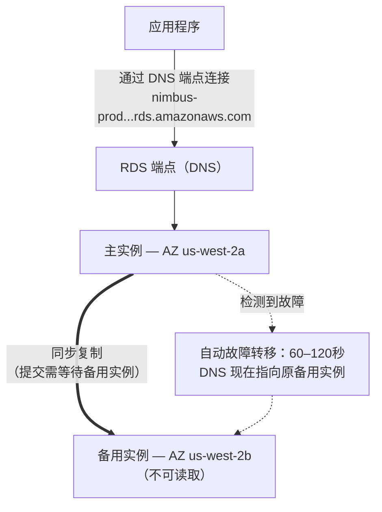

# 第8章：从不请病假的数据库管理员

凌晨3点，警报来了。

Priya 是唯一醒着的人。她的手机在床头柜上亮了起来，她在黑暗中读着屏幕，亮度太高了。她坐起身，凭记忆找到笔记本电脑，没开灯就打开了它。

键盘在黑暗的房间里轻轻地敲击着。

数据库服务器需要打安全补丁——那种需要重启的补丁。漏洞是真实存在的，补丁已经可用，而在不打扰客户的情况下应用它的窗口就是现在，就在半夜，流量最低的时候。

她连接到服务器。她拉取了补丁。她应用了它。

然后她读了发行说明。

这次软件包更新触及了 PostgreSQL 用来定义连接参数的配置文件。发行说明中包含一条警告：取决于升级的执行方式，自定义过的配置文件可能会被软件包的默认版本替换。

他们的配置文件是自定义过的。Leo 两个月前编辑过它，调优了 max_connections 设置。

补丁运行了。服务器重启了。数据库重新上线了。

Priya 测试了一个查询。能用。

她检查了日志。一切看起来正常。

凌晨4点15分，她回去睡觉了。

早上9点05分，Leo 打开应用程序，得到一个错误。他检查了数据库。最大连接数被设成了默认值：100。而他们的应用程序被配置为使用最多500个连接的连接池。

每个新的连接尝试都在失败。应用程序实际上已经失去了数据库访问。

"发生了什么？" Maya 问。

"补丁，" Priya 说。她已经在看配置文件了。"软件包更新用默认配置文件覆盖了我们自定义的配置文件。Leo 的 max_connections 调优就这么没了——服务器用出厂设置重启了，而且没有人收到任何错误。它静悄悄地回退到了默认值。"

"修复要多久？" Leo 问。

"二十分钟，" Priya 说。"但我们需要一个维护窗口。这需要一次配置变更和一次重启。"

"两小时后就有餐厅要开门迎接午餐了，" Tom 说。

Priya 用十八分钟修复了它。维护窗口造成了十二分钟的实际停机。餐厅受到了影响，但高峰还没开始。

早上她告诉了团队发生的事情。一阵沉默。

"这还会再发生，" Tom 说。

"每次有补丁都会发生，" Priya 说。"而且总是会有补丁。必须有更好的办法来处理这件事。"

八秒的查询时间问题仍未解决。而就在同一周，又来了这个：一个凌晨3点的维护窗口变成了一场早晨的事故。两个问题有着同一个根本原因——Nimbus 在运行一个他们没有能力管理的数据库。

解决方案是存在的。只是需要放弃"他们必须自己管理数据库"这个想法。

**传统数据库问题**

当你在 EC2 实例上自己运行数据库时，你要对一切负责。

安装数据库软件。安全地配置它。在发现安全漏洞时给它打补丁。做备份。测试备份是否真的有效（大多数团队跳过这一步，直到为时已晚）。监控磁盘空间。为冗余设置复制。为主服务器宕机配置故障转移。调优查询性能。在负载下管理连接。

这些都不是应用程序本身。没有一项能增加功能。但全都需要专业知识。

专业知识的要求是关键问题。一名合格的数据库管理员不仅懂得如何运行数据库，还懂得如何：

- 监控慢查询日志并识别性能瓶颈
- 为工作集合理配置内存以避免磁盘 I/O
- 配置 WAL 归档以实现时间点恢复
- 设置带自动故障转移的同步流复制
- 调优连接池以防止负载下的连接耗尽
- 在不丢失数据、不长时间停机的情况下执行主要版本升级

这是一套独立的、专门化的技能。资深 DBA 之所以能拿到高薪，正是因为把这一切做好很难。大多数初创公司雇不到这样的人。大多数开发团队也不具备这种能力。

大多数开发团队不是数据库管理员。这造成了一个可预测的模式：数据库被安装、做了最低限度的配置，然后基本上被遗忘，直到出现灾难性的问题。Nimbus 的 PostgreSQL 实例一直运行在默认配置上——max_connections 是100，没有连接池，手动备份 Leo 做过两次就忘了，而且完全没有任何复制。

凌晨3点的补丁事故是一个症状：这个系统由一群擅长构建应用程序、却没有任何数据库运维背景的人在运行。这不是批评——这是对大多数初创公司的准确描述。解决方案不是雇一名 DBA。解决方案是使用一个能自动提供 DBA 级别运维的服务。

"我们就是那样做的吗？" Maya 问。

Leo 的回答是沉默，这就等于是肯定。

**托管数据库**

想象一下雇用这样一位数据库管理员：从不请病假，自动处理每一个安全补丁，每晚不用吩咐就做备份，出了问题还能自我修复。他们做这一切都不会打扰你——而且在任何情况下，绝不碰你的应用程序逻辑。

AWS 把这个服务叫做 **RDS**——Relational Database Service（关系数据库服务）。

使用 RDS，AWS 管理：

- 安装和给数据库引擎打补丁
- 自动备份（存储在 S3，保留最多35天）
- 自动故障转移（当主数据库宕机时，备用数据库自动接管）
- 监控和指标
- 静态加密和传输加密
- 存储自动扩展（如果你启用它，磁盘在快满时自动增长）

你管理：

- 数据库架构（你的表的结构）
- 你的查询和应用程序逻辑
- 谁可以访问数据库
- 哪种实例类型运行数据库
- 参数调优（尽管 RDS 提供了合理的默认值）

**支持的引擎**

RDS 支持几种流行的数据库引擎：

- **MySQL**——使用最广泛的开源关系数据库
- **PostgreSQL**——功能强大、可扩展，在复杂工作负载中越来越受欢迎
- **MariaDB**——开源的 MySQL 分支，完全兼容
- **Oracle**——企业级，在有遗留要求的大型组织中使用
- **Microsoft SQL Server**——用于以 Windows 为主的环境
- **Amazon Aurora**——AWS 自己的 MySQL/PostgreSQL 兼容引擎，为云而构建（我们在第24章深入介绍 Aurora）

对于 Nimbus，选择是 PostgreSQL。这是 Leo 熟悉的，而且它能很好地处理关系数据。对大多数应用程序来说，引擎的选择没有你想象的那么重要——无论选哪个引擎，RDS 的运营优势都同样适用。

有一个细微之处：当你在 RDS 上运行某个引擎时，AWS 会自动维护次要版本补丁（在你配置的维护窗口期间）。主要版本升级——比如从 PostgreSQL 14 升到 15——是需要你安排并执行的手动操作。AWS 对主要版本升级做了细致的测试，但你应该先在预发布环境中测试。主要版本变更可能引入与特定 SQL 语法、扩展或驱动版本的兼容性问题。

Leo 发现这一点是在 RDS 应用了一个次要补丁之后——应用程序日志短暂地显示了一条弃用警告，提到一个在某个子版本中已被移除的函数。次要补丁本应基本上是透明的——但在每个维护窗口之后监控你的应用程序日志是一个好习惯。

"我们想过如果次要补丁弄坏了什么会怎样吗？" Priya 问。

"我们回滚到上一个快照，" Leo 说。

"那要多久？"

Leo 查了一下他们数据库规模对应的 RDS 恢复时间。对于一个跑在 `db.m6i.large` 上的 50GB 数据库：从快照恢复大约需要15到30分钟。

"所以如果补丁弄坏了生产环境，我们有一个15到30分钟的恢复窗口，" Priya 说。"而且我们在清晨的维护窗口应用补丁，至少影响是最小的。"

"而且我们先在预发布环境测试补丁，" Leo 补充道。

"对，" Priya 说。"还有这条。"

**RDS 实例规格选择：工作负载并非生而平等**

创建 RDS 实例时，你要选择一种实例类型——与 EC2 是同一个概念，只是限定在数据库工作负载范围内。AWS 把 RDS 实例类型组织成几个实用的层级。

**db.t3 系列**：可突增性能实例。为开发、预发布和不需要持续高 CPU 的轻量生产工作负载设计。`db.t3.micro` 适合低流量的开发数据库。`db.t3.medium` 能处理带有偶尔突增的中等生产负载。

T 系列实例的取舍在于：它们在低利用率时段累积 CPU 积分，在突增时段消耗这些积分。如果你让一个 T 系列实例长时间保持高 CPU，积分会被耗尽，性能会被限制到一个可能不够用的基线水平。

**db.m6i 系列**：通用型实例，性能稳定、不可突增也无需突增。`db.m6i.large` 是生产数据库常见的起点。这些实例没有积分限制——只要你需要，CPU 随时全量可用。

**db.r6i 系列**：内存优化实例。每个 vCPU 配备的 RAM 比 M 系列更多。适合工作集很大的数据库——那些受益于数据驻留在内存中、而不是每次访问都从磁盘读取的查询。如果你的数据库性能在增加 RAM 后显著提升，R 系列就是正确的选择。

对于 Nimbus：

- 开发和预发布环境：`db.t3.medium`。足以应付开发查询，成本低。
- 生产环境：`db.m6i.large`。性能稳定，RAM 足够容纳菜单和订单的工作集，没有积分限流。

"m6i.large 比 t3.medium 贵多少？" Tom 问。

Leo 查了价格页面。`db.t3.medium` 大约每月 $55。`db.m6i.large` 大约每月 $140。差距是实实在在的，但可靠性的差距也是。

"t3 在持续负载下会被限流，" Priya 说。"如果某个周五很忙，CPU 持续四个小时居高不下，t3 就会耗尽积分然后被限流。m6i 不会。"

Tom 记下了这个数字。他还记下了两周前那次周五宕机的成本。这个对比毫无悬念。

生产环境上了 `db.m6i.large`。

**多 AZ：随时接管的备用实例**

这是彻底改变可靠性计算的功能。

**多 AZ 部署**意味着 RDS 在与主实例不同的可用区维护一个同步的备用实例。提交到主实例的每一笔事务，都会在提交被确认之前同步复制到备用实例。

当主实例失败时——硬件故障、AZ 中断、软件崩溃——RDS 会自动故障转移到备用实例。数据库端点的 DNS 记录会被更新。你的应用程序重新连接到新的主实例。

故障转移需要60–120秒。在这个窗口期间，你的应用程序会遇到连接错误。编写规范的应用程序应该能优雅地处理这种情况（带退避的连接重试）。

备用实例不是只读副本。它不处理读取流量。它的唯一目的就是随时准备接管。



（注：较新的**多 AZ DB 集群**部署选项维护*两个***可读的**备用实例，并能在约35秒内完成故障转移——考试可能会把它与这里描述的经典多 AZ *实例*部署区分开来。）

"多 AZ 要多少钱？" Tom 问。

大约是单个实例成本的两倍——因为你实际上在运行两个数据库实例。备用实例的成本与主实例相同。

Tom 打开订单历史，估算了他们周五高峰期每小时的收入。

"那如果有人在故障转移窗口期间试图入侵呢？" Priya 问。"当主实例宕机、备用实例正在提升的时候，是不是有六十秒我们是暴露的？"

"故障转移是透明的，" Maya 说，"但这个问题问得对。连接字符串应该使用 RDS 端点，而不是硬编码的 IP——否则故障转移就不会是无缝的。"

那天下午就启用了多 AZ。

**自动备份和时间点恢复**

RDS 每天进行自动备份。AWS 把这些备份存储在 S3 中（由 RDS 管理——你不会直接在你的 S3 控制台中看到它们）。你可以把数据库恢复到备份保留期内的任何时间点。

备份发生在可配置的**备份窗口**期间——一个低流量时段，通常在清晨。（这与**维护窗口**是两个独立的设置——后者是 RDS 应用补丁和配置变更的时段。考试喜欢测试这是两个不同的窗口。）对于大多数引擎类型，备份不会造成停机——而且在多 AZ 部署上，快照是从备用实例上做的，主实例完全不受影响。

**时间点恢复**是最有价值的功能之一：你可以恢复到保留期内的任何一秒。不只是每日快照——*任何一秒*。之所以可能，是因为 RDS 除了每日备份之外，还在持续归档事务日志。

如果有人在下午2:37不小心运行了 `DELETE FROM orders WHERE 1=1`，你可以恢复到下午2:36。

Leo 在理解这一点时明显松了口气。

"我已经把备份保留期设成一天了，" Leo 说。"哦——不过没关系吧？我们可以改的对吧？"

"改成至少七天，" Priya 说。"生产环境三十天。"

Leo 立刻更新了设置。

"我们本来可以从我上个月删掉的东西恢复吗？" 他问。

"在 RDS 之前？不行，" Priya 说。"在 RDS 之后？可以。"

你可能想知道：自动备份和手动快照有什么区别？自动备份在保留期到期后会被删除（最多35天）。手动快照会一直保留，直到你显式删除它们。如果你需要永久保存某个数据库状态——大型迁移之前、有风险的部署之前——做一次手动快照。

**RDS Proxy：在规模化下解决连接问题**

迁移到 RDS 两周后，Leo 在指标中注意到了一些东西。

数据库处理查询没有问题。但打开的连接数很高——比他预期的要高。随着 Auto Scaling Group 在高峰期添加 EC2 实例，每个新实例都会打开自己的一池数据库连接。十个 EC2 实例，每个有一个50连接的连接池：五百个同时连到数据库的连接。

"PostgreSQL 的每个连接都有开销，" Priya 说。"内存，连接处理器的 CPU。五百个连接光是连接管理就占用了数据库相当一部分资源——还没干任何实际的活儿。"

"我们能缩小连接池吗？" Leo 问。

"可以，" Priya 说。"但那样我们就要冒高峰期请求排队等连接的风险。"

更好的解决方案是：**RDS Proxy**。

RDS Proxy 位于应用程序和数据库之间。EC2 实例连接到 Proxy，而不是直接连接到 RDS 实例。Proxy 维护一池数据库连接，并把应用程序的请求多路复用到这些连接上。如果十个 EC2 实例各自向 Proxy 打开五十个连接，Proxy 可能只维护一百个实际的数据库连接——在所有应用请求之间高效共享。

带来的好处：

**连接池化**：更少的实际数据库连接意味着 RDS 实例上更少的内存开销，以及更好的负载下性能。

**更快的故障转移**：在多 AZ 故障转移期间，Proxy 在应用程序一侧保持连接，同时在后端重新建立数据库连接。应用程序看到的是一次短暂的停顿，而不是一次完整的连接重置。RDS Proxy 把故障转移的影响从60–120秒缩短到通常30秒以内。

**IAM 身份验证**：应用程序可以使用 IAM 角色向 RDS Proxy 进行身份验证，而不是把数据库凭证嵌入应用程序里。Proxy 负责处理实际的数据库凭证。这彻底消除了应用环境中的机密信息。

"RDS Proxy 要多少钱？" Tom 问。

它的费用大约是底层 RDS 实例每 vCPU 小时 $0.015，与实例本身分开计费。对于一个 `db.m6i.large`（2个 vCPU），Proxy 每月大约增加 $22。

Tom 看了看连接数曲线图——高峰期五百个连接在争抢数据库资源——又看了看每月 $22 的成本。

"这比为了应付连接开销而升级到更大的 RDS 实例便宜，" 他说。

那一周就启用了 RDS Proxy。

"那如果有人试图通过 Proxy 入侵呢？" Priya 问。"Proxy 的 IAM 认证能减少攻击面吗？"

"能，" Priya 回答了自己的问题。"应用环境里没有数据库凭证，就意味着没有数据库凭证可以从应用程序里偷。"

她为 Proxy 启用了 IAM 身份验证。

**只读副本：扩展读取流量**

多 AZ 关乎可用性。**只读副本**关乎性能。

只读副本是你主数据库的异步副本，可以处理读取查询。主流 RDS 引擎——MySQL、PostgreSQL 和 MariaDB——最多支持15个只读副本（Aurora 同样支持最多15个 Aurora 副本，共享同一个存储卷）。

应用程序需要做修改：把读取查询发送到副本，把写入查询发送到主数据库。这样分散了负载：主数据库处理写入和复杂事务；副本处理读取。

关键特征：

- 复制是**异步的**——主数据库和副本之间可能有小的延迟（滞后）。如果你写入一条记录并立即从副本读取，你可能还看不到它。
- 只读副本可以在同一区域，也可以在不同区域（跨区域副本增加延迟，但支持地理分布）。
- 在灾难场景中，只读副本可以被提升为独立数据库。

对于 Nimbus：菜单查询是读取。订单历史是读取。绝大多数流量都是读取流量。添加一个只读副本并把读取路由过去，可以显著降低主数据库的负载。

我们在第24章讨论 Aurora 时会更深入地介绍只读副本。

**如果读取密集就加副本，但要盯住滞后**

如果你的工作负载是读取密集型的，添加只读副本可以减轻主数据库的负载、提升查询性能——但复制是异步的，这意味着副本可能略微落后于主数据库。如果你的应用程序写入一条记录后立即读回它，它必须从主数据库读取，而不是副本。把这一点搞错会产生微妙的、难以调试的数据新鲜度 bug：用户下了一单，确认页面查询了副本，副本还没追上来，订单看起来不见了。这叫做"读自己写"一致性（read-your-writes consistency），是团队初次添加副本时最常犯的错误。

**Performance Insights：找出慢查询**

八秒的菜单加载时间仍然是个问题。迁移到 RDS 提升了可靠性，但那条查询依然很慢。

Leo 添加了一个只读副本，并把菜单查询路由到了它上面。菜单加载时间降到了大约四秒。好一些了。仍然算不上好。

"查询还是慢，" Maya 说。"我们缓解了瓶颈，但没有修复它。"

RDS 包含一个叫做 **Performance Insights** 的功能——一个监控工具，能显示哪些查询消耗了最多的数据库资源、哪些会话在等待、它们在等什么。

Leo 在只读副本上启用了 Performance Insights，并在一个下午的测试时段里反复加载菜单页面。

Performance Insights 仪表板显示有一条查询主导了负载：对 `menu_items` 表的全表扫描，每次加载菜单页面都要取出全部22,000行。`restaurant_id`——应用程序用来过滤的那一列——上没有索引。

没有索引时的执行时间：8.2秒。

Leo 加上了索引。

```sql
CREATE INDEX idx_menu_items_restaurant_id ON menu_items(restaurant_id);
```

有了索引后的执行时间：14毫秒。

从8,200毫秒到14毫秒。这就是一个把顾客赶走的餐厅点餐应用，和一个让人用起来毫无感觉的应用之间的差别。

"问题一直就是这个？" Maya 说。

"问题就是这个，" Leo 说。

"Performance Insights 找到它花了多久？"

"大概二十分钟。"

Tom 已经在算账了。三周的次优菜单加载时间，估计这段时间有200,000次菜单页面加载，估计因为太慢导致15%的放弃率。他最后算出来的数字让人很不舒服。

"下次上线前先把缺的索引加上，" 他说。

"会有一份检查清单的，" Priya 说。她已经在写了。

**什么时候不该用 RDS**

RDS 对相当广泛的关系数据库工作负载来说都很出色。但它并不是所有问题的正确答案。

**当你需要操作系统级访问时**：RDS 不给你访问底层操作系统的权限。你不能安装自定义的操作系统软件包、不能修改内核参数、不能运行需要数据库服务器 root 权限的工具。如果你的数据库有需要操作系统访问权限的要求——某些 Oracle 配置、自定义存储驱动、特定的网络接口——你就需要直接在 EC2 实例上运行数据库。

**当你使用不受支持的引擎时**：RDS 支持 MySQL、PostgreSQL、MariaDB、Oracle、SQL Server 和 Aurora。如果你的应用程序使用其他数据库引擎——CockroachDB、SingleStore、Greenplum——你就得在 EC2 上运行它，而不是 RDS。

**当你需要写入密集型的水平扩展时**：RDS 通过副本来扩展读取。写入则全部进入一个主实例。如果你的工作负载是写入密集型的、需要分布到多个写入节点，RDS 就不是正确的架构。Aurora 的 Global Database 在大规模场景下能提供一些帮助，但对于极端的写入扩展需求，DynamoDB（第9章）或跑在 EC2 上的 CockroachDB 这样的分布式数据库才是合适的工具。

**当托管成本超过运营成本时**：对于非常大型、稳定的工作负载，如果你的团队真正具备数据库管理专业能力，用自己的工具链在 EC2 上运行 PostgreSQL 可能比 RDS 更便宜。对于不以 DBA 为主业的团队来说这种情况并不常见。但它是真实存在的，一个好的架构师会承认这一点。

对于 Nimbus——一家没有专职 DBA 资源的初创公司，在托管服务上运行 PostgreSQL，增长还难以预测——RDS 显然是正确的选择。

**RDS 参数组和选项组**

考试中会出现的两种配置机制：

**参数组**控制数据库引擎设置——比如最大连接数、查询缓存大小、超时值。RDS 会创建一个适用于大多数情况的默认参数组。当你需要调整特定设置时，你创建自定义参数组。

**选项组**为某些引擎启用额外功能——比如 Oracle 的原生网络加密或 SQL Server 的透明数据加密。大多数开源引擎的部署不需要自定义选项组。

你可以通过这些机制自定义数据库引擎的行为——但对大多数刚起步的团队来说，默认值就够用。

### 把数据搬进来：AWS Database Migration Service

几周后，Tom 带着一页幻灯片来到了站会。

Nimbus 要收购一家小型的区域竞争对手。对方的订餐系统运行在一个托管机房（co-location）里的 MySQL 数据库上。这个系统在迁移期间不能下线——餐厅正在使用它。

"我们需要把他们的数据搬进 RDS，" Tom 说。"而且不能让系统停机。"

"数据库有多大？" Leo 问。

"大概80 GB。"

"他们什么时候需要完成切换？"

"六周。"

Priya 已经调出了文档。"AWS DMS，" 她说。

**AWS DMS（Database Migration Service，数据库迁移服务）**以最小的停机时间把数据从源数据库迁移到目标数据库。它分两个阶段处理迁移：先对现有数据做一次全量加载，然后在源数据库继续运行的同时持续复制变更。

迁移分两种类型：

**同构迁移：**源和目标是相同的引擎——MySQL 到 RDS MySQL，PostgreSQL 到 Aurora PostgreSQL。架构是兼容的；DMS 直接迁移数据。

**异构迁移：**源和目标是不同的引擎——Oracle 到 Aurora PostgreSQL，SQL Server 到 RDS MySQL。架构必须先做转换。这需要 **AWS Schema Conversion Tool（SCT）**先翻译架构，然后由 DMS 来搬数据。

对于 Nimbus 这次收购：MySQL 到 RDS MySQL。同构迁移。不需要 SCT。

实际工作流程：

1. DMS 从源端读取——托管机房里的 MySQL 数据库
2. **全量加载**：DMS 把所有现有数据复制到目标 RDS 实例
3. **CDC（Change Data Capture，变更数据捕获）**：全量加载之后，DMS 读取源数据库的事务日志，近乎实时地把持续发生的变更复制到目标端
4. 源端持续运行。等团队准备好了，他们切换连接字符串。

"所以餐厅订餐系统全程保持在线？" Tom 问。

"全程在线，" Priya 确认。"源端和目标端通过 CDC 保持同步。等我们准备好了，就切换端点。停机时间就是这次变更传播所需的那几秒钟。"

DMS 支持几十种源和目标的组合：Oracle、SQL Server、MySQL、PostgreSQL、MongoDB、DynamoDB、S3、Redshift、Aurora 等等。

"等等——可是*为什么*异构迁移需要一个单独的工具？" Maya 问。"DMS 不能自己搞定架构差异吗？"

"Oracle 里的 VARCHAR 和 PostgreSQL 里的 VARCHAR 不是一回事，" Priya 说。"数据类型、存储过程、序列、专有函数——它们不是一一对应的。SCT 分析源架构，为目标生成最接近的等价物。然后 DMS 把数据搬进这个转换好的架构里。把架构转换和数据搬运分开，正是这个流程可靠的原因。"

"那如果有人试图通过 DMS 复制实例入侵呢？" 片刻之后 Priya 又问了自己。"它需要源端的读权限和目标端的写权限。"

"两端都最小权限，" Leo 说。"源端只读 IAM。写权限只限定到迁移目标。而且复制实例待在私有子网里。"

Priya 记了下来。

## 优势与局限性

**为什么 RDS 很出色**：

- 消除了管理数据库软件的运营负担
- 自动备份和时间点恢复
- 多 AZ 提供自动故障转移，RTO 最小化
- 只读副本用于扩展读取流量
- 内置的静态加密和传输加密
- 支持所有主流关系数据库引擎
- RDS Proxy 提供连接池化和更快的故障转移响应

**RDS 的局限**：

- 你无法访问底层操作系统。如果你的数据库有需要操作系统级访问的要求，你可能需要运行自己的基于 EC2 的数据库。
- RDS 不是无服务器的（有例外——Aurora Serverless 存在，在第24章介绍）。即使空闲，你也要为运行中的实例付费。
- RDS 不是为水平分片数据库设计的。对于写入密集型关系工作负载的大规模横向扩展，你最终可能需要不同的架构。
- 对于非关系型（NoSQL）数据模式，DynamoDB（第9章）更合适。

## 摘要

Priya 凌晨3点的补丁窗口只是症状。根本原因在于 Nimbus 正在管理一个托管服务能管得更好的数据库。RDS 不只是消除了凌晨3点把人叫醒的电话——它把打补丁、故障转移、备份和连接管理的责任转移给了 AWS，让团队能专注于真正服务客户的应用代码。代价是失去操作系统级访问，但这很少有影响，而且远没有听起来那么严重。

- **Amazon RDS** 是托管的关系数据库服务。AWS 负责打补丁、备份、故障转移和存储。你负责架构、查询和应用程序逻辑。
- **多 AZ** 在不同 AZ 维护一个同步备用实例。自动故障转移在60–120秒内发生。连接字符串永远使用 RDS 端点的 DNS 名称——而不是硬编码 IP——这样故障转移才是透明的。
- **只读副本**是处理读取流量的异步副本。复制滞后意味着它们可能略微落后——"读自己写"一致性要求在写入后立即读取时必须读主数据库。
- **RDS Proxy** 池化连接，降低开销并提高故障转移速度。对于可能创建数千个短生命周期连接的 Lambda 工作负载至关重要。
- **Performance Insights** 识别慢查询——找出一个缺失的索引就能把8秒的查询变成14毫秒。主要版本升级是手动的；先在预发布环境测试。

## 考试技巧

*SAA-C03 领域3——任务3.3（数据库解决方案）*

- **多 AZ 用于高可用性，不是性能。** 备用实例不处理读取流量。只读副本才是用于性能的。这个区别经常被考。
- **多 AZ 故障转移是自动的。** 你不需要配置它何时、如何发生。RDS 监控主实例并自动触发故障转移。
- **复制滞后很重要。** 只读副本可能略微落后于主数据库。如果你的应用程序需要读取它刚写入的数据，它必须从主数据库读取，而不是副本。这称为"读自己写一致性"（read-your-writes consistency）。
- **自动备份保留0–35天。** 把保留期设为0会禁用自动备份。手动快照会一直保留，直到你删除它们。
- **RDS 存储自动扩展**防止磁盘写满导致的中断。启用它。它只向上扩展，从不向下缩减。考试可能测试你是否知道这种不对称性。
- **RDS Proxy** 出现在涉及 Lambda 函数连接 RDS 的考试场景中（Lambda 可能创建数千个短生命周期连接，没有 Proxy 会压垮数据库），或要求更快多 AZ 故障转移的场景中。
- **db.t3 实例会突增也会限流。** 描述小型 RDS 实例间歇性性能下降的考试场景，可能说的就是 T 系列实例的 CPU 积分耗尽。解决办法是升级到 M 或 R 系列实例。
- **多 AZ DNS 端点**：当多 AZ 故障转移发生时，RDS 端点的 DNS 记录会被更新，指向新的主实例。使用 RDS 端点（而不是硬编码 IP）的应用程序会自动重连。使用过长 DNS TTL 或硬编码 IP 地址的应用程序不会自动重连。永远使用 RDS 端点。
- **只读副本提升**：只读副本可以被提升为独立的数据库实例——当主数据库丢失且未配置多 AZ 时，这对灾难恢复很有用。提升是单向操作：副本变成主数据库，不再从原数据库复制。问到"手动提升"或"把只读副本转换为主数据库"的考试场景，涉及的就是这个操作。
- **Performance Insights** 按等待时间和 CPU 使用率识别最耗资源的 SQL 查询。当考试场景问如何诊断 RDS 数据库上的慢查询时，Performance Insights 就是 AWS 原生的答案。
- **RDS 与在 EC2 上自建数据库**：考试有时会把这呈现为一道选择题。RDS 提供托管运维，但限制操作系统级访问。基于 EC2 的数据库给你完全的控制权，但运维需要 DBA 专业能力。考试场景里出现"需要操作系统级访问"这种措辞，就是选 EC2 而不是 RDS 的信号。
- **AWS DMS：**使用全量加载 + CDC 以最小停机时间迁移数据库。同构（相同引擎）= 直接用 DMS。异构（不同引擎）= 先用 SCT 转换架构，再用 DMS 搬数据。考试触发词："以最小停机时间迁移数据库"或"Oracle 到 Aurora" → DMS + SCT。

## 练习

**练习 1——回忆**

用你自己的话：RDS 中多 AZ 和只读副本之间有什么区别？它们各自解决了什么问题？

*（提示：一个防止停机；另一个在读取密集型负载下提升性能。它们解决不同的问题，可以一起使用。）*

**练习 2——SAA-C03 场景题**

*场景*：一家公司在 RDS 上运行一个生产 PostgreSQL 数据库。由于全天运行的报表查询，数据库的读取流量很高。团队同时担心数据库可用性——在故障场景中他们承受不了超过几分钟的停机。他们还希望最小化报表工作负载对主数据库的影响。

哪种 RDS 功能组合**最能**同时解决这两个问题？

A) 启用多 AZ，并把所有查询都跑在备用实例上  
B) 更频繁地做手动快照，如果主数据库失败就从快照恢复  
C) 创建多个只读副本，并禁用多 AZ 以降低成本  
D) 启用多 AZ 提供故障转移保护，并为报表查询创建一个只读副本

**提示 1**：两个需求是：（1）故障期间的可用性，（2）卸载读取。哪些功能解决哪个需求？

**提示 2**：多 AZ 提供自动故障转移。备用实例*不*处理读取流量。所以仅靠多 AZ 解决不了读取问题。

**提示 3**：只读副本处理读取流量。多 AZ 提供故障转移。两者都需要。

**答案**：D

**解析**：多 AZ 提供到不同 AZ 中备用实例的自动故障转移——这解决了可用性需求。只读副本允许报表查询在不影响主数据库的情况下运行——这解决了性能需求。两种功能可以同时使用。

**为什么不是 A？** 多 AZ 备用实例不能处理读取流量。它专门用于故障转移。尝试直接查询它是不受支持的。

**为什么不是 B？** 手动快照要恢复数据库的一份完整副本——这个过程长得多（大型数据库可能需要数小时）。这不满足"几分钟停机时间"的需求。

**为什么不是 C？** 只读副本有助于读取性能，但不提供自动故障转移。如果主数据库失败，你需要手动提升一个只读副本——这需要时间，而且不是自动的。

*SAA-C03 领域3——任务3.3*

**练习 3——架构挑战** *（可选）*

Nimbus 正在考虑把现有的自管理 PostgreSQL 数据库（运行在一个 EC2 实例上）迁移到 RDS PostgreSQL。迁移需要以最小的停机时间进行——理想情况下在15分钟以内。数据库大小为200 GB。

你会推荐什么方案？哪些 AWS 服务可能有助于迁移？在切换生产流量之前，你会测试哪些风险？

*（没有唯一正确答案。思考一下 AWS Database Migration Service、逻辑复制，以及切换期间数据不一致的风险。）*

## 彩蛋场景

到那天结束时，Nimbus 已经迁移到了启用多 AZ 的 RDS PostgreSQL。迁移本身花了大半个下午——Leo 使用了备份加恢复的方案，外加一个短暂的维护窗口。

Tom 一直在仔细盯着账单。

"RDS 实例，" 他说，"成本是 EC2 数据库的两倍。"

"自动备份呢？" Maya 问。

"再多一点。"

"那如果主数据库宕机，我们免费获得的故障转移呢？"

Tom 对此没有价格。他把它记下来作为一个问题。

三天后，数据库运转良好。在 Leo 添加了缺失的索引之后，查询时间大幅下降。菜单在一秒之内就能加载出来。

"问题，" Priya 说，"不在于数据库引擎。在于数据模型。"

她停顿了一下。

"这里面有些数据根本就不是关系型的。菜单项、餐厅简介、配送区域——这些数据的形状是可变的。SQL 在和我们对着干。"

Leo 已经在研究什么了。

"如果我们给菜单用一种不同类型的数据库呢？" 他说。

下一章：即使一百万人同时下单也不会变慢的数据库。
