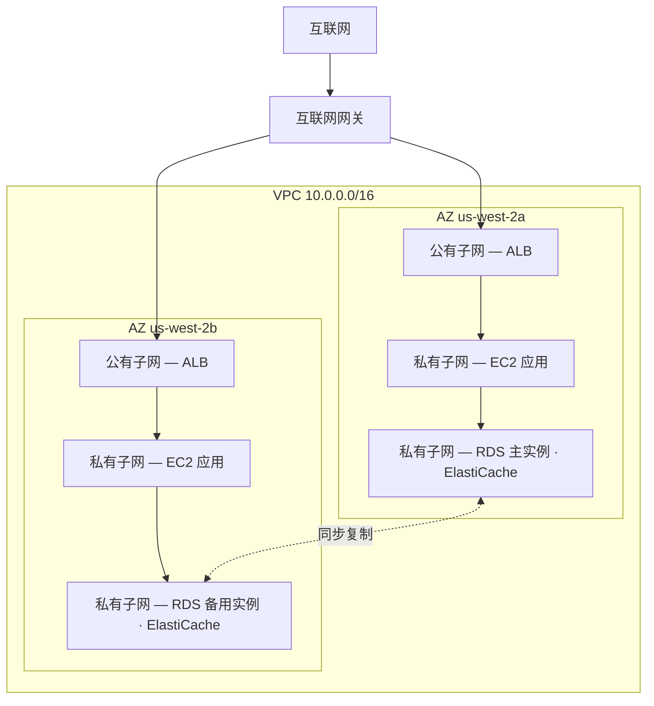

# 第11章：云端你的私人角落

Priya 手里拿着一张画了图的纸。

这不是一张复杂的图。一个矩形，标着"AWS"。矩形里面，一簇方框：EC2 实例、一个 RDS 数据库、一个 ElastiCache 集群。线条把所有东西连到所有其他东西上。矩形外面，一个单独的标签："互联网"。

她把它放在桌子中央。

---

*缓存层在正常运转。Redis 把页面加载从188毫秒压到了12毫秒。但当 Leo 还在庆祝这场胜利时，Priya 一直在读网络日志——而她不喜欢自己看到的东西。每个服务都在同一个扁平网络上。数据库有一个公网 IP 地址。Redis 集群从技术上讲可以从外部访问到。应用程序能用，但这个架构就是一个停车场：没有围栏，没有大门，没有分区。*

---

"这就是我们现在的状态，" 她说。"我们的数据库有一个公网 IP 地址。我们的缓存层可以从互联网访问到。我们的 EC2 实例全部在同一个扁平网络上。"

"这看起来没问题啊，" Leo 说。"我们有安全组。"

"你配置的安全组，" Priya 说。"在深夜。在最初搭建的时候。"

Leo 什么也没说。

"我不是在批评配置，" 她说。"我是说，当一切都生活在一个扁平的公共网络上时，一次错误配置就是'一个正常工作的系统'和'一个互联网上所有人都能访问的系统'之间的全部差别。"

她拿起一支红色记号笔，在数据库周围画了一个圈。

"这个东西不应该能从互联网访问到。一点都不应该。不是靠一条安全组规则，也不是靠一份加固过的配置。它应该在结构上就不可达。"

"我们需要谈谈网络架构，" Maya 说。

"三个月前我们就该谈了，" Priya 说。"不过现在也行。"

团队几周以来第一次围到了白板前。

**开放停车场的问题**

想象一个巨大的公共停车库。一万辆车。任何车都可以停在任何地方。区域之间没有隔断，没有闸门，没有预留区。

这就是一个开放网络。每个服务都能访问到其他每个服务。你的 Web 服务器能和你的数据库通信。你的数据库能访问互联网。你的缓存层能从任何地方接收连接。

当一切都能和一切通信时，一处沦陷就会波及一切。

"所以如果有人闯进了停车库，" Tom 说，"他们就能走到任何一辆车跟前。"

"而且从任何一辆车出发，开到任何地方，" Priya 确认道。"我们要围栏。我们要上锁的大门。我们要分区。"

VPC 就是你在 AWS 中构建这些分区的方式。

**什么是 VPC？**

"等等——可是*为什么*要那样做？" Maya 问。"如果我们已经在每个资源上都有安全组了，为什么还需要 VPC？安全组不是在做同样的事吗？"

安全组和 VPC 在不同的层面提供保护。安全组是附着在某个特定资源上的一条规则——它说"这台 EC2 实例只接受来自负载均衡器的8080端口流量"。但它仍然在公共网络上。那个 IP 地址仍然是可达的；规则只是在门口拦住了连接。VPC 则是把这扇门从公共街道上彻底移走。位于私有子网中的资源没有通往互联网的*路由*——按惯例也没有公网 IP——所以无论安全组怎么写，它都不可能从互联网被访问到。这是一种结构性的保证，而不是配置性的保证。

**虚拟私有云（VPC）**是 AWS 云中一块逻辑隔离的区域——一个由你定义的私有网络，默认只有你的资源可以访问。

把它想象成那座巨大公共停车库里一块围起来的私人车位区。你的区域有自己的规则：谁能进，谁能出，各个分区之间存在哪些通路。

创建 VPC 时，你定义：

**一个 CIDR 块**：你的网络内可用的 IP 地址范围。例如，`10.0.0.0/16` 给你65,536个可能的 IP 地址（10.0.0.0 到 10.0.255.255）。

**子网**：VPC 的细分，每个子网被分配你的 IP 地址范围的一部分，并与一个特定的可用区关联。

**路由表**：决定网络流量去向的规则。

**互联网网关（Internet Gateway）**：你的 VPC 与公共互联网之间的连接。

**子网：公有与私有**

并非所有资源都应该可以公开访问。

你的 Web 服务器需要接受来自互联网的流量——用户的浏览器需要访问到它。

你的数据库*永远*不应该接受来自互联网的流量——只有你的 Web 服务器应该能和它通信。

这就是子网登场的地方。

**公有子网**连接到一个互联网网关，可以包含拥有公网 IP 地址的资源。流量可以在它和互联网之间双向流动。

**私有子网**的路由表中没有通往互联网的路由。私有子网中的资源只能与你 VPC 内的其他资源通信（除非你设置了特定的出站路由）。按惯例，它们也没有公网 IP 地址。

对于 Nimbus，设计变得清晰了：



负载均衡器面向公网——它需要从互联网接收流量。EC2 实例是私有的——它们只接收来自负载均衡器的流量。数据库是私有的——它们只接收来自 EC2 实例的流量。

"所以要碰到数据库，" Tom 说，"得先穿过负载均衡器，再穿过 EC2 实例，再穿过数据库的安全组？"

"三层，" Priya 确认道。"纵深防御。"

---

**Nimbus 的 CIDR 规划**

"等等——可是*为什么*要那样做？" Maya 看着 CIDR 块的选择问道。"为什么 Priya 对 IP 地址范围这么讲究？我们不能就用 AWS 默认给的吗？"

"因为 CIDR 块以后非常难改，" Priya 说。"而且，如果我们以后要把这个 VPC 连到另一个 VPC，或者连到一个本地数据中心网络，重叠的 IP 范围会导致路由失败，调起来非常痛苦。"

她在白板上画出了规划。

Nimbus 的 VPC：`10.0.0.0/16`——总共65,536个地址。

| 子网 | CIDR | AZ | 用途 |
|---|---|---|---|
| Public A | 10.0.0.0/24 | us-west-2a | 负载均衡器 |
| Public B | 10.0.1.0/24 | us-west-2b | 负载均衡器 |
| Private App A | 10.0.10.0/24 | us-west-2a | EC2 应用服务器 |
| Private App B | 10.0.11.0/24 | us-west-2b | EC2 应用服务器 |
| Private Data A | 10.0.20.0/24 | us-west-2a | RDS、ElastiCache |
| Private Data B | 10.0.21.0/24 | us-west-2b | RDS、ElastiCache |

"为什么不把所有子网都设成 /16？" Leo 问。

"因为位于不同 AZ 的子网不应该共享一个地址空间。每个子网只在一个 AZ 里。如果我们以后要把这个 VPC 跟别的 VPC 对等，划分得越细，发生冲突的可能性就越小。而且每个 /24 给我们251个可用地址——对任何单一层级来说都绰绰有余。"

"AWS 在每个子网里保留五个地址，" Tom 看着文档说。"所以是251，不是256。"

"对。前四个和最后一个。网络地址、VPC 路由器、DNS 服务器、保留未来使用、广播地址。"

"那 /24 是你能接受的最小值了？"

"实践中是的。非常小的子网你会用 /28——比如一个 VPN 网关子网，它只需要寥寥几个 IP。但对于应用层级，/24 是一个合理的下限。"

Tom 把数字记了下来，还算了不同规格之间的每月成本差。他总是这么干。

---

**要避免的 CIDR 规划错误**

"我们想过如果子网不够用了会怎样吗？" Priya 问。她问这话不是因为她不知道。她问是因为团队其他人需要把答案内化。

Leo 想了想。"我们可以再加子网？"

"你可以往 VPC 里添加子网。但你不能调整一个现有子网的大小。如果你的私有应用子网满了——251个地址不够用——你就得创建一个新子网，再把实例迁移过去。"

"这事实际上多久会发生一次？"

"规划得好的话，很少。但人们常犯三个错误。"

她列了出来：

**错误一**：VPC 的 CIDR 设得太小。如果整个 VPC 用 `10.0.0.0/24`（254个地址），你还没规划完子网，空间就用光了。从 `/16` 开始，留足灵活性。

**错误二**：在多个 VPC 之间使用重叠的 CIDR。如果你的生产 VPC 是 `10.0.0.0/16`，而你的预发布 VPC 也是 `10.0.0.0/16`，你就永远无法把它们对等，也无法通过 transit gateway 把它们连起来。路由器不知道该把流量发往哪个 VPC。

**错误三**：不为未来的层级预留地址空间。Nimbus 的规划把 `10.0.30.0/24` 和 `10.0.31.0/24` 留空未分配——为将来的内部工具层、监控子网或 VPN 端点子网留出余地，而不必重构整个地址空间。

"按你以为需要的两倍来规划，" Priya 说。"子网是免费的。`/16` 里的 IP 地址空间很充裕。规划错误的代价是一次网络迁移。"

---

**NAT 网关：仍然能下载东西的私有子网**

私有子网无法访问互联网。但有时候，它们需要。你的 EC2 实例需要下载软件更新。你的应用程序需要调用外部 API。

这就是 **NAT 网关**（Network Address Translation，网络地址转换）登场的地方。

NAT 网关位于公有子网中。私有子网中的资源可以把出站流量发给 NAT 网关，由它中继到互联网——但互联网无法反过来主动发起连接。

它就像一扇单向旋转门。你可以出去。外面的人进不来。

"这每个月要花多少钱？" Tom 问。

NAT 网关的定价有两个组成部分：每个 NAT 网关的小时费，加上按 GB 计的数据处理费。

在 Nimbus 搭建这套东西的时候，大约是每个 NAT 网关每月 $32，加上每 GB 数据处理 $0.045。流量小的时候，固定费用占大头。到了一定规模，数据费用就会变得可观。

Tom 在配置完 NAT 网关之前，先设置了一个针对数据处理成本的账单警报。他见识过没人盯着的时候 AWS 数据费用长什么样。

让很多团队措手不及的意外是：流经 NAT 网关的每个字节都要收费。如果你私有子网里的 EC2 实例在下载大型软件包、向外部服务流式传输日志，或向外部 API 发送大量数据，NAT 网关的数据费用就会以惊喜的形式出现在账单上。对于 AWS 到 AWS 的流量，解决方案是：VPC 端点把通往 AWS 服务（S3、DynamoDB）的流量私有化路由，完全绕过 NAT 网关，消除那些数据费用。

"所以私有子网里的 EC2 实例通过 NAT 网关下载操作系统更新，" Tom 说。"那些更新有多少 GB？"

"每实例、每月，大概两到五 GB，" Leo 说。

"乘以十个实例。乘以十二个月。按每 GB $0.045——"

"每年十一到二十七美元，" Priya 接过话头。"在这个场景下，可以接受。"

"但如果我们在流式传输日志——比如把我们所有的应用日志发给一个外部可观测性服务——"

"那我们就把那些流量走 VPC 端点，或者改用 CloudWatch Logs，而不是从 NAT 出去。"

Tom 关掉了计算器。这笔账已经够清楚了。

### NAT 实例：预算型替代方案

"等等，" Tom 还盯着价格页面说。"我们就为了让私有实例能访问互联网，要按 GB 付费？这是唯一的选项？"

"这是托管的选项，" Priya 说。"还有一种更老的办法，但它有代价。"

在 NAT 网关出现之前，团队用一台普通的 EC2 实例实现同样的出站路由——一台"NAT 实例"。你在公有子网里启动一台 EC2 实例，在操作系统中启用 IP 转发，禁用源/目标检查（AWS 默认开启这个检查，会丢弃不是发给该实例的数据包），再把私有子网的路由表指向这台实例的 ENI。私有实例的流量会经它流向互联网，效果和 NAT 网关一样。

它现在仍然可用。AWS 仍然在文档中保留它。在流量非常低的场景下——比如一个只有寥寥几台实例、偶尔下载软件包的开发环境——一台 `t3.micro` NAT 实例每月成本可以不到五美元，相比之下 NAT 网关有固定小时费加按 GB 收费。

| | NAT 网关 | NAT 实例 |
|---|---|---|
| 管理 | 由 AWS 完全托管 | 你自己管理 EC2 |
| 可用性 | AZ 内冗余 | 单台 EC2——单点故障 |
| 带宽 | 最高 100 Gbps，自动扩展 | 受限于 EC2 实例类型 |
| 成本 | $0.045/GB + 小时费 | 仅 EC2 实例成本 |

成本优势消失得很快。在有实际意义的流量规模下，NAT 网关的按 GB 收费与你为承载这些带宽所需的 EC2 实例类型相比是有竞争力的——而且 NAT 网关零打补丁、零监控、故障时零应急响应（它根本不会故障）。

"那我们到底什么时候会用 NAT 实例？" Leo 问。

"一个用完即弃的开发环境，" Priya 说。"在那种地方你只跑一两台实例，偶尔更新一下软件包，又想把固定成本压到最低。生产工作负载——任何需要保持可用的东西——NAT 网关，每个 AZ 一个。"

考试会点名考这组取舍。模式是："在低流量的开发或测试环境中最小化 NAT 成本"指向 NAT 实例。"需要高可用的生产工作负载"指向按 AZ 部署的 NAT 网关。

你可能想知道：既然安全组已经存在并且默认拦截流量，带私有子网的 VPC 还能增加多少有意义的保护？因为"被安全组拦住"和"在结构上不可达"是两回事。安全组的一次错误配置——一条写错的规则、一个开放的端口——就可能暴露一个拥有公网 IP 的资源。而私有子网中的资源压根没有可以触达的公网 IP。你必须先攻陷负载均衡器和一台运行中的 EC2 实例，才有机会尝试接触数据库。私有子网在网络层面强制隔离，而不是在规则层面。

**路由表：流量如何找到自己的路**

每个子网都有一张**路由表**，告诉流量该去哪里。

一张典型的公有子网路由表是这样的：

| 目的地 | 目标                      |
|-------------|-----------------------------|
| 10.0.0.0/16 | local                       |
| 0.0.0.0/0   | igw-xxxx（互联网网关） |

第一条规则：发往你 VPC 范围内任何 IP 的流量保持在本地。第二条规则：其余所有流量（`0.0.0.0/0` 意为"一切"）发往互联网网关。

一张私有子网路由表：

| 目的地 | 目标                 |
|-------------|------------------------|
| 10.0.0.0/16 | local                  |
| 0.0.0.0/0   | nat-xxxx（NAT 网关） |

私有子网的流量要么留在本地，要么经 NAT 网关出去。没有直达互联网网关的路由。

**安全组与 NACL（预览）**

在 VPC 内部，你有两种工具在资源层面控制流量：

**安全组**（第15章深入介绍）充当单个资源的虚拟防火墙——一台 EC2 实例、一个 RDS 实例、一个负载均衡器。它们是*有状态的*：如果流量被允许进入，响应流量会自动被允许出去。

**网络 ACL（NACL）**工作在子网层面，并且是*无状态的*：你必须分别显式地允许入站和出站流量。

对大多数用例来说，安全组就够了。当你需要子网级别的控制时，NACL 提供了额外一层——例如，让某个特定 IP 范围永远碰不到一个子网。

"安全组在实例级别，" Leo 在白板上写道。"NACL 在子网级别。"

"还有，永远不要让22端口对 0.0.0.0/0 开放，" Priya 补充道，看着 Leo。

"那只有一次，" Leo 说。

"永远都恰好只有一次，" Priya 说，"直到不是的那一天。"

"那如果有人试图入侵呢？" Priya 还站在白板前说。"不是通过一条配置错误的安全组——如果他们攻陷的是负载均衡器本身呢？有什么能阻止他们横向移动到私有子网？"

"私有子网的 EC2 实例只接受来自负载均衡器安全组的流量，" Leo 说。"即使负载均衡器被攻陷，攻击者也只能发出看起来像正常 API 调用的请求。"

"而数据库只接受来自 EC2 安全组的流量，" Priya 说。"纵深防御。每一层都假设前一层可能失守。"

---

**VPC Flow Logs：看见正在发生的事**

"我们需要在网络上长眼睛，" VPC 重设计进行到第三天，Priya 说。

"我们有安全组和 NACL，" Leo 说。"流量是受控的。"

"受控不等于可见。如果有什么怪事发生——一次意料之外的连接尝试、发往某个奇怪端口的流量——我们怎么知道？"

VPC Flow Logs 捕获流经你 VPC 的网络流量的元数据。不是数据包内容——只是连接级别的信息：源 IP、目标 IP、端口、协议、数据包数、字节数、开始时间、结束时间，以及流量是被接受还是被拒绝。

一条典型的流日志条目是这样的：

```
2 123456789012 eni-0abc123 10.0.10.5 10.0.20.8 49321 5432 6 20 4320 1620000000 1620000060 ACCEPT OK
```

它告诉你：从 `10.0.10.5`（应用子网里的一台 EC2 实例）到 `10.0.20.8`（RDS 实例），端口5432（PostgreSQL），20个数据包，4,320字节，已接受。正常流量。

但启用 Flow Logs 几天之后，Priya 发现了这条：

```
2 123456789012 eni-0abc123 185.220.101.55 10.0.10.5 0 8080 6 1 40 1620003200 1620003201 REJECT OK
```

一个外部 IP——`185.220.101.55`——曾尝试连接这台 EC2 实例的8080端口。连接被安全组拒绝了。但这次尝试被记录了下来。

她查了这个 IP。它属于一个以自动化扫描而闻名的罗马尼亚地址段——互联网上每个公网 IP 都在持续不断地接收的那种背景噪音式探测。

"有人在探测我们，" 她说。

"但被拒绝了，" Leo 说。

"这次是。在我们继续之前，先启用 GuardDuty"——一个威胁检测服务，我们会在第17章正式认识它——"我们需要行为检测，而不只是边界拦截。"

Flow Logs 存储在 CloudWatch Logs 或 S3 中。可以用 CloudWatch Insights 或 Athena 来查询。Priya 设置了一个每晚运行的 CloudWatch Insights 查询，标记所有来自非 AWS IP 范围的被拒连接尝试。

"这每个月要花多少钱？" Tom 问。

"流日志按摄取进 CloudWatch 或 S3 的数据量（GB）收费。按我们的流量，大概每月八到十五美元。"

Tom 停顿了一下。"而替代方案是不知道有人在探测我们的网络。"

"对。"

"那没问题，" 他说，然后打开了控制台。

**在 Flow Logs 里读出一次端口扫描**

启用流日志两周后，Priya 跑了她的每晚 CloudWatch Insights 查询，发现了新东西。不是一次被拒连接——而是几十次，密集连续，来自同一个源 IP，扫过一连串端口。

```
185.220.101.55 → 10.0.10.5 port 22   REJECT
185.220.101.55 → 10.0.10.5 port 23   REJECT
185.220.101.55 → 10.0.10.5 port 25   REJECT
185.220.101.55 → 10.0.10.5 port 80   REJECT
185.220.101.55 → 10.0.10.5 port 443  REJECT
185.220.101.55 → 10.0.10.5 port 3306 REJECT
185.220.101.55 → 10.0.10.5 port 5432 REJECT
185.220.101.55 → 10.0.10.5 port 6379 REJECT
```

全部发生在五秒钟的窗口内。全部被拒绝。

"这是一次端口扫描，" Priya 说。"有人在探测这台实例上跑着哪些服务。"

"但全被拒绝了，" Leo 说。"所以安全组在尽它的本分。"

"安全组是在尽本分。但这次扫描对攻击者来说仍然有信息量——它能告诉他们哪些端口*没有*在超时之前拒绝，也就意味着那些端口在某个地方是开放的。它还告诉他们这台主机是活着的，值得继续调查。"

"我们怎么办？"

"两件事，" Priya 说。"第一：加一条 NACL 规则，封掉那个 IP 所属的整个 /24 范围。不只是那一个 IP——整个子网段。端口扫描器会在一个网段内轮换 IP。第二：加一个 CloudWatch 警报，当任何单一源 IP 在六十秒内产生超过十次被拒连接时触发。那种模式几乎总是扫描。"

她把两件事都设置好了。接下来一周，这个警报响了两次——一次还是来自那个罗马尼亚网段，一次来自一台位于新加坡的自动化扫描器。两次都在检测后的几分钟内在 NACL 处被封禁。

流日志拦不住攻击。它们让攻击变得可见。而可见的攻击是可以被响应的。反过来——流量在不可见中流动——意味着问题的第一个迹象就是损失本身，而不是那次尝试。

---

**单 NAT 网关陷阱**

VPC 重设计三个月后，Priya 做了一次故障演练。她想知道如果 `us-west-2a` 可用区发生中断，Nimbus 会怎样。

大部分都没问题。负载均衡器故障转移到了 `us-west-2b` 的实例上。`us-west-2b` 里的 RDS 备用实例本来就是热的。ElastiCache 提升了副本。应用程序继续处理请求。

然后 Leo 注意到他在 `us-west-2b` 的 EC2 实例不再收到操作系统更新通知了。他检查了 NAT 网关的配置。

只有一个。在 `us-west-2a`。

"两个 AZ 的私有子网的所有出站互联网流量，都走的是一个 AZ 里的一个 NAT 网关，" Priya 说。

"所以如果 `us-west-2a` 宕了——"

"`us-west-2b` 里的每台 EC2 实例都会失去出站互联网访问。它们无法下载更新。它们无法访问外部 API。没有缓存的 Secrets Manager 查询会失败。任何需要出站互联网的东西都会坏掉。"

修复方案：每个 AZ 一个 NAT 网关。每个 AZ 的私有子网把出站流量路由到同一个 AZ 里的 NAT 网关。当一个 AZ 故障时，只有那个 AZ 的流量受影响。

"那这个修复的价格是？" Tom 问。

"第二个 AZ 的 NAT 网关每月多三十二美元。"

Tom 沉默了片刻。

"`us-west-2b` 里的 EC2 算力在一次故障期间够不着外部 API 的代价，" Priya 说，"可不止三十二美元。"

Tom 批准了这项变更。

这是最常见的 VPC 设计错误之一：一个看起来高可用、实际上却是单点故障的 NAT 网关。如果你在三个 AZ 里有资源，却只有一个 NAT 网关，那你拥有的是三 AZ 的计算韧性和一 AZ 的网络韧性。两者并不匹配。

规则：每个 AZ 一个 NAT 网关，放在那个 AZ 的公有子网中。每个 AZ 的私有路由表指向它自己的 NAT 网关。成本不高。可用性的提升是实实在在的。


---

**VPC 对等连接：连接私有网络**

如果 Nimbus 成长为多个 VPC 怎么办？（这是会发生的。团队变大。服务被隔离到独立的账户里。）

**VPC 对等连接（VPC Peering）**让两个 VPC 像在同一个网络上一样私下通信。流量不会离开 AWS 的私有网络。

重要限制：

- VPC 对等不具有传递性。如果 VPC A 与 VPC B 对等，VPC B 与 VPC C 对等，A 和 C 无法通信——除非你再加一条直接的 A-C 对等连接。
- 对等的 VPC 之间 CIDR 块不能重叠。

对于拥有许多 VPC 的更大型架构，**AWS Transit Gateway**（第25章）能处理传递性路由，无需建立全网状的对等连接。

---

**AWS PrivateLink：私有访问 AWS 服务**

"那从私有子网访问 S3 呢？" Leo 问。"我们的 EC2 实例往 S3 写收据。现在那些流量是经 NAT 网关出去的。"

"VPC 端点，" Priya 说。"具体来说，S3 和 DynamoDB 用网关端点——它们是免费的。"

**VPC 端点（VPC Endpoint）**在你的 VPC 和某个 AWS 服务之间建立一条私有连接，完全绕过公共互联网。你的私有子网和该 AWS 服务之间的流量保持在 AWS 网络内部。没有 NAT 网关费用。没有互联网暴露。

对于 S3 和 DynamoDB，**网关端点（Gateway Endpoints）**免费且简单：往路由表里加一条记录，把发往 S3/DynamoDB 的流量指向端点而不是 NAT 网关。

对于其他 AWS 服务（Secrets Manager、KMS、SNS、SQS），**接口端点（Interface Endpoints）**会在你的子网中创建一个带私有 IP 地址的弹性网络接口（ENI）。发往该服务的流量走那个私有 IP。接口端点是收费的——大约每小时 $0.01，**按端点所部署的每个 AZ 计费**（一个在三个 AZ 里都有 ENI 的端点，费用是小时费率的三倍），外加约每 GB $0.01 的数据处理费——但它们让你不必再把敏感的 API 调用（比如 Secrets Manager 查询）经 NAT 网关或公共互联网路由。

"所以我们的 EC2 实例可以访问 S3、DynamoDB、Secrets Manager 和 KMS，" Priya 说，"全部从私有子网出发，没有任何互联网暴露，而且对 S3 和 DynamoDB 来说，没有任何 NAT 网关数据费用。"

Tom 重新算了一遍。S3 流量省下的钱，几个月内就能抵消 Secrets Manager 接口端点的成本。

"PrivateLink 是统称，" Priya 补充道。"AWS PrivateLink 是接口端点背后的底层技术。考试两个术语都会用。"

---

**一份排障清单**

VPC 重设计三个月后，Leo 把网络弄坏了。不算严重——他修改了一个路由表关联，不小心把私有应用子网与它的 NAT 网关路由断开了。

EC2 实例够不着外部 API 了。它们彼此之间能通，也能连到数据库。就是上不了互联网。出站的 HTTPS 调用开始失败。

他排查了四十分钟，Priya 递给了他一份清单。

"当 VPC 里某个东西够不着另一个东西时，按这个顺序检查，" 她说。

1. **源端的安全组**：出站规则对吗？它允许你要发送的流量吗？
2. **目标端的安全组**：入站规则对吗？它允许来自源端的流量吗？
3. **源子网的 NACL**：有没有阻挡响应流量的入站拒绝规则？有没有出站允许规则？
4. **目标子网的 NACL**：有没有入站允许规则？有没有针对响应的出站允许规则？
5. **源子网的路由表**：它有通往目标的路由吗？路由指向的目标对吗（NAT 网关、IGW、VPC 端点）？
6. **目标子网的路由表**：它有回到源端的路由吗？
7. **VPC 端点策略**：如果在用 VPC 端点，端点策略允许这个操作吗？
8. **IAM 权限**：EC2 角色有调用该服务的权限吗？（针对 AWS API 调用）

Leo 在第5步找到了问题。路由表被重新关联到了错误的私有子网。NAT 网关路由不见了。

"如果三个月前我手里有这份清单，" 他说，"我五分钟就能找到它。"

"从现在起你就有了，" Priya 说。

## Direct Connect：专线

VPC 重设计三个月后，Nimbus 和 Harborview Dining Group 签下了一单——一家拥有一百个门店的企业级连锁集团，每天处理两百万美元的交易。

技术评审电话开局顺利。然后对方的合规官打开了麦克风。

"我们不能让生产交易数据走公共互联网，" 她说。"我们的审计师要求在我们的数据中心和任何云环境之间有一条专用的、私有的、可审计的网络路径。Site-to-Site VPN 不可接受。它和所有其他人共享带宽。它和消费者流量跑在同样的线路上。"

Tom 看向 Leo。Leo 看向 Priya。

"准确地说，" Priya 谨慎地开口，"PCI DSS 本身并不禁止经互联网的加密 VPN——加密传输是满足标准的。您描述的是贵方审计师的内部政策，它更严格。这是正当的。而且有一个服务正是为此而生。"

**AWS Direct Connect** 是一条连接你的本地数据中心与 AWS 的专用物理网络链路。这条连接完全绕开公共互联网——你的流量永远不触碰共享基础设施，永远不和任何人争抢带宽，永远不走一根不属于你的线缆。

搭建 Direct Connect 意味着与 AWS 以及一家托管机房或网络提供商合作，在一个 Direct Connect 地点——一座 AWS 部署了专用设备的数据中心——安装一条物理交叉连接。物理链路就绪后，你在其上建立虚拟接口，连接到你的 VPC 或直接连接到 AWS 服务。

**关键特性：**

带宽有两种形式。*专用连接（Dedicated connections）*直连 AWS 硬件：1 Gbps、10 Gbps 或 100 Gbps。*托管连接（Hosted connections）*经由 AWS 合作伙伴，提供从 50 Mbps 到 10 Gbps 的更细粒度选项——当你不需要一个完整专用端口时很有用。

延迟是稳定的。因为你不用争抢互联网带宽，到 AWS 的往返时间是可预测的。对 Harborview 来说——他们的销售点系统每笔交易要发起数百次 API 调用——稳定的5毫秒以内延迟，就是200毫秒结账和400毫秒结账之间的差别。

隐私是结构性的，而不是配置性的。Site-to-Site VPN 是加密的，但它仍然穿越公共互联网——和所有其他人共用的同一套物理基础设施。Direct Connect 的流量永远不触碰公共互联网。对 Harborview 的合规团队来说，这才是硬性要求，再多的 VPN 配置也满足不了。

成本比 VPN 高。你要为 Direct Connect 连接支付端口小时费，外加数据传输费。这条连接不便宜，而且开通需要数周到数月——一次物理交叉连接的安装可不是周五下午就能拉起来的东西。

"等一下，" Maya 说。"如果 VPN 是加密的，它走公共互联网又有什么关系？"

因为这条合规要求不只关乎加密——它关乎隔离。VPN 加密的是流量的内容，但流量仍然穿越共享的物理基础设施。任何控制了路径上某台路由器的人，都能看到这些加密数据包、把它们录下来、留着以后尝试解密。一条专用物理链路上没有共享的路由器。这条路径在物理上是你的。对于有严格数据主权要求的行业——金融、医疗、政府——这个区别就是合规与不合规的差别。

"还有一点，" Priya 说。"Direct Connect 默认是私有的，但默认不加密。如果你两者都要——既私有又加密——你就在 Direct Connect 连接之上跑一条 IPSec VPN。那样你既有专用带宽，又有加密。两全。"

Tom 已经找到了价格页面。他看了看 1 Gbps 专用连接的月度费用。

"以 Harborview 每天两百万美元的交易量，这笔钱在四舍五入的零头里就能赚回来，" 他说。

他发出了提案。

---

> **考试技巧——Direct Connect 与 VPN 的对比**
>
> *SAA-C03 领域：设计安全架构（领域1）*
>
> - **VPN：**加密，开通快（分钟级），走公共互联网，带宽和延迟不稳定。
> - **Direct Connect：**专用物理链路，带宽和延迟稳定，私有（流量永不触碰公共互联网），但默认不加密。开通需要数周到数月。
> - **既加密又私有：**在 Direct Connect 之上跑一条 IPSec VPN。专用带宽和加密兼得。
> - **考试触发词：**"通往 AWS 的稳定、私有、专用带宽"或"合规要求流量不走公共互联网" → Direct Connect。"既加密又私有" → Direct Connect + IPSec VPN。"快速搭建、成本更低、可接受走公共互联网" → Site-to-Site VPN。
> - **成本和搭建时间**是考试考查的取舍点：VPN = 快 + 便宜；Direct Connect = 开通慢 + 昂贵 + 稳定。

---

### Client VPN：面向个人用户的远程访问

Direct Connect 和 Site-to-Site VPN 连接的是网络——把整个办公室或数据中心连到 AWS。但工程师也需要把个人的笔记本电脑连到 VPC：调试一台私有 EC2 实例、查询一个私有 RDS 数据库，或者在家访问内部工具。

"我们不是已经有这个了吗？" Maya 问。"我们有堡垒主机。Leo 不能直接通过它 SSH 吗？"

"SSH 是可以，" Priya 说。"但如果 Leo 需要用笔记本上的数据库图形界面连 RDS 实例呢？或者通过 HTTP 查询内部指标仪表板呢？堡垒主机只处理 SSH。Client VPN 对任何协议都有效。"

**AWS Client VPN** 是一个托管的 VPN 端点，让个人用户从任何设备、任何地点连接到你的 VPC。用户在笔记本电脑上安装一个标准的 OpenVPN 客户端；VPN 端点在 AWS 这边。

关键特性：

- 由 AWS 托管——你不需要运行 VPN 服务器
- 基于 OpenVPN——可与任何标准 OpenVPN 客户端配合使用
- 身份验证支持 Active Directory（基于用户）、基于证书的双向 TLS，或 SAML 2.0 联合身份验证（通过身份提供商的 SSO）
- 每个接入的客户端在你的 VPC 里获得一个私有 IP，可以像身处 VPC 内部一样访问私有资源（RDS、ElastiCache、内部服务）
- 支持**分流隧道（split-tunnel）**（只有发往 VPC 的流量走 VPN——互联网流量直接出去）或**全隧道（full-tunnel）**（所有流量都走 VPN）

"分流隧道，" Tom 立刻说。

"为什么？" Leo 问。

"因为全隧道意味着我的 Netflix 视频流要经过我们的 VPN 端点，而我得为它付数据传输费。"

说得没错。分流隧道是开发者接入的默认推荐：发往 VPC 的流量走 VPN，互联网流量直接出去。VPN 只处理需要私有化的部分。

**与 Site-to-Site VPN 对比：**Site-to-Site 连接两个网络（办公室 ↔ VPC）。Client VPN 连接单台设备（笔记本电脑 ↔ VPC）。

**与堡垒主机对比：**堡垒主机要求走 SSH；Client VPN 对任何协议都有效——数据库连接、HTTP 内部服务，任何跑在 TCP 或 UDP 上的东西。

> **考试技巧——Client VPN 与 Site-to-Site VPN 的对比**
>
> - **Site-to-Site VPN：**网络对网络（办公室到 VPC，数据中心到 VPC）。
> - **Client VPN：**单台设备到 VPC（远程办公的工程师，从家里访问私有资源）。
> - 考试触发词："用户需要从家里访问私有 VPC 资源"或"远程开发人员需要数据库访问" → Client VPN。"把整个分支办公室连到 AWS" → Site-to-Site VPN。

---

## 优势与局限性

**为什么 VPC 设计很重要**：

- 网络隔离是纵深防御——攻破一层不意味着攻陷一切
- 私有子网显著缩小攻击面
- 路由表和安全组提供对流量走向的精确控制
- VPC 与所有 AWS 网络服务集成（Direct Connect、VPN、Transit Gateway）
- Flow Logs 让网络流量可见、可审计

**事情变得复杂的地方**：

- VPC 设计需要前期规划——CIDR 块之后很难更改
- 太多小型 VPC 会带来对等连接的复杂性（n 平方问题）
- 在 VPC 中调试网络问题需要同时理解路由表、安全组、NACL 和子网关联
- NAT 网关的成本在规模化时可能让你大吃一惊（按 GB 的处理费）
- VPC 端点能降低 NAT 成本，但非网关型端点会带来自己的小时费

## 摘要

网络重设计花了三天。每个资源最终都落到了正确的位置——而所谓正确的位置，意味着只有恰好需要它的那些服务能够触达它，其他一概不行。好的网络设计不只是让入侵更难发生；它还限制了攻击者在入侵之后能做什么。

- **VPC** 是 AWS 中一个逻辑隔离的私有网络——你在公共云里围起来的那块地。
- **子网**按可用区划分你的 VPC。公有子网连接到互联网网关；私有子网不连。
- 把面向互联网的资源（负载均衡器）放进公有子网。把其余一切（EC2、数据库、缓存）放进私有子网。
- **路由表**控制流量的走向。每个子网都有一张。
- **NAT 网关**（位于公有子网）让私有资源能发起出站互联网连接，同时不接受入站连接。
- **VPC Flow Logs** 记录所有网络流量的元数据——对安全可见性和排障至关重要。
- **VPC 端点**把私有子网连接到 AWS 服务，无需经过 NAT 网关或公共互联网。网关端点（S3、DynamoDB）是免费的。
- 仔细规划你的 CIDR 块——资源部署之后它们非常难改。

## 考试技巧

*SAA-C03 领域：设计安全架构（领域1，任务1.2）*

- **公有 vs 私有子网**：区别在于路由表。公有子网有一条通往互联网网关的路由。私有子网没有。
- **NAT 网关的放置**：始终放在*公有*子网中。私有子网的资源把出站流量路由给它。
- **NAT 的高可用**：每个 AZ 创建一个 NAT 网关。如果你只在 AZ-a 有一个 NAT 网关，而 AZ-b 的实例都经它路由，那么 AZ-a 的故障会连带切断 AZ-b 的互联网访问。
- **VPC 对等不具传递性**：考试会描述三个 VPC，问它们能否通过中间那个互相通信——答案是不能，除非有直接对等或 Transit Gateway。
- **CIDR 重叠**：对等的 VPC 不能有重叠的 CIDR 块。经典考试陷阱。
- **堡垒主机（跳板机）**：要 SSH 进入一台私有 EC2 实例，你需要公有子网里的一台堡垒主机。堡垒主机是唯一拥有公网 IP 的机器；私有实例只接受来自堡垒主机安全组的 SSH。
- **VPC 端点**：让私有资源无需经过 NAT 网关就能访问 AWS 服务（S3、DynamoDB）。两种类型：**网关端点**（S3、DynamoDB——免费）和**接口端点**（其他服务——按小时计费外加数据费）。
- **VPC Flow Logs**：只有元数据——没有数据包内容。用于安全分析、网络排障和合规。可以发送到 CloudWatch Logs 或 S3。
- **NAT 网关与 NAT 实例的对比：**NAT 网关是托管的、高可用的、自动扩展的，但按 GB 收费。NAT 实例是一台自管理的、开启 IP 转发的 EC2——在极低流量下更便宜，但是单点故障。考试触发词："在开发/测试环境中最小化 NAT 成本" → NAT 实例。
- **Direct Connect 与 VPN 的对比：**VPN = 加密、开通快、走公共互联网、带宽不稳定。Direct Connect = 专用物理链路、带宽/延迟稳定、私有（默认不加密）、开通需数周。考试触发词："稳定、私有、专用带宽" → Direct Connect。"既加密又私有" → Direct Connect 之上加 IPSec VPN。"快速、成本更低、可接受公共互联网" → Site-to-Site VPN。
- **Client VPN 与 Site-to-Site VPN 的对比：**Site-to-Site = 网络对网络（办公室到 VPC）。Client VPN = 单台设备到 VPC（远程办公的工程师）。考试触发词："用户需要从家里访问私有资源" → Client VPN。"把分支办公室连到 AWS" → Site-to-Site VPN。

## 练习

**练习 1——回忆**

解释为什么数据库应该放在私有子网中。这具体缓解了什么威胁？

*（提示：对一个暴露在公共互联网上的数据库，攻击者能做哪些对一个只能从 VPC 内部访问的数据库做不到的事？）*

**练习 2——SAA-C03 场景题**

*场景*：一家公司正在 AWS 上设计一个三层 Web 应用程序。Web 层（ALB + EC2）必须接受互联网流量。应用层（EC2）必须只接收来自 Web 层的流量。数据库层（RDS）必须只接收来自应用层的流量。应用层的 EC2 实例需要从互联网下载软件包。该方案必须高可用。

哪种架构**最能**满足这些需求？

A) 所有层都在公有子网；用安全组限制层间流量  
B) Web 层在公有子网；应用层和数据库层在私有子网；一个 NAT 网关放在一个公有子网中  
C) Web 层在公有子网；应用层和数据库层在私有子网；每个 AZ 一个 NAT 网关  
D) 所有层都在私有子网；由一个互联网网关为所有层提供双向互联网访问

**提示 1**："高可用"意味着没有单点故障。哪个选项把 NAT 网关引入成了单点故障？

**提示 2**：如果 NAT 网关所在的 AZ 宕了，哪些实例会失去互联网访问？

**提示 3**：仔细读需求——应用层需要的是*出站*互联网访问，不是入站。

**答案**：C

**解析**：Web 层放在公有子网，通过 ALB 提供面向互联网的访问。应用层和数据库层放在私有子网，确保它们无法从互联网直接触达。每个 AZ 一个 NAT 网关（每个公有子网各一个）为私有子网实例提供高可用的出站互联网访问——如果一个 AZ 故障，另一个 AZ 的 NAT 网关继续承载流量。

**为什么不是 A？** 所有层都放在公有子网，会把应用程序和数据库直接暴露给互联网，违背了分层安全模型的初衷。

**为什么不是 B？** 单个 AZ 里的一个 NAT 网关是单点故障。如果那个 AZ 的 NAT 网关失效，所有私有实例都会失去出站互联网访问。

**为什么不是 D？** 互联网网关提供的是双向连接——拥有通往互联网网关路由的私有子网，实际上就是公有子网。

*SAA-C03 领域：设计安全架构——任务1.2*

**练习 3——架构挑战** *（可选）*

Nimbus 在成长。工程团队想把"菜单服务"分离到它自己的账户和自己的 VPC 中，同时把 Nimbus 主应用程序保留在另一个独立的账户和 VPC 里。

你会如何连接这两个 VPC，让主应用程序能够查询菜单服务？你需要提前规划哪些约束？如果 Nimbus 有十个独立的微服务 VPC 都需要互相通信，你会改用什么？

*（没有唯一正确答案。目标是练习多 VPC 网络设计。）*

## 彩蛋场景

Priya 重新设计了网络。

三天后，每个资源都在正确的位置上。EC2 实例在私有子网中。负载均衡器在公有子网中。RDS 和 ElastiCache 只能从应用层访问。安全组只开放最少必需的端口。

"我已经部署上线了——哦。" Leo 之前试图直接 SSH 进数据库去检查点东西。他连不上。连接超时了——实际上这是正确的——但他慌了神，在意识到架构正按设计运转之前，开了一条临时的安全组规则。

Priya 一言不发地把那条规则关掉了。

"那个超时是好事，" 她说。

"我只是需要查一件事，" Leo 说。

"什么事？"

"索引有没有建对。"

Priya 打开了她的笔记本电脑。"我可以从堡垒主机，经过应用实例——它在 Secrets Manager 里有正确的数据库凭证——来检查。"

"那是四跳。"

"那是正确的做法。" 她敲了几下键盘。"索引建好了。不客气。"

Leo 盯着屏幕看了一会儿。

"我要把这个学会，" 他说。

"你已经在学了，" 她说。"你刚才抱怨的是安全控制太严，而不是抱怨它们不存在。"

下一章：互联网如何找到 Nimbus——域名背后那套看不见的机器。
