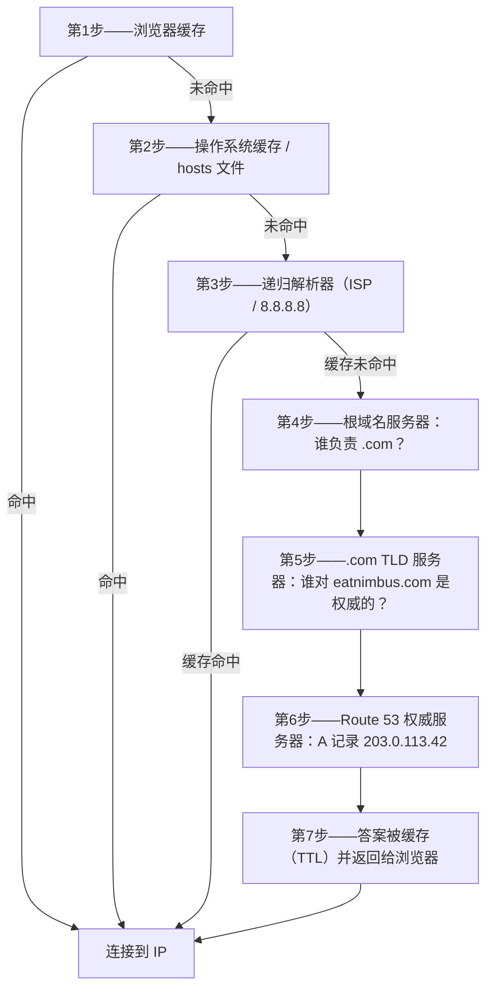

# 第12章：互联网如何找到你

Maya 在浏览器里又刷新了一次 `nimbus-alb-123456789.us-west-2.elb.amazonaws.com`，然后向后靠去，望着天花板。页面加载了。应用能用。但每次把这个链接分享给餐厅合作伙伴时，她都会感到一种说不上来的小小尴尬。

那个 URL 是一个技术产物，不是一个产品。

---

*上一章的网络重构进行得很顺利。每个资源都在正确的位置——负载均衡器在公有子网，数据库锁在私有子网。基础设施安全且分段正确。但随着 Nimbus 准备首次公开发布，一个新问题出现了：AWS 自动分配的负载均衡器 URL 看起来像一个系统标识符，而不是人们会信任的产品。他们需要一个真正的域名。他们还需要理解，从有人输入 `eatnimbus.com` 的那一刻到页面出现的那一刻之间，到底发生了什么。*

---

Nimbus 在运行了。负载均衡器有一个公网 IP。EC2 实例有私网 IP。数据库被锁在私有子网中。Priya 对着网络图赞许地点了点头。

Tom 看了看负载均衡器的 URL：`nimbus-alb-123456789.us-west-2.elb.amazonaws.com`。

"这就是顾客要在浏览器里输入的东西？"他问。

"这是 AWS 自动分配的，"Maya 说。

"我不打算把这个印在名片上。"

"我也不打算。"

他们需要一个域名。他们从一家域名注册商那里购买了 `eatnimbus.com`。现在他们需要把这个名字连接到他们的 AWS 基础设施。

"互联网怎么知道 `eatnimbus.com` 指的是 us-west-2 中的那个负载均衡器？"Leo 问。

问得好，Leo。

**电话本类比**

在智能手机出现之前，每个城市都有一本电话本。如果你想联系"Mario's Pizza"，你不需要记住他们的电话号码——你查找名字，得到号码，然后打电话。

互联网有自己的电话本：**域名系统（DNS）**。

DNS 将人类可读的名称（如 `eatnimbus.com`）转换为机器可读的 IP 地址（如 `203.0.113.42`）。每次你访问一个网站，你的计算机都会悄悄地在 DNS 中查找域名，得到要连接的 IP 地址。

如果你更改了服务器的 IP 地址，你就更新 DNS 记录——就像在电话本里更改你的号码——互联网就能在你的新位置找到你。

**完整的 DNS 解析之旅**

"但查找*究竟*是怎么进行的？"Leo 问。"我是说，一步一步地。我的浏览器知道 `eatnimbus.com` 这个名字。接下来会发生什么？"

大多数文档对这一点都一笔带过。但它很重要。

当你的浏览器需要解析 `eatnimbus.com` 时，下面是每一跳，按顺序：

**第1步——浏览器缓存**：浏览器检查自己最近是否已经解析过这个名字。如果有，就使用缓存的 IP。如果没有，继续。

**第2步——操作系统缓存 / 本地解析器**：你的操作系统检查自己的 DNS 缓存和本地 `hosts` 文件。如果找到，结束。如果没有，它会转发给你配置的 DNS 解析器——通常是你的 ISP 的解析器，或者像 8.8.8.8 这样的公共解析器。

**第3步——递归解析器**：递归解析器（你的 ISP 或 Google 的 8.8.8.8）是真正干活的角色。它也有缓存。如果它知道答案，就立即返回。如果不知道，它就开始真正的解析链。

**第4步——根域名服务器**：递归解析器联系 13 个根域名服务器集群之一（部署在世界各地）。根服务器不知道 `eatnimbus.com` 在哪里。但它知道谁管理 `.com` 域名——`.com` TLD 服务器。它返回这些服务器的地址。

**第5步——TLD（顶级域）域名服务器**：递归解析器联系 `.com` TLD 服务器。TLD 服务器也不知道 `eatnimbus.com` 在哪里。但它们知道哪些域名服务器对 `eatnimbus.com` 是权威的——也就是真正持有 DNS 记录的服务器。它们返回这些服务器的地址。

**第6步——权威域名服务器**：递归解析器联系 Route 53 的域名服务器——`eatnimbus.com` 的权威域名服务器。Route 53 拥有真正的记录。它返回 A 记录：`eatnimbus.com → 203.0.113.42`。这个答案是权威的——它是真实的答案，而不是缓存的答案。

**第7步——响应被缓存并返回**：递归解析器按照记录上的 TTL（生存时间）时长缓存这个答案。它把 IP 返回给你的浏览器。你的浏览器也缓存它。你的浏览器发起连接。



"只为找一个 IP 地址就要七跳，"Tom 说。

"总耗时通常不到 100 毫秒，"Priya 说。"第3到第6步在每一层都被积极缓存。对于热门域名，第4和第5步——根和 TLD 查找——往往会被完全跳过，因为递归解析器已经缓存了那些服务器。整个链条通常在 20–40 毫秒内跑完。"

"而且第一次查找之后，浏览器缓存意味着后续请求会跳过所有这些步骤，"Leo 补充道。

"对。DNS 感觉是即时的，因为大多数查找都是缓存命中。只有当记录是新的或者 TTL 过期时，完整的链条才会运行。"

**认识 Route 53**

Amazon Route 53 是 AWS 的托管 DNS 服务。它之所以叫 Route 53，是因为 53 端口是标准的 DNS 端口。（有时 AWS 的命名方式很直白。）

Route 53 做几件事：

**域名注册**：你可以直接通过 Route 53 购买域名。

**DNS 托管（托管区域）**：你为你的域名创建一个*托管区域*，由 Route 53 管理那些告诉全世界在哪里能找到你的 DNS 记录。

**健康检查**：Route 53 可以监控你的端点，并将流量从不健康的端点引开。

**流量路由策略**：Route 53 支持多种超越简单 DNS 的路由策略——加权、基于延迟、地理位置、故障转移。

**DNS 记录：电话本条目**

DNS 记录将名称映射到目标。最常见的类型：

**A 记录**：将名称映射到 IPv4 地址。
`eatnimbus.com → 203.0.113.42`

**AAAA 记录**：将名称映射到 IPv6 地址。

**CNAME 记录**：将名称映射到另一个名称（别名）。
`www.eatnimbus.com → eatnimbus.com`

**MX 记录**：指定哪些服务器处理该域名的电子邮件。

**TXT 记录**：存储任意文本。常用于域名验证（证明你拥有该域名）和电子邮件身份验证（SPF、DKIM）。

对于 Nimbus，主要设置：

- `eatnimbus.com` → 指向负载均衡器的别名记录
- `www.eatnimbus.com` → 指向 `eatnimbus.com` 的 CNAME
- `api.eatnimbus.com` → 指向 API 负载均衡器的别名记录

"等等，"Tom 说。"负载均衡器的 IP 可能会变。AWS 文档里这么说的。"

抓得好，Tom。

**别名记录：AWS 对动态 IP 的解决方案**

负载均衡器、CloudFront 分配和 S3 网站有 DNS 名称，而没有静态 IP 地址。底层 IP 可能会变化。

如果你创建一个 CNAME 指向负载均衡器的 DNS 名称，它可以工作——但由于 DNS 标准的限制，你无法对根域名（没有 `www` 的 `eatnimbus.com`）使用 CNAME。

Route 53 通过**别名记录**解决了这个问题——这是 AWS 对 DNS 的专有扩展。别名记录将名称直接映射到 AWS 资源（负载均衡器、CloudFront 分配、S3 网站），Route 53 自动处理动态 IP 解析。别名记录可以在根域名级别使用。而且与对外部服务的常规 DNS 查询不同，对 AWS 资源的别名记录查询是免费的。

"所以我们为 `eatnimbus.com` 使用一条指向负载均衡器的别名记录，"Leo 确认道。

"不管负载均衡器在任何时刻用的是什么 IP，Route 53 都会处理，"Priya 补充道。

"还免费，"Tom 说，突然变得非常感兴趣。他打开了 Route 53 的定价页面。"那其他部分呢？"

"每个托管区域五十美分，"Leo 说。"加上每百万次 DNS 查询大约四十美分。按我们现在的流量，每月大概不到两美元。"

Tom 满意地关掉了定价页面。

**路由策略：不只是"它在哪里？"**

这就是 Route 53 变得有趣的地方。DNS 不只是一个查找服务——它可以是一个流量管理工具。

**简单路由**：一条记录，一个目标。标准 DNS。

**加权路由**：按权重在多个目标之间分配流量。在迁移期间将 90% 的流量发送到新服务器，10% 发送到旧服务器。调整权重，直到你对新服务器有信心，然后切换到 100%。

**基于延迟的路由**：将用户路由到对他们延迟最低的 AWS 区域。西雅图的用户被路由到 `us-west-2`。东京的用户被路由到 `ap-northeast-1`。相同的域名，不同的目的地。

**地理位置路由**：根据用户的地理位置进行路由。所有欧洲用户去 `eu-west-1`。所有北美用户去 `us-east-1`。适用于数据主权（将欧盟用户数据保留在欧盟区域）或内容定制（语言、货币）。路由决策使用硬边界——一个用户属于某个国家、某个大洲或美国的某个州，他就被路由到对应的地方。

**地理邻近度路由**：根据用户的地理位置路由流量，*并且*允许你用一个**偏差（bias）**值调整这些决策。正偏差会扩大路由到某个资源的地理区域——吸引更多流量。负偏差会缩小它。与使用国家和大洲硬边界的地理位置路由不同，地理邻近度是连续的：一个小的偏差值可以逐步将流量从一个区域转移到另一个区域，而无需重新划定任何固定的边界线。

区分这两者的场景：如果一家公司正在从 `us-east-1` 逐步迁移到 `us-west-2`，并希望增量地将流量向西转移——不是一键切换，而是随时间拨动旋钮——那么在西部端点上设置不断增大的正偏差的地理邻近度路由就是正确的工具。地理位置路由要么把所有西海岸用户路由到俄勒冈，要么完全不路由；它没有旋钮可拨。自 2024 年 1 月起，地理邻近度路由可以作为常规路由策略直接在 DNS 记录上使用（控制台、API、CLI）——不再需要 Route 53 Traffic Flow，不过在 Traffic Flow 中仍然可用。

**故障转移路由**：指定一个主端点和一个备端点。如果主端点未通过 Route 53 的健康检查，流量会自动重定向到备端点。这是灾难恢复的 DNS 层。

"等等——如果我们已经有了 Multi-AZ，*为什么*还要设置到第二个区域的故障转移路由？"Maya 问。"Multi-AZ 不就是用来应对故障的吗？"

问得好。Multi-AZ 防护的是一个区域内单个可用区的故障——如果一个数据中心宕机，另一个可用区的备用实例会接管。但如果整个 AWS 区域不可用呢？或者发生了区域范围的服务中断呢？DNS 故障转移路由在不同的层面运作：当某个区域的健康检查失败时，它把流量从整个区域引开。Multi-AZ 是区域内的弹性。DNS 故障转移是区域间的弹性。

**多值应答路由**：为一次查询返回最多八个健康的 IP 地址，让客户端选择。一种简单的替代方案，可以在多台服务器之间分配流量，而无需负载均衡器。

"所以 Route 53 不只是一本电话本，"Maya 说。"它是一本聪明的电话本，可以根据你从哪里打来电话来路由通话。"

"并且如果号码不健康，还会把你挂断，"Priya 补充道。

---

**延迟路由加健康检查：一个思想实验**

Priya 在白板上勾画了一个场景。假设 Nimbus 的东海岸用户群持续增长，有一天团队在 `us-east-1`（北弗吉尼亚）搭起了一套轻量级技术栈——不是完整的多区域双活部署，那样会昂贵且复杂，而是一个负载均衡器加一组只读的 EC2 实例，提供静态内容和浏览页面。订单仍然向西发往 `us-west-2` 的主数据库。浏览流量——占请求量的百分之七十——可以从任一海岸提供服务。

浏览端点的 Route 53 配置会是这样：

```
browse.eatnimbus.com
  → Latency record: us-east-1 ALB (with health check, set-identifier "east")
  → Latency record: us-west-2 ALB (with health check, set-identifier "west")
```

（注意记录是一个*主机名*，`browse.eatnimbus.com`——DNS 路由的是名字，从来不是 URL 路径。像 `/browse` 这样的基于路径的路由是负载均衡器的工作，不是 Route 53 的。）

使用延迟路由时，西雅图的用户会被解析到 `us-west-2` 端点。波士顿的用户会去 `us-east-1`。Route 53 持续测量从其基础设施到每个区域的延迟，并为每个用户挑选更快的那个。

"但如果西部区域出了问题怎么办？"Tom 问。"我们西雅图的浏览用户就被困住了。"

"这正是健康检查的用途，"Priya 说。"每条延迟记录都在其对应的负载均衡器上配置一个健康检查。如果 `us-west-2` 的健康检查连续失败三次，Route 53 就停止返回那条记录——即使对于俄勒冈通常更快的用户也一样。西雅图用户会被路由到东部，直到俄勒冈恢复。"

"所以延迟路由决定正常情况下首选哪个区域，"Maya 说，"而健康检查会在首选区域宕机时推翻这个偏好？"

"完全正确。延迟策略在正常情况下选出胜者。健康检查会把已经停止工作的胜者移出局。"

Leo 思考着故障场景。"那这些记录的 TTL 呢？"

"六十秒，"Priya 说。"以三十秒为间隔连续三次检查失败才会触发——检测到故障最多需要九十秒——然后 DNS 解析器接收到变化最多还需要六十秒。"

"最坏情况两分半钟，"Leo 说。

"这就是为什么你要在需要它之前就降低 TTL，而不是之后。"

这种组合——延迟路由加每条记录上的健康检查——是多区域部署中最强大的 Route 53 配置之一。用户总是去往最快的健康区域。当某个区域出问题时，系统会自愈。而这一切都只是 DNS：没有额外的基础设施，没有代理服务器，区域之间也没有负载均衡器。

---

**健康检查故障事件**

Nimbus 的预发布环境给了他们一次意外的故障转移路由演示。

他们曾在预发布负载均衡器上配置了 Route 53 健康检查作为测试——每 30 秒检查一次 `/health` 端点。一个周五下午，Leo 向预发布环境推送了一个有 bug 的部署：健康端点开始返回 500 错误。它通过了他的本地测试，但在服务器上挂了。

Route 53 注意到了这些失败。连续三次检查失败后，它将端点标记为不健康。故障转移记录被激活，把预发布流量路由到了一个只读的兜底页面，上面写着"维护进行中"。

Leo 收到的第一个警报是一位 QA 工程师发来的 Slack 消息："预发布环境显示维护页面了。"

Leo 检查了部署。日志里的 500 错误一目了然。他回滚了部署。在健康端点恢复返回 200 后的 90 秒内，Route 53 重新评估了检查，看到连续三次成功，把流量送回了预发布负载均衡器。维护页面消失了。

维护页面总共显示了：七分钟。

"这是系统在正确地工作，"Priya 说。

"我知道，"Leo 说。"可怕的是去想如果没有健康检查会发生什么。那些 500 错误会直接打到真实用户身上。"

"在生产环境，健康检查会故障转移到备用区域或静态错误页面。用户看到的会是一个维护良好的体验，而不是报错。"

"故障转移实际上需要多长时间？"Maya 问。"从健康检查失败到 DNS 开始改变路由？"

"健康检查间隔默认是 30 秒。连续三次失败才触发故障转移。也就是说检测到问题最多需要 90 秒。然后是 DNS TTL——如果是 60 秒，传播还要再加一分钟。"

"所以最坏情况大约三分钟？"

"差不多。这就是为什么你希望关键记录的 TTL 要低，健康检查间隔在预算允许的范围内尽量短。"

---

**健康检查：绕开故障路由**

"那如果有人试图闯进来呢？"Priya 说。"DNS 是公开的。任何人都能查到 `eatnimbus.com` 指向哪里。这意味着攻击者确切地知道该攻击哪个 IP。"

"没错，"Leo 说。"但他们找到的 IP 是负载均衡器的 IP。ALB 是唯一拥有公网地址的东西。它背后的一切——EC2、RDS、ElastiCache——都在私有子网里。DNS 告诉他们的是前门在哪。它不会告诉他们门后有什么。"

Route 53 可以用健康检查监控你的端点。如果端点失败，Route 53 可以：

- 把它从 DNS 响应中移除（停止向那里发送流量）
- 触发到备份端点的故障转移
- 通过 CloudWatch 发送警报

健康检查是 DNS 路由和应用程序实际健康状况之间的纽带。在故障转移配置中：Route 53 每 30 秒监控一次主端点。如果连续三次检查失败，Route 53 开始返回备端点的地址。这些数字没有一个是固定的：30 秒是标准间隔（付费的"快速"选项每 10 秒检查一次），失败阈值默认为连续 3 次检查，但可以在 1 到 10 之间配置。

这不是即时的——DNS 有传播时间。一旦 Route 53 更改了 DNS 记录，世界各地的 DNS 解析器需要接收到这个变化，根据 TTL 设置，这可能需要几秒到几分钟。

**TTL：DNS 缓存**

DNS 响应在多个层面被缓存——在你的路由器、你的 ISP、你的浏览器中。DNS 记录上的 **TTL（生存时间）**告诉缓存在再次检查之前要记住答案多长时间。

高 TTL（1 小时或更长）：DNS 查询更少，Route 53 上的负载更小，但变更传播更慢。

低 TTL（60 秒或更短）：变更传播更快，但需要更多 DNS 查询。

在计划好的迁移之前（更新 DNS 指向新服务器），提前一天将 TTL 降低到 60 秒。然后当你做出更改时，它大约在一分钟内传播完毕。迁移之后，再把它升回正常值。

"我已经部署了——哦。"Leo 在降低 TTL 之前就更新了 DNS 记录。他意识到了自己的错误，开始倒计时：旧的 TTL 是一小时。在接下来的六十分钟里，一些用户会被解析到旧服务器。

"如果我们只是在迁移期间而不是之前降低它，"Leo 慢慢说，"旧的 TTL 意味着一些用户会看到旧服务器长达一小时。"

"完全正确，"Priya 说。"DNS 迁移需要在迁移之前进行规划，而不只是在迁移期间。"

你可能会想：如果 TTL 设为一小时，是不是意味着 DNS 变更后每个用户都要整整等一小时才能看到新服务器？不完全是。TTL 意味着解析器在 TTL 过期之前不会重新检查。如果某个用户的 DNS 解析器在 55 分钟前以 1 小时 TTL 缓存了旧值，他们 5 分钟后就会得到新值。如果是 5 分钟前缓存的，他们就要等 55 分钟。平均而言，用户会在 TTL 时长的一半之内看到变更。这就是为什么提前降低 TTL 如此重要：它在变更发生之前就缩小了最坏情况下的传播窗口。

---

**私有托管区域：内部 DNS**

公共域名上线两周后，Priya 提出了一个新需求。

"我们的 EC2 实例需要访问数据库，"她说。"现在它们用的是 RDS 端点的 DNS 名称——`nimbus-prod.abc123.us-west-2.rds.amazonaws.com`。这能用，但它是一个公共 DNS 名称。如果我们将来想改变数据库配置，所有应用程序的配置文件都得更新。"

"我们可以用一个私有 DNS 名称，"Leo 说。"比如 `db.nimbus.internal`。一个我们的服务在内部使用的名字，映射到当前的数据库端点，不管它是什么。"

"正是。Route 53 私有托管区域。"

**私有托管区域**是一个只在你的 VPC 内部解析的 DNS 域。外部对 `nimbus.internal` 的 DNS 查询得不到任何响应。但在 VPC 内部，`db.nimbus.internal` 会解析到 RDS 端点。

他们配置如下：

- 私有托管区域：`nimbus.internal`
- CNAME 记录：`db.nimbus.internal → nimbus-prod.abc123.us-west-2.rds.amazonaws.com`
- CNAME 记录：`cache.nimbus.internal → nimbus-cache.abc123.usw2.cache.amazonaws.com`
- A 记录：`api.nimbus.internal → 10.0.10.5`（内部 EC2 IP——A 记录把名称映射到 IP 地址；CNAME 把名称映射到其他名称。这里没问题，因为这个实例保持着一个静态私有 IP；对于任何处于 Auto Scaling 之后的东西，你应该指向一个负载均衡器）

现在应用程序的配置变成了：

```
DATABASE_HOST=db.nimbus.internal
CACHE_HOST=cache.nimbus.internal
```

当他们迁移到新的 RDS 实例时，只更新了一条 DNS 记录。不需要任何应用程序部署。

"这也是为什么私有 DNS 在数据库迁移时很重要，"Priya 说。"你把 `db.nimbus.internal` 更新为指向新端点。流量转移。旧端点在 TTL 窗口期间保持可用。不需要改任何应用程序配置。"

**内部 DNS 调试故事**

三周后，Leo 部署了一个新服务——一个后台 worker——它连不上数据库。这个 worker 和 API 服务器在同一个 VPC、同一个私有子网里。API 服务器能连上数据库。worker 不能。

他检查了安全组。worker 的安全组有针对 PostgreSQL 的出站规则。数据库的安全组有来自 worker 安全组的入站规则。一切看起来都正确。

他在 worker 实例上运行了 `nslookup db.nimbus.internal`。

没有响应。

"DNS 查找失败了，"他对 Priya 说。

她看了看 worker 实例的 VPC 配置。"这个 worker 实际上在哪个 VPC 里？私有托管区域是与 VPC 关联的——如果实例不在已关联的 VPC 里，对它来说这个区域根本就不存在。"

"在主 VPC 里。跟其他所有东西一样。"

"是吗？"

私有托管区域必须显式地与它服务的每个 VPC 关联——关联是按 VPC 进行的，从来不是按子网。Priya 创建区域时关联了主 VPC。但 Leo 不小心把 worker 部署到了他为另一个实验创建的测试 VPC 里。不同的 VPC。没有与私有托管区域关联。

"worker 在错误的 VPC 里，"Priya 说。

"我已经部署了——哦。"Leo 把 worker 移到了正确的 VPC。DNS 解析成功了。worker 连上了数据库。

"一个 VPC，"Leo 边记笔记边说。"除非我们有理由用不止一个。"

---

**DNSSEC：验证 DNS 响应**

"我们考虑过 DNS 欺骗吗？"Priya 问。"如果有人拦截我们的 DNS 查询并返回一个假 IP 怎么办？我们用户的浏览器就会连接到攻击者的服务器，而不是我们的。"

**DNSSEC（DNS 安全扩展）**通过对 DNS 记录进行加密签名来解决这个问题。当 DNS 响应包含 DNSSEC 签名时，解析器可以验证响应来自权威域名服务器且没有被篡改。

Route 53 支持对公共托管区域进行 DNSSEC 签名。流程包括：

1. 在 Route 53 中为托管区域启用 DNSSEC
2. Route 53 生成存储在 KMS 中的密钥签名密钥（KSK）
3. Route 53 用区域签名密钥对所有记录签名
4. 你在上级域名注册商（.com TLD）处添加一条 DS（委派签名者）记录
5. 支持 DNSSEC 的解析器现在可以验证响应的真实性

"DNS 欺骗有多常见？"Leo 问。

"在公共互联网上，罕见但可能发生，"Priya 说。"如今大多数 ISP 解析器都支持 DNSSEC 验证。启用 DNSSEC 不花什么钱，却增加了一层实实在在的真实性保障。"

"那每月要花多少钱？"Tom 问。

"在 Route 53 中启用 DNSSEC 签名本身是免费的，"Priya 说。"唯一真正的成本是持有密钥签名密钥的那个 KMS 密钥：每月 1 美元，加上 KMS API 调用——而且一个密钥可以在多个托管区域之间共享。在我们这个规模上，对 DNS 劫持攻击的防护实际上是免费的。"

Tom 在午饭前就把它启用了。

---

**Route 53 Resolver：混合 DNS**

当 Nimbus 最终通过 VPN 把他们的 AWS VPC 连接到本地开发网络时，一个新问题出现了：本地服务器需要解析 AWS 私有 DNS 名称（如 `db.nimbus.internal`），而 AWS 资源需要解析本地主机名（如 `jenkins.corp.nimbus.local`）。

DNS 解析默认不会跨越网络边界。AWS 资源使用 Route 53 Resolver（内置于每个 VPC）解析 DNS。本地服务器使用它们自己的 DNS 服务器。双方都看不到对方的记录。

**Route 53 Resolver 端点**弥合了这个鸿沟：

**入站端点**：本地 DNS 服务器可以把针对 AWS 托管 DNS 区域的查询转发到你 VPC 中的一个入站端点 IP。Route 53 Resolver 处理查询并返回结果。

**出站端点**：当 EC2 实例需要解析本地主机名时，Resolver 通过出站端点把那些查询转发给本地 DNS 服务器。

"所以它就像一个翻译服务，"Maya 说。"你的 AWS DNS 和你的本地 DNS 互相不直接对话。Resolver 端点充当中间人。"

"正是。你的本地服务器现在可以解析 `db.nimbus.internal` 了。你的 EC2 实例可以解析 `jenkins.corp.nimbus.local`。双方都能看到两个世界的 DNS 名称。"

对 Nimbus 来说，当开发团队想从办公室对 AWS 中的预发布环境运行集成测试时，这一点变得切实相关。没有 Resolver 端点，他们就得手动编辑 hosts 文件。有了它们，内部 DNS 就直接跨 VPN 工作了。

Resolver 端点的架构：

- **入站端点**：在你的 VPC 中两个不同的可用区里创建两个 ENI（弹性网络接口）。每个获得一个私有 IP。你配置本地 DNS 服务器，把针对你的 AWS 托管区域的查询转发到这些 IP。流量经由你的 VPN 或 Direct Connect 传输。
- **出站端点**：在两个可用区里的两个 ENI。你创建转发规则："针对 `corp.nimbus.local` 的查询发往这些本地 DNS 服务器 IP。"EC2 实例自动使用 Resolver，Resolver 会查阅你的转发规则并把查询发送到本地。

"为什么每个端点要两个 ENI？"Leo 问。

"高可用，"Priya 说。"如果一个可用区失去网络连接，另一个端点 IP 仍然能用。和 NAT 网关是同样的原理。"

"那每月要花多少钱？"Tom 问。

Resolver 端点的费用大约是**每个弹性网络接口**每小时 0.125 美元，而每个端点为了可用性至少需要两个 ENI——所以一个现实的底线是每个端点每月约 180 美元，再加上每百万次 DNS 查询 0.40 美元。对于一个用混合 DNS 解析内部名称的团队来说，这个成本不算高——而且免去了在多台开发者机器和 CI/CD 系统上维护 hosts 文件的负担。

"我们也可以直接把主机名写进 hosts 文件，"Leo 提议。

"写在每台开发者机器、每个 CI 运行器、每次新人入职的时候，"Priya 说。"每次有任何变动的时候。"

"端点值这个钱，"Leo 说。

"值。"

## 优势与局限性

**Route 53 适合的情况**：完全在 AWS 内注册和管理域名；根据延迟、地理位置或加权分布在多个端点之间路由流量；基于健康检查的区域间故障转移，或主端点与灾难恢复端点之间的故障转移；通过别名记录将 DNS 与其他 AWS 服务集成；用私有托管区域实现内部服务发现。

**Route 53 不是你需要的东西的情况**：Route 53 是一个 DNS 服务，不是负载均衡器。如果你需要在一个区域内的多台服务器或容器之间分配流量，请使用应用负载均衡器——Route 53 无法像负载均衡器那样在连接级别做加权轮询。跨区域的基于延迟的路由会增加成本和运维复杂性，只有当你的用户真正分布在全球、且毫秒级差异对转化率有影响时才有意义。对于大多数单区域应用程序，一条指向 ALB 的别名记录就是你需要的全部 Route 53 配置。

## 摘要

从 `nimbus-alb-123456789.us-west-2.elb.amazonaws.com` 走到 `eatnimbus.com`，感觉像是一件小事。其实不是。DNS 是整个互联网赖以运行的地址系统，而 Route 53 给了你一套工具，让你不仅能用这个系统做查找，还能做流量管理和提升弹性。

- **DNS** 将域名转换为 IP 地址——互联网的电话本。
- **Route 53** 是 AWS 的托管 DNS 服务：域名注册、DNS 托管、健康检查和路由策略。
- **A 记录**将名称映射到 IPv4 地址。**CNAME** 将名称映射到其他名称。**别名记录**将名称映射到 AWS 资源（负载均衡器、CloudFront、S3）。
- 对根域名和具有动态 IP 的资源使用别名记录（而不是 CNAME）。
- 路由策略超越了简单 DNS：**加权**（流量分割）、**基于延迟**（性能）、**地理位置**（数据主权——国家/大洲硬边界）、**地理邻近度**（基于距离、带偏差旋钮——逐步转移流量）、**故障转移**（灾难恢复）。
- **私有托管区域**为 VPC 资源提供内部 DNS——服务之间用名字通信，而不是硬编码 IP。
- **DNSSEC** 对记录进行加密签名，防止 DNS 欺骗。
- **Route 53 Resolver 端点**桥接混合网络——AWS 和本地 DNS 可以互相解析对方的名称。

## 考试技巧

*SAA-C03 领域：设计高性能架构（领域3，任务3.4）*

- **别名 vs CNAME**：别名记录可以在根域名使用；CNAME 不行。对 AWS 资源的别名记录查询免费；CNAME DNS 查询收费。当考试询问将根域名映射到负载均衡器时 → 别名记录。
- **路由策略使用案例**（常见考试场景）：
  - "逐步将流量迁移到新版本" → 加权路由
  - "将用户路由到最近的 AWS 区域" → 基于延迟的路由
  - "将欧盟用户数据保留在欧盟区域" → 地理位置路由
  - "主端点宕机时自动 DNS 故障转移" → 带健康检查的故障转移路由
  - "逐步将流量转移到新区域"或"增加吸引到我们欧盟部署的流量" → 带正偏差的地理邻近度路由
- **地理邻近度 vs 地理位置：**地理位置路由按用户的国家/大洲用硬边界路由。地理邻近度路由按地理距离路由并带有可配置的偏差——当你需要逐步将流量转移到新区域，或吸引更多用户到特定部署时使用它。自 2024 年 1 月起可作为常规路由策略直接用于记录（不再需要 Traffic Flow）。
- **Route 53 健康检查**：可以检查 HTTP/HTTPS/TCP 端点，并可以触发 CloudWatch 警报。考试在灾难恢复场景中使用这些。
- **TTL 和传播**：要知道 TTL 控制 DNS 解析器缓存记录的时长。短 TTL = 更快的变更。考试场景："团队更新了 DNS 但用户仍然访问旧服务器" → TTL 太高。
- **私有托管区域**：Route 53 可以创建只在 VPC 内部解析的 DNS 记录。考试将其用于内部服务发现（例如 `database.internal` 解析为私有 RDS 端点）。
- Route 53 是**全局的**——它不部署在某个区域。创建托管区域时不需要选择区域。
- **Route 53 Resolver 端点**：用于本地和 AWS DNS 需要互相解析对方名称的混合场景。入站端点用于本地 → AWS。出站端点用于 AWS → 本地。

## 练习

**练习 1——回忆**

解释 CNAME 记录和别名记录之间的区别。你什么时候会分别使用它们？

*（提示：考虑根域名上的 CNAME 限制，以及别名记录对动态 AWS 资源的行为。）*

**练习 2——SAA-C03 场景**

*场景*：一家媒体公司从两个 AWS 区域运营网站：`us-east-1`（主）和 `eu-west-1`（备）。团队希望在主区域不可用时，流量自动路由到 `eu-west-1`。公司还希望在不实际关闭主区域的情况下验证这个故障转移机制是否正常工作。

哪种 Route 53 配置最能满足这些需求？

A) 加权路由，`us-east-1` 权重 100%，`eu-west-1` 权重 0%  
B) 基于延迟的路由，两个端点都配健康检查  
C) 故障转移路由，主端点配健康检查，次要记录指向 `eu-west-1`  
D) 地理位置路由，北美指向 `us-east-1`，欧洲指向 `eu-west-1`

**提示 1**：需求是主端点宕机时自动故障转移。哪种路由策略正是为此设计的？

**提示 2**："在不关闭主区域的情况下测试"——健康检查可以手动设为"不健康"来进行测试。

**提示 3**：基于延迟的路由优化的是速度，不是故障转移。

**答案**：C

**解析**：故障转移路由正是为这种使用案例设计的。主记录指向 `us-east-1` 并配有健康检查。次要记录指向 `eu-west-1`。如果健康检查失败，Route 53 自动提供次要记录。健康检查可以手动强制失败来进行测试，而不会实际中断主区域。

**为什么不是 A？** 100%/0% 的加权路由实际上是静态的——主端点失败时它不会自动切换。

**为什么不是 B？** *带健康检查的*延迟记录确实会停止返回不健康的端点，所以 B 能挺过一次真正的故障。但它改变了正常的流量模式（用户会按延迟被分散到两个区域，而不是按要求的主/备模式），而且它没有干净的方式来*测试*故障转移：你必须在生产环境中真的让主端点的健康检查失败。故障转移路由建模了题目陈述的意图——指定的主端点、指定的备端点、可以通过强制健康检查状态来测试。

**为什么不是 D？** 地理位置路由按用户位置路由，而不是按端点健康状况。即使 `us-east-1` 健康，欧洲用户也会被困在 `eu-west-1`；而即使 `us-east-1` 宕机，北美用户也不会故障转移到 `eu-west-1`。

*SAA-C03 领域：设计高性能架构——任务3.4*

**练习 3——架构挑战** *（可选）*

Nimbus 正在向国际扩展。他们希望 `eatnimbus.com` 对西海岸、东海岸和澳大利亚的用户都能快速加载。他们还有一个法规要求：欧洲用户下的订单必须由欧盟的服务器处理。

设计一个同时解决这两个需求的 Route 53 路由策略。你会使用哪种路由策略或策略组合？每个区域需要什么基础设施？

*（没有唯一正确答案。目标是练习多区域路由设计。）*

## 彩蛋场景

`eatnimbus.com` 上线了。

Maya 在浏览器里输入了它，Nimbus 订餐页面加载了出来。她从自己家族的餐厅点了一份阿瑞巴玉米饼，只是为了测试整个流程。订单成功了。厨房收到了。

她坐了回去。

Tom 已经在读 Route 53 健康检查日志了。"从 us-west-2 检查器的响应时间是 18 毫秒。"

"那算快吗？"Maya 问。

"对 DNS 来说？快。对西雅图用户来说也快——他们离俄勒冈几乎就是隔壁。"

"但对波士顿的用户呢？"

Tom 看了看延迟图。"大约 80 毫秒。"

Maya 想了想。"如果我们东海岸的合作伙伴持续增长，而我们的服务器在俄勒冈……"

"每个请求都要从波士顿到俄勒冈再回来，"Leo 从房间另一头说。"光速。你无法打败物理学。"

"所以我们需要离波士顿更近的服务器。"

"或者离波士顿更近的、能替服务器分发内容的东西。"

这个想法悬在了空中。

下一章：让 Nimbus 的内容与世界各地每个用户都只有一毫秒之遥的那些仓库。
