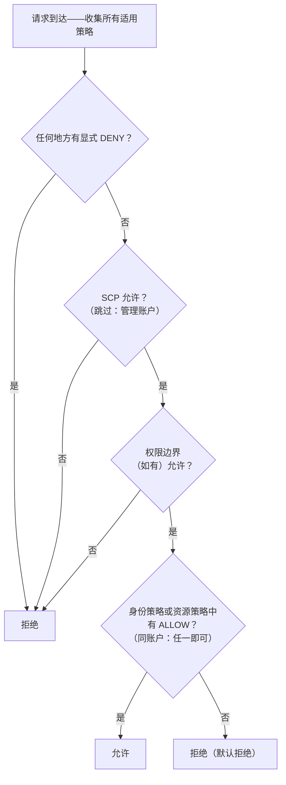

# 第14章：谁被允许做什么

新工程师们周一就要入职了。Soo-Jin 和 Rafael。Maya 一直在思考他们的第一周——他们需要访问什么、不该碰什么，以及当前的 IAM 设置是否真的准备好再扩展给两个人。

在办公室坐满人之前，她端着一杯咖啡坐下来，列了一张清单。

---

*CloudFront 部署好了。缓存命中率不错。性能上去了。但就在团队准备迎接新工程师时，一个安静的问题浮出了水面：IAM 配置是由一群赶时间的人搭起来的。访问密钥躺在配置文件里。有些角色的权限超出了它们所需。而两位新人即将拿到一个从未为多用户而设计的生产系统的凭证。*

---

Tom 在一个文本文件里打开了访问密钥，准备粘贴。

"你在做什么？"Priya 问。

"EC2 实例需要从 S3 读取配置文件。我要把凭证放进服务器配置里。"

她盯着屏幕看了一会儿。"关掉那个文件。"

"我只是想——"

"如果有人攻进那台服务器，"她说，"他们就拿到了那些密钥。而那些密钥能触及那个 IAM 用户被允许触及的一切。那很可能不只是 S3。"

Tom 关掉了文件。

"有一个更好的办法，"她说。"服务器本身可以拥有一个角色。把它想象成一个职位头衔——实例不需要凭证，因为系统已经知道它是什么，以及它被允许做什么。"

Tom 一脸怀疑。"所以服务器自己验证自己的身份？"

"是的。没有密码。没有配置文件里的密钥。没有任何可能被意外提交到 git 的东西。"

最后那句话击中了要害。Tom 自己两周前差点把一个访问密钥提交进仓库——在最后一刻从 diff 里发现了它。他打开了一个新的浏览器标签页。

**重新审视 IAM：全貌**

第3章介绍了 IAM：用户、组、角色和策略。现在是时候深入了。

IAM 策略是 JSON 文档，指定对哪些资源允许或拒绝哪些操作。它们看起来是这样的：

```json
{
  "Version": "2012-10-17",
  "Statement": [
    {
      "Effect": "Allow",
      "Action": [
        "s3:GetObject",
        "s3:PutObject"
      ],
      "Resource": "arn:aws:s3:::nimbus-assets/*"
    }
  ]
}
```

这个策略允许在 `nimbus-assets` 桶中读写对象，仅此而已。不能删除。不能列出桶。不能做任何其他 S3 操作。不能碰任何其他 AWS 服务。

这才是授予权限的正确方式：特定的操作，特定的资源。

**"管理员访问"的问题**

像 `AdministratorAccess` 这样的 AWS 托管策略是为了快速上手而设计的。它们不是为有真实团队成员的生产系统设计的。

`AdministratorAccess` 授予对每个资源的每个操作。如果拥有这个策略的团队成员犯了错误——不小心删除了 S3 桶、终止了错误的 EC2 实例、改动了安全组规则——AWS 没有任何办法阻止他们。权限已经被授予了。

如果团队成员的凭证被盗（钓鱼攻击、泄露的访问密钥、笔记本电脑失窃），攻击者就对你 AWS 账户中的一切拥有管理员访问权限。

"那 Soo-Jin 应该有什么？"Leo 问。

"Soo-Jin 需要做什么？"Priya 反问。

"部署 API。查看日志。别的没有了。"

"那她就得到：向代码流水线推送的能力、CloudWatch 日志的读取权限，除此之外什么都没有。"

"那……非常具体。"

"是的。这正是重点。"

**IAM 角色：服务的身份**

第3章把角色介绍为 EC2 实例无需存储凭证就能访问 AWS 服务的方式。我们来把它具体化。

运行 Nimbus API 的 EC2 实例需要：

- 从 DynamoDB 读取（菜单）
- 向 DynamoDB 写入（订单）
- 把对象放进 S3（收据、上传文件）
- 把日志写入 CloudWatch
- 从 Secrets Manager 读取机密

与其创建一个带访问密钥的用户并把密钥存在 EC2 实例上（这是安全噩梦——任何有 SSH 访问权限的人都能读到访问密钥），不如为 EC2 实例创建一个恰好拥有这些权限的 **IAM 角色**。

"等等——*为什么*要这么做？"Maya 问。"EC2 实例已经在跑我们的代码了。为什么不直接给代码一个访问密钥？"

因为访问密钥是静态凭证，它必然存放在某个地方——配置文件里、环境变量里，如果有人犯错，还会出现在 git 仓库里。它们可以被复制、被外泄、被意外提交。IAM 角色的工作方式不同：EC2 实例自动代入（assume）角色。AWS 通过实例元数据服务提供临时凭证。凭证自动轮换——它们每隔几小时就过期，并且无需你做任何事就会被刷新。没有可泄露的东西，因为没有存储任何东西。

"那如果有人入侵了 EC2 实例呢？"Leo 问。

"他们能做 EC2 角色允许的事，"Priya 说。"也就是读菜单、写订单、发日志。他们不能删除 S3 桶。他们不能终止 EC2 实例。他们不能碰 IAM。"

"因为 EC2 角色没有那些权限。"

"完全正确。"

---

**EC2 角色代入的逐步原理**

"有什么地方说不通，"Maya 说。"如果实例上没有存储任何凭证，那实例到底是怎么向 AWS 证明自己是谁的？凭证总得存在于某个地方吧。"

确实存在。但它是临时的、自动轮换的，而且只能从实例内部访问。

当一个挂载了 IAM 角色的 EC2 实例启动时，AWS 会做以下事情：

**第1步**：AWS STS（Security Token Service）生成临时凭证——一个访问密钥 ID、一个秘密访问密钥和一个会话令牌。对于 EC2 实例角色，这些凭证的有效期通常约为六小时，AWS 会在它们过期之前自动轮换。

**第2步**：AWS 把这些凭证放在一个特殊的 IP 地址上提供：`169.254.169.254`。这是**实例元数据服务**（IMDS）。它只能从 EC2 实例内部访问。实例之外的任何东西都访问不到它。

**第3步**：当你的应用代码调用任何 AWS SDK（boto3、Java SDK、Node.js SDK）时，SDK 会自动查询实例元数据端点：

```
GET http://169.254.169.254/latest/meta-data/iam/security-credentials/{role-name}
```

**第4步**：SDK 收到临时凭证，并用它们对 API 请求进行签名——例如，一个从 S3 读取的请求。

**第5步**：AWS 验证凭证，检查附加在角色上的 IAM 策略，然后允许或拒绝该请求。

**第6步**：在凭证过期前大约十五分钟，EC2 实例会自动从元数据服务刷新它们。应用代码永远不需要处理这件事——SDK 透明地完成。

整个过程对开发者是不可见的。你只是写 `s3.get_object(...)`。剩下的 SDK 全包了。

"所以凭证是存在的，"Maya 说。"只是它是临时的、自动轮换的，并且被锁定在实例元数据端点上。"

"这就是为什么它比静态访问密钥安全得多，"Priya 说。"静态密钥一旦被盗，在有人手动轮换它之前一直有效。被盗的临时凭证会自己过期——在几小时之内，而不是几个月。"

"那如果实例内部有人查询元数据端点呢？"

"他们能拿到当前的临时凭证。这是一个真实的风险，也是 AWS 推出 IMDSv2——实例元数据服务第2版——的原因。IMDSv2 要求调用者先通过一个 PUT 请求获取会话令牌。这能阻止一类叫做服务器端请求伪造（SSRF）的攻击——恶意代码骗服务器替攻击者去获取元数据 URL。"

Leo 更新了 EC2 启动配置，强制使用 IMDSv2。一个设置项，在启动时应用。

---

**角色代入：服务如何变成其他服务**

角色可以被以下对象代入：

- **AWS 服务**（EC2、Lambda、ECS 任务等）
- **你自己账户中的 IAM 用户**（角色提升——你为某项特定任务代入一个权限更大的角色）
- **其他 AWS 账户中的 IAM 用户**（跨账户访问——另一个组织的账户可以代入你账户中的角色）
- **外部身份提供商**（Google、Active Directory、Okta——为人类用户提供联合访问）

"我们想过如果 Nimbus 使用一个需要访问我们 AWS 资源的第三方服务会怎么样吗？"Priya 问。"比如一家外部分析供应商。我们不想为他们创建一个 IAM 用户然后递过去一个访问密钥。"

"跨账户角色，"Leo 说。"我们在自己账户里创建一个角色，写一条信任策略，声明'这个特定的外部账户被允许代入这个角色'。他们用自己的凭证代入角色，获得临时访问权限。没有需要管理的密钥，没有可泄露的密钥。"

最后这种模式——**身份联合**——是大型组织在不为每个人创建单独 IAM 用户的情况下，授予员工 AWS 访问权限的方式。你公司的 Active Directory 持有你的凭证。当你登录 AWS 时，你向 Active Directory 验证身份，AWS 授予你一个角色。

---

**跨账户访问：会计团队场景**

第六个月，Nimbus 聘请了一家会计师事务所帮助做财务报告。会计团队需要读取 Nimbus 账单 S3 桶中的账单数据——但他们在自己独立的 AWS 账户中运营。Nimbus 不想为他们创建 IAM 用户。把静态访问密钥递给外部公司的人，怎么想都不对。

"跨账户角色，"Priya 说。

这套设置分三部分：

**第一部分**：在 Nimbus 账户中创建一个 IAM 角色——叫它 `AccountingReadRole`。附加一条策略，允许对账单 S3 桶执行 `s3:GetObject` 和 `s3:ListBucket`。别的什么都没有。

**第二部分**：给 `AccountingReadRole` 添加一条信任策略。信任策略声明哪个外部身份被允许代入这个角色：

```json
{
  "Version": "2012-10-17",
  "Statement": [{
    "Effect": "Allow",
    "Principal": {
      "AWS": "arn:aws:iam::ACCOUNTING-FIRM-ACCOUNT-ID:role/AccountingAppRole"
    },
    "Action": "sts:AssumeRole"
  }]
}
```

它的意思是：只有会计师事务所 AWS 账户中那个特定的角色可以代入这个角色。其他任何人都不行。

**第三部分**：在会计师事务所的账户中，他们的应用程序使用 `sts:AssumeRole` 获取 `AccountingReadRole` 的临时凭证。这些凭证的权限范围只限于 `AccountingReadRole` 所允许的事情。会计应用程序可以读取账单文件。它不能写入。它不能碰 Nimbus 账户里的任何其他东西。

针对这个场景，还有一个加固步骤——而且它是一个有名有姓的考试主题。会计师事务所服务着许多客户。假设他们的某个恶意客户得知了 Nimbus 的 `AccountingReadRole` 的 ARN，并让事务所的软件去"分析"它。事务所的软件拥有代入角色的合法权限——它可能被骗去以错误客户的名义访问 Nimbus 的数据。这就是**混淆代理问题（confused deputy problem）**，而解决办法是 **ExternalId**：Nimbus 生成一个唯一的秘密值，把它作为条件放进信任策略（`"sts:ExternalId": "nimbus-7f3a..."`），并且只分享给这家会计师事务所。事务所的软件必须在每次 `AssumeRole` 调用中传入那个 ExternalId，而且它为每个客户使用*不同的* ExternalId——这样，以错误客户的名义发起的请求就会失败。考试触发词："第三方需要跨账户访问" → 角色 + 信任策略 + **ExternalId**。绝不是共享密钥的 IAM 用户。

"如果我们需要撤销他们的访问权限呢？"Tom 问。

"删除信任策略或者删除角色，"Priya 说。"搞定。没有需要追查的凭证，没有需要停用的密钥。角色就是访问权限本身。移除角色，访问权限就没了。"

"而且我们能在 CloudTrail 里看到他们每一次使用它的记录，"Leo 补充道。

"他们发起的每一次 API 调用，都被记录下来。哪个桶、哪个文件、什么时间、什么结果。"

Tom 把这个模式记了下来。它还会再出现——每一个集成伙伴、每一个外部供应商、每一个需要 AWS 访问权限的第三方工具，都会得到一个带信任策略的角色，而不是一个带访问密钥的用户。

---

**IAM 策略评估：决策逻辑**

"我们想过当多条策略同时适用于同一个请求时会发生什么吗？"Priya 问。"IAM 用户有一条策略。他们访问的资源有一条资源策略。可能还有一条 SCP。AWS 怎么决定？"

要理解的关键是：AWS **不是**按类型逐个、按顺序检查策略的。它会把适用于该请求的*所有*策略——基于身份的、基于资源的、SCP、权限边界、会话策略——全部收集起来，然后对整堆策略一次性应用一组规则：

**规则1——显式拒绝永远获胜。**如果任何一条适用的策略——IAM、基于资源、SCP 或边界——显式拒绝了该操作，请求即被拒绝。没有任何东西能推翻显式拒绝。

**规则2——SCP 和权限边界充当过滤器。**它们从不授予任何东西。该操作必须被每一条适用的 SCP 和权限边界（如果存在）*允许*，否则就被拒绝——不管其他策略说什么。

**规则3——在同一个账户内，一个允许就够了。**身份的 IAM 策略*或*资源的策略中，*任一*存在显式允许就能放行该操作。它们是并集，不是先后顺序——资源策略并不会在 IAM 策略"之前"被评估。

**规则4——默认拒绝。**如果没有任何东西显式允许该操作，它就被拒绝。



结论：任何地方有显式拒绝 = 拒绝。任何地方都没有允许 = 拒绝。来自身份策略*或*资源策略的允许 = 允许，只要没有拒绝、SCP 或边界拦住它。

还有一个考试钟爱的事实：**SCP 不适用于组织的管理账户**（也不适用于服务关联角色）。一条声明"us-west-2 之外不许有 EC2"的 SCP 会约束每一个成员账户——但管理账户不受影响。这也是 AWS 告诉你不要在管理账户里跑任何工作负载的原因之一。

有一个细节会绊倒考试考生：对于**跨账户访问**，目标账户中的基于资源的策略本身并不够。源账户中的身份也需要在它自己的 IAM 策略中拥有执行该操作的显式权限。如果你设置了一条允许账户 B 读取你对象的 S3 桶策略，但账户 B 的 IAM 用户没有任何允许 `s3:GetObject` 的 IAM 策略，访问仍然会被拒绝。两边都必须允许该操作——资源策略在目标侧打开大门，源账户中的 IAM 策略授予用户走进这扇门的权限。

"所以如果 Priya 的 SCP 说'eu-west-1 不许有 EC2'，而她的 IAM 策略说'允许所有 EC2 操作'，她仍然不能在 eu-west-1 创建实例？"Leo 问。

"正确，"Priya 说。"SCP 在 IAM 策略被评估之前就过滤了什么是可能的。两者必须一致，操作才能成功。"

"那 IAM 策略里的显式拒绝会覆盖资源策略里的显式允许吗？"

"永远会。链条上任何地方的显式拒绝都获胜。"

---

**权限边界：限制角色能授予什么**

这里有一个微妙但重要的问题：默认情况下，IAM 并不阻止用户授予他们当前并不拥有的权限。

如果 Soo-Jin 拥有 `iam:CreatePolicy` 和 `iam:AttachUserPolicy`，她可以创建一条授予 S3 写入权限的策略并把它附加给自己——即使她现有的策略只允许 S3 读取。这类漏洞叫做**权限提升**，而这正是权限边界存在的原因。

但如果你想把 IAM 权限创建委托给一位团队负责人，同时确保他们不能授予超出你预期的权限呢？

**权限边界**设定了一个身份所能被授予的权限上限。即使该身份附加的策略更宽泛，有效权限也被权限边界框住。

举例：你给团队负责人一条允许他们创建 IAM 角色的策略。但你附加一个权限边界，规定"这位团队负责人创建的角色永远不能拥有 S3 删除权限"。即使团队负责人创建了一个拥有 S3 完全访问权限的角色，边界也会阻止 S3 删除生效。

你可能会想：权限边界和服务控制策略有什么区别？它们听起来很相似——都限制哪些权限可以生效。区别在于作用范围。权限边界作用于一个特定的 IAM 身份（用户或角色），限制该身份所能做的一切。SCP 作用于整个 AWS 账户或组织单元——它是组织级别的护栏，影响账户中的每一个身份，包括管理员。当你把 IAM 管理委托给团队负责人时，用权限边界。当你需要账户里任何人都无法绕开的全组织规则时，用 SCP。

这是一个高级概念，但它会出现在考试中，也反映了组织在规模化时如何委托 IAM 管理。

**一个具体的权限边界：安全地委托角色创建**

Nimbus 在成长。Soo-Jin 提议，平台团队的每位高级工程师都应该被允许为他们各自负责的 Lambda 函数创建 IAM 角色——而不需要 Priya 逐一批准。

"风险在于，"Priya 说，"某位高级工程师创建了一个带 `AdministratorAccess` 的 Lambda 角色——要么是失误，要么是没仔细想。"

"所以我们用权限边界，"Soo-Jin 说。

Priya 创建了一条名为 `NimbusDeveloperBoundary` 的权限边界策略：

```json
{
  "Version": "2012-10-17",
  "Statement": [
    {
      "Effect": "Allow",
      "Action": [
        "s3:GetObject", "s3:PutObject",
        "dynamodb:GetItem", "dynamodb:PutItem", "dynamodb:Query",
        "cloudwatch:PutMetricData", "logs:CreateLogGroup",
        "logs:CreateLogStream", "logs:PutLogEvents",
        "secretsmanager:GetSecretValue",
        "xray:PutTraceSegments"
      ],
      "Resource": "*"
    }
  ]
}
```

然后她允许每位高级工程师创建角色，但前提是他们必须附加这个边界：

```json
{
  "Effect": "Allow",
  "Action": ["iam:CreateRole", "iam:AttachRolePolicy"],
  "Resource": "*",
  "Condition": {
    "StringEquals": {
      "iam:PermissionsBoundary": "arn:aws:iam::ACCOUNT_ID:policy/NimbusDeveloperBoundary"
    }
  }
}
```

没有这个条件，工程师可以创建拥有任意权限的角色。有了这个条件，他们创建的任何角色都必须附加 `NimbusDeveloperBoundary`。一个挂着 `AdministratorAccess` 加 `NimbusDeveloperBoundary` 的角色，其有效权限是二者的交集——实际上只剩下边界中列出的那些服务。

"所以他们能创建角色，"Leo 说，"但那些角色永远做不了比读 S3、写 DynamoDB、向 CloudWatch 记日志更多的事。"

"正确。他们不能创建碰 IAM 的角色。他们不能创建删除 EC2 实例的角色。边界定义了天花板。"

"那如果他们忘了附加边界呢？"

"条件会阻止 `CreateRole` 调用成功。除非包含边界，否则创建失败。"

Priya 和 Soo-Jin 一起走完了这个流程。二十分钟的设置。结果是：工程师可以自助创建他们的 Lambda 角色，不需要每次部署都过一遍安全审查，而平台团队仍然有把握，没有任何 Lambda 函数会拥有超出定义范围的权限。

**IAM Access Analyzer：审计权限**

Priya 花了两天时间审查团队的 IAM 设置。她发现：

- Leo 的个人用户拥有管理员访问权限（如前所述）
- 一个旧的 Lambda 函数拥有读取所有 S3 桶的权限（一次测试遗留下来的）
- 一个服务角色对已不存在的 DynamoDB 表拥有写入权限

这很正常。IAM 配置会随时间积累杂质。

**IAM Access Analyzer** 是一个 AWS 服务，自动识别可以从你的 AWS 账户外部访问的资源（S3 桶、IAM 角色、KMS 密钥、Lambda 函数、SQS 队列）。它还包含一个策略验证功能，对照 IAM 最佳实践检查策略；以及一个策略生成功能，通过分析 CloudTrail 事件来生成最小权限策略。

"那每月要花多少钱？"Tom 从浏览器上抬起头问。

"外部访问分析是免费的，"Priya 说。"它持续运行，并在控制台中报告发现。未使用访问分析——识别最近没被使用过的角色和权限——每个被分析的 IAM 角色每月大约 0.20 美元。"

Tom 回到了他的浏览器。

外部访问发现是最立竿见影的价值所在。Priya 启用 Access Analyzer 后，它发现了两件事：

第一，`nimbus-receipts` S3 桶有一条桶策略，允许某个特定的外部 AWS 账户读取——那是八个月前帮忙搭建初版收据导出功能的一位承包商的账户。承包商早已不再合作。桶策略从来没被清理过。

"八个月没人打算给的访问权限，"Priya 说。

"他们还在访问吗？"Tom 问。

Leo 调出了 S3 访问日志。那个账户六个月内没有发起过任何请求。但权限就在那里。Access Analyzer 把它揭露了出来；人工审查不会有人发现它。

第二，`nimbus-dev-assets` S3 桶被设成了公开可读。那在开发期间是有意为之——公开访问测试起来更方便。后来被忘了。

"移除公开访问阻止的覆盖设置，"Priya 说。"并在账户级别启用 S3 Block Public Access。这样无论单个桶怎么设置，都不会有任何桶变成公开的。"

他们两件事都做了。

每月运行一次的未使用访问分析，会揭露 90 天内没被使用过的角色。那些是删除的候选对象。IAM 配置天然只朝一个方向生长——角色和策略不断积累。Access Analyzer 让清理工作变得可见。

定期的 IAM 审计应该是你运维的一部分。Access Analyzer 不能取代审计——它让审计变得可管理。

**服务控制策略：组织级别的护栏**

如果你的 AWS 环境发展成多个账户（大型团队的常见模式——开发账户、预发布账户、生产账户），**AWS Organizations** 让你从一个中央账户管理它们。一个立即可见的实际好处：**合并账单**。所有成员账户汇总成一张由管理账户支付的账单，并且用量跨账户聚合——所以批量折扣（例如 S3 的定价阶梯）以及预留实例或 Savings Plans 的折扣会在整个组织范围内适用，而不是按账户分别计算。Tom 在还没搞懂 Organizations 的其他任何东西之前，就先赞成了它。

在 Organizations 中，**服务控制策略（SCP）**应用的护栏会影响账户中的*每一个* IAM 实体，包括管理员。

示例 SCP："开发账户中的任何人都不能在 eu-west-1 区域创建 EC2 实例。"

即使某人在开发账户中拥有管理员访问权限，他们也无法违反这条 SCP。它在组织级别强制执行，高于账户级别。

SCP 不授予权限——它们限制权限。它们定义账户中任何 IAM 实体所能拥有的最大权限。

当 Nimbus 建立起多账户结构——一个共享的生产账户、一个开发账户和一个安全账户——Priya 写了三条基础性的 SCP：

**SCP 1——区域锁定**：所有账户都被限制在 `us-east-1` 和 `us-west-2`。如果某个开发者不小心部署到了 `ap-southeast-1`，该操作会被拒绝。这能防止意料之外的区域里出现影子基础设施。

**SCP 2——CloudTrail 保护**：任何账户中的任何人都不能禁用 CloudTrail 或删除 CloudTrail 日志。即使是账户管理员。如果 CloudTrail 熄灯，安全可见性也会随之消失——这条 SCP 让那在结构上变得不可能。

**SCP 3——root 用户封锁**：拒绝成员账户的 root 用户执行的所有操作（AWS 推荐的模式是对匹配 root 的 `aws:PrincipalArn` 直接拒绝，而不是有条件地要求 MFA——条件式 MFA 的 SCP 会破坏那些无法出示 MFA 的服务流程）。root 用户几乎永远不该被使用；日常工作属于角色。记住：SCP 适用于成员账户的 root 用户，但**永远不**适用于管理账户。

"这三条策略可以阻止我们过去一年里看到的三起真实事件，"Priya 说。"区域锁定能拦住那个不小心在我们不运营的区域启动了两百个 EC2 实例的开发者。CloudTrail 保护能拦住我们前雇主那起内部威胁事件。root 封锁纯属卫生习惯。"

"这也适用于安全账户吗？"Leo 问。

"安全账户有一条不同的 SCP——限制更少，因为安全团队有时需要做其他账户做不了的事。但 CloudTrail 保护到处适用。日志是神圣的。"

经验法则：SCP 用于在任何地方、任何账户、任何情况下都永远不该发生的事。IAM 策略用于每个团队和服务具体需要什么。

---

## 自动化登陆区：AWS Control Tower

SCP 起作用了。多账户结构正在成形。但 Priya 一直在心里默默算账，而她不喜欢算出来的数字。

"八个账户，"她说。"还没把新的连锁品牌算进去。"

Nimbus 已经超出了单个 AWS 账户的规模。他们有生产环境。有预发布环境。还有三家被收购的餐厅连锁——每家都运行着自己的 AWS 环境，每家都需要被纳入 Nimbus 的治理模型。总共八个账户，而且还会更多。

Soo-Jin 熟悉这个问题。"在我上一家公司，我们手动设置每个新账户，"她说。"root 账户邮箱、IAM 用户、SCP 附加、CloudTrail、Config、GuardDuty——每个账户至少两小时。而且总有些地方略有不同。一个账户的 CloudTrail 只开在了 us-east-1。另一个账户的 GuardDuty 被禁用了，因为有人忘记启用。等你有了五十个账户，审计这些差异本身就是一个项目。"

"我们不会那么干，"Priya 说。

**AWS Control Tower** 自动化多账户 AWS 环境的搭建和治理。与其为每个新账户手动把 Organizations、SCP、CloudTrail、Config 和 GuardDuty 接到一起，不如让 Control Tower 替你构建并维护这个结构。

当你设置 Control Tower 时，它会创建一个**登陆区（landing zone）**：一个预先配置好的、安全的多账户环境，包含一个管理账户、一个日志归档账户和一个审计账户，全部遵循 AWS 最佳实践。日志归档账户收集组织中每个账户的 CloudTrail 日志。审计账户承载安全工具。这套基线是自动建立的——不是你的团队花两天搭的，而是 Control Tower 在几分钟内搭好的。

登陆区建立之后，Control Tower 通过**控制（controls）**来管理它（旧名称**护栏（guardrails）**仍然到处可见，包括在考试中）——三种形式的预置治理规则。*预防性控制*是 SCP：它们在不合规的操作发生之前就拦住它。*检测性控制*是 AWS Config 规则：它们扫描配置漂移，并把它报告到 Control Tower 仪表板。*主动性控制*是 CloudFormation 钩子：它们在资源被预置*之前*检查合规性，让部署直接失败，而不是事后打标记。Priya 的 CloudTrail 保护 SCP 翻译成 Control Tower 的语言，就是一条预防性控制。一条标记任何带公开访问的 S3 桶的 Config 规则，是一条检测性控制。一个阻止 CloudFormation 栈创建未加密 EBS 卷的钩子，是一条主动性控制。

解决 Soo-Jin "每账户两小时"问题的那块拼图：**Account Factory**。当 Nimbus 再收购一家餐厅连锁时，工程团队打开 Account Factory，填上账户名和邮箱，点击预置。几分钟后，一个新的 AWS 账户就到位了，预先配置好正确的 IAM 角色、CloudTrail、Config，所有护栏都已应用。不是差不多对。不是漏了一项。和其他每个账户完全一致。

"等等——*为什么*要这么做？"Maya 问。"我们已经有 Organizations 和 SCP 了。为什么还要在上面加一个服务？"

因为 Organizations 加 SCP 给你的是护栏——但其他一切都得你自己构建和维护。Control Tower 给你完整的登陆区：账户结构、日志归档、审计账户、基线安全配置，还有 Account Factory，全部由 AWS 维护。Control Tower 底层用的是 Organizations，但它附加了 Organizations 本身不提供的自动化的、有主见的设置。如果你今天从零开始，需要规模化的一致治理，Control Tower 就是答案。如果你已经手动建好了一套成熟的 Organizations 配置，你可以把它注册进 Control Tower——或者保持原样。

绊倒考试考生的区别在于："应用一条 SCP 来跨账户限制某个特定操作" → 你要的是直接用 Organizations + SCP。"按 AWS 最佳实践自动搭建一个安全的多账户环境，并带有新账户预置流程" → 你要的是 Control Tower。

"把 Meridian Kitchen 的账户注册进来要多久？"Leo 问。

"Account Factory 大约三十分钟就能预置一个新账户，"Priya 说。"完全配置好。不是'基本配置好'。"

Tom 什么也没说。他在看一位工程师两小时的成本，乘以八，再乘以未来还会有多少个账户。

---

> **考试技巧——AWS Control Tower**
>
> *SAA-C03 领域：设计安全架构（领域1）*
>
> - **Control Tower** 自动化多账户登陆区的搭建，带有控制（护栏）和 Account Factory。在启动新的 AWS 组织，或需要以一致的治理基线规模化预置账户时使用它。
> - **预防性控制 = SCP。**它们在不合规操作发生之前拦住它。
> - **检测性控制 = AWS Config 规则。**它们检测配置漂移并报告到仪表板。
> - **主动性控制 = CloudFormation 钩子。**它们在预置之前验证资源。三种控制类型，三种机制——考试考的就是这个对应关系。
> - **Account Factory** 用你组织的安全基线预先配置好新账户——不需要手动设置。
> - **Control Tower vs Organizations：**Organizations + SCP = 一切由你构建和管理。Control Tower = AWS 构建登陆区并为你管理护栏更新，底层使用 Organizations。
> - **考试触发词：**"自动用安全基线设置新账户" → Control Tower。"应用一条特定的 SCP 来限制某个操作" → 直接用 Organizations + SCP。

---

**CI/CD 流水线：你忘记的那些凭证**

"我们想过部署流水线里的凭证会发生什么吗？"Priya 问。

部署 Nimbus 应用的 GitHub Actions 工作流，此前使用的是存储为 GitHub Secrets 的 AWS 访问密钥。这是标准做法——但它意味着长期有效的访问密钥存在于一个第三方系统中。

"如果 GitHub 被攻破呢？"Priya 问。"或者某个仓库不小心被设成公开，有人读到了那些密钥？"

解决方案：GitHub OIDC 联合。GitHub Actions 支持 OpenID Connect——它可以从 GitHub 的身份提供商获取一个临时令牌，并通过一个 IAM 角色把它换成 AWS 凭证。从头到尾不会创建任何静态访问密钥。

部署角色的 IAM 信任策略：

```json
{
  "Effect": "Allow",
  "Principal": {
    "Federated": "arn:aws:iam::ACCOUNT_ID:oidc-provider/token.actions.githubusercontent.com"
  },
  "Action": "sts:AssumeRoleWithWebIdentity",
  "Condition": {
    "StringEquals": {
      "token.actions.githubusercontent.com:aud": "sts.amazonaws.com",
      "token.actions.githubusercontent.com:sub": "repo:nimbus-org/nimbus-api:ref:refs/heads/main"
    }
  }
}
```

这条信任策略允许 GitHub Actions 代入部署角色——但只在从 `nimbus-api` 仓库的 `main` 分支运行时。一个 fork、一个外部贡献者的 pull request，或者别的分支，都无法代入这个角色。

"GitHub Secrets 里没有访问密钥了，"Leo 说。"流水线用 GitHub 的身份令牌向 AWS 验证身份。"

"而且这个角色只允许部署实际需要的操作，"Priya 补充道。"推送到 ECR、更新 ECS 服务、往 S3 放一个文件。别的什么都没有。"

"我已经部署了——哦。"Leo 在 `main` 分支测试了 OIDC 联合，却忘了预发布环境是从 `staging` 分支部署的。条件写得太严了。他把条件更新为同时允许 `ref:refs/heads/main` 和 `ref:refs/heads/staging`。

旧的访问密钥被删除了。部署流水线现在运行时不再有任何长期有效的凭证。

---

**企业规模的 IAM**

Soo-Jin 来自一家有三百名工程师和五百个 AWS 账户的公司。她看着 Nimbus 的 IAM 设置，沉默了片刻。

"很干净，"她最后说。"最小权限做得不错。但等这家公司有五十名工程师时，这个结构会很痛苦。"

"会变成什么样？"Maya 问。

"你不再管理单个用户的权限，而是开始通过 IAM Identity Center 管理用户组，"Soo-Jin 说。"你会有多个账户——开发、预发布、生产、安全、共享服务。工程师需要访问某些账户，而不是另一些。用每个账户里的单独 IAM 用户来做这件事，意味着要维护数百份配置。"

IAM Identity Center（前身是 AWS Single Sign-On）解决了这个问题。工程师用公司凭证登录一次。Identity Center 把他们的身份映射到特定账户中的权限集——一捆捆的策略。开发者获得开发和预发布环境的读取权限，以及生产环境中他们自己服务资源的写入权限。安全工程师获得所有账户的读取权限。

"在一个地方管理谁能访问什么，覆盖所有账户，"Soo-Jin 说。"有人入职，你把他们加进一个组。有人离职，你把他们从 Identity Center 移除，他们对一切的访问就消失了。"

"也没有需要清理的单独 IAM 用户，"Leo 说。

"正确。那些 IAM 用户根本不存在。存在的是联合。"

企业模式：多账户的 AWS Organizations，由 Identity Center 集中管理人类访问，每个账户里的服务角色负责自动化，SCP 在账户范围内强制护栏。没有长期有效的访问密钥。没有共享凭证。有人离职时不需要手动注销权限。

"我们还没到那一步，"Maya 说。

"还没有，"Soo-Jin 说。"但那是方向。你现在做的每个决定，都应该让到达那里更容易，而不是更难。"

**公司目录住在哪里？AWS Directory Service**

联合身份这幅图景还有最后一块。Identity Center 需要一个身份*来源*——公司身份实际居住的地方。对许多企业来说，那个来源是 Microsoft Active Directory，而 AWS 在 **AWS Directory Service** 的伞下提供三种连接方式：

**AWS Managed Microsoft AD** 是真正的 Microsoft Active Directory，运行在 AWS 托管的、横跨两个可用区的域控制器上。它支持真实 AD 支持的一切：组策略、与你本地 AD 的信任关系，以及依赖 AD 的 AWS 工作负载——FSx for Windows File Server、带 Windows 身份验证的 Amazon RDS for SQL Server、加入域的 EC2 实例。当你需要一个完整的、*位于* AWS 中的目录，或者在云中运行 AD 感知的应用程序时，选它。（这就是 Leo 在第6章 Copper Kettle 的 FSx 迁移中使用的目录。）

**AD Connector** 根本不是一个目录——它是一个代理。它通过 VPN 或 Direct Connect 链路，把身份验证请求转发给你*现有的本地* AD。没有任何目录数据被存储或缓存在 AWS 中；用户保留他们现有的凭证，你的本地 AD 仍然是唯一的事实来源。当需求说"使用现有的公司凭证"和"不得在云中存储任何身份信息"时，选它。

**Simple AD** 是一个低成本、基于 Samba、具备基本 AD 兼容性的目录。它适用于需要 LDAP 和简单域加入的小型独立环境，但它不支持信任关系、MFA 或高级 AD 功能。它的存在主要是作为小型目录的预算选项——以及考试里的干扰项。

"决策树很短，"Soo-Jin 说。"已有本地 AD 并且禁止把它复制到云端？AD Connector。在 AWS 中运行依赖 AD 的工作负载，或者要建信任关系？Managed Microsoft AD。微型独立目录加微型预算？Simple AD。就这么多。"

---

## 当用户不是 AWS 账户时

Nimbus 餐厅运营者门户已经上线三周了。餐厅老板可以登录查看订单、更新营业时间、下载每周报告。Maya 设计了体验。Leo 把它构建了出来。Priya 全程很安静——安静得不寻常。

"我们是怎么处理身份验证的？"一个周四下午，Priya 问。

"我们在 RDS 里建了一张用户表，"Leo 说。"用户名、哈希后的密码、餐厅 ID。标准做法。"

Priya 看着屏幕。"所以我们在管理密码。存储它们。处理登录流程。重置邮件。暴力破解防护。"

"是的？"

"当某人的账户被盗时，责任也在我们。当重置邮件发到一个被伪造的地址时。当某位餐厅老板复用了在别处泄露过的密码时。"

Leo 没有把这些全想过。

"有一个托管服务正是为这个问题而生，"Priya 说。"而且它不是 IAM——IAM 是给你的 AWS 账户、你的工程师、你的部署流水线用的。你需要的是为你的*应用程序用户*处理身份验证的东西。那些没有 AWS 账户的人。那些只是想登录看看自己订单的人。"

那个服务就是 **Amazon Cognito**。

**用户池：托管的用户目录**

把 Cognito 用户池想象成一个为你的应用程序服务的托管用户目录。它处理关于你的用户是谁、他们如何验证身份的一切——而你什么都不用自己构建。

用户池给你：

- **注册和登录流程**：内置 UI，或使用托管页面的自定义 UI。邮箱验证、手机号验证，或两者皆有。
- **密码管理**：策略、哈希、重置流程、临时密码——全部托管。
- **MFA**：通过短信或身份验证器应用的一次性密码。你启用它；Cognito 负责提示。
- **社交身份提供商**：接入 Google、Facebook 或任何 OpenID Connect 提供商。你的用户可以用他们已有的账户登录。Cognito 处理 OAuth 流程，并在你的池里创建一个关联用户。

当用户成功通过用户池验证身份后，Cognito 会签发 **JWT**——JSON Web Token，具体来说是一个 ID 令牌（用户是谁）和一个访问令牌（他们在你的应用程序中被允许做什么）。你的后端在每次请求时验证 JWT。

"我们原来的做法有什么不好？"Maya 问。"为什么不像以前那样直接拿用户去查我们的数据库？"

因为你以前做的一切——密码哈希、会话管理、重置流程、暴力破解防护——Cognito 全都自动、正确、零额外工程成本地做了。JWT 是一个带签名的、会过期的令牌。你的后端不需要在每次请求时查数据库，只需验证签名。而且如果你以后要加 MFA，或者 Google 登录，你在 Cognito 里配置即可，根本不用碰你的身份验证代码。

那天下午，Leo 删掉了 400 行身份验证代码。

**身份池：把应用用户变成 AWS 身份**

用户池处理身份验证——它回答"这个人是谁？"这个问题。但有时你的应用程序需要让它的用户直接与 AWS 资源交互。餐厅老板的门户可能要为他们的每周报告生成一个预签名 S3 URL，或者调用一个会触发 Lambda 的 API Gateway 端点。为此，用户需要临时 AWS 凭证。

这就是 **Cognito 身份池**（也叫联合身份）做的事。身份池接受来自一个已验证来源——Cognito 用户池、Google、Facebook 或其他 OpenID Connect 提供商——的令牌，并通过 STS 把它换成临时 AWS 凭证。

流程：

1. 用户向用户池验证身份 → 收到一个 JWT
2. 应用程序把 JWT 传给身份池
3. 身份池调用 STS 生成临时凭证，把用户映射到你定义的一个 IAM 角色
4. 应用程序用这些凭证直接调用 AWS 服务

这就是"把你的应用用户变成临时的 AWS 身份"。凭证的权限范围严格限于你在 IAM 角色中允许的内容——餐厅老板获得对自己 S3 报告文件夹的读取权限，仅此而已。

**两者协同工作**

最常见的模式：

```
User logs in
    → Cognito User Pool (authentication — issues JWT)
        → Cognito Identity Pool (authorization — JWT exchanged for AWS credentials)
            → Temporary AWS credentials for the specific IAM role
```

用户池回答："这个人是谁，他们的凭证有效吗？"
身份池回答："这个已验证身份的人能访问哪些 AWS 资源？"

对于 Nimbus 餐厅门户：用户池处理登录、密码重置和可选的 Google 登录。门户里的大多数功能调用 Nimbus API，由 API 直接验证 JWT。只有报告下载功能使用身份池获取临时 S3 凭证——而且只能读取那家餐厅数据所在的特定前缀。

"那如果有人试图篡改 JWT 呢？"Priya 问。

"JWT 是用 Cognito 的私钥签名的，"Leo 说。"后端用 Cognito 的公钥验证签名。被篡改的 JWT 会立即验证失败。"

"那身份池凭证的权限范围是哪个 IAM 角色？"

"一个允许对 `arn:aws:s3:::nimbus-reports/{sub}/*` 执行 `s3:GetObject` 的角色——其中 `{sub}` 是用户的 Cognito 用户 ID。每位餐厅老板只能读自己的报告。"

Priya 批准了。

---

> **考试技巧——Cognito**
>
> *SAA-C03 领域：设计安全架构（领域1）*
>
> - **用户池 = 身份验证（你是谁？）**。注册、登录、MFA、社交 IdP 联合、签发 JWT。考试信号："应用程序用户需要验证身份"、"Web 应用的用户目录"、"社交登录"、"JWT 令牌"。
> - **身份池 = 授权（你能访问哪些 AWS 资源？）**。把来自用户池或外部 IdP 的令牌换成临时 AWS 凭证。考试信号："已验证的用户需要直接访问 S3/DynamoDB/API Gateway"、"联合身份需要 AWS 凭证"。
> - **考试考的就是这个区别。**"一个移动应用需要让用户登录，然后直接把照片上传到 S3" → 用户池负责身份验证，身份池提供 S3 凭证。把两者搞混是经典的 Cognito 陷阱。
> - **Cognito vs IAM Identity Center**：Cognito 是给你的*应用程序用户*（客户、合作伙伴、外部各方）用的。IAM Identity Center 是给访问 AWS 账户的*员工和工程师*用的。它们解决不同的问题。

---

## 优势与局限性

**为什么 IAM 角色和最小权限很重要**：

- 凭证被盗时限制爆炸半径
- 迫使攻击者必须穿过多个系统层层提权，而不是立即获得完全访问
- 提供审计跟踪——CloudTrail 记录哪个角色做了什么
- 强制对访问做出有意识的决定——"这个服务实际需要什么？"

**事情变得复杂的地方**：

- 编写精确的 IAM 策略需要理解每个服务的操作/资源模型（而每个服务有几十个操作）
- 过于严格的策略会弄坏应用程序——跨多个服务调试"拒绝访问"错误很耗时
- IAM 传播变更有轻微延迟（通常几秒，有时更长）——可能造成令人困惑的时序问题
- 跨账户角色需要仔细的信任策略配置

## 摘要

那个周末的 IAM 大整修让人谦卑——不是因为工作在技术上有多难，而是因为它让人看清了有多少访问权限是在无人留意的情况下积累起来的。好的 IAM 设计不是为了限制而限制。它是确切地知道每个服务需要什么，恰好授予那么多，并且能够解释任何偏离。

- 在生产中避免**管理员访问**——它用于初始搭建，不用于日常运营。
- IAM 策略指定 **Effect**、**Action** 和 **Resource**——三者都要具体。
- EC2 实例、Lambda 函数和其他 AWS 服务应该使用 **IAM 角色**，而不是访问密钥。
- **权限边界**为任何身份能拥有的最大权限设上限，无论附加了什么策略。用它来安全地把 IAM 角色创建委托给团队负责人。
- **SCP**（服务控制策略）施加全组织范围的限制，连管理员也无法绕开。
- **跨账户角色**让外部账户用临时凭证访问你的资源——没有静态访问密钥。
- **IAM 策略评估**：所有适用的策略被一起评估——任何地方的显式拒绝都获胜；SCP 和权限边界必须允许（它们只过滤，从不授予）；在同一账户内，身份策略*或*资源策略中任一存在允许即可；否则默认拒绝。SCP 永远不适用于管理账户。
- EC2 实例上的 **IMDSv2** 防止针对元数据服务的服务器端请求伪造攻击。永远强制启用它。
- **IAM Identity Center** 是跨多账户人类访问的企业方案。单独的 IAM 用户无法规模化。
- **Amazon Cognito** 是为*应用程序用户*提供的托管身份验证和授权服务——是需要登录你产品的客户和合作伙伴，而不是需要访问你 AWS 账户的工程师。用户池处理身份验证（注册、登录、MFA、社交 IdP、JWT）。身份池处理授权（把用户池的 JWT 换成临时 AWS 凭证）。

## 考试技巧

*SAA-C03 领域：设计安全架构（领域1，任务1.1）*

- **EC2 的 IAM 角色**：当 EC2 需要访问 S3、DynamoDB、Secrets Manager 或任何 AWS 服务时的标准答案。永远不要在实例上存储访问密钥。
- **策略评估逻辑**：IAM 评估请求时使用显式允许/拒绝的层级。显式**拒绝**永远获胜，即使对上显式允许。默认是拒绝。
- **权限边界**：用于委托 IAM 管理。考试场景："允许开发者为他们的 Lambda 函数创建角色，但阻止他们授予超出自身权限的权限。" → 权限边界。
- **SCP 不授予权限**：它们只限制。如果 SCP 允许 S3 但 IAM 策略拒绝它，S3 被拒绝。如果 SCP 拒绝 S3 但 IAM 策略允许它，S3 被拒绝。
- **基于资源的策略**：某些 AWS 服务（S3、SQS、Lambda）有基于资源的策略——附加在资源而不是身份上的权限。它们与 IAM 策略协同工作。
- **跨账户访问**：账户 A 中的 IAM 角色，带有允许账户 B 代入它的信任策略。账户 B 的用户/角色随后使用 `sts:AssumeRole` 获取账户 A 中的临时凭证。
- **IAM 用户 vs 联合访问**：对于大型组织，联合访问（通过 IAM Identity Center 或直接与 IdP 联合）优于单独的 IAM 用户。
- **实例元数据服务**：EC2 角色通过 `http://169.254.169.254/latest/meta-data/iam/security-credentials/` 提供临时凭证。IMDSv2 增加了会话令牌要求，以防止 SSRF 攻击。考试可能问出于安全考虑该用哪个版本——永远是 IMDSv2。
- **IAM 策略评估顺序**：任何地方的显式拒绝 = 拒绝。SCP 限制上限。基于资源的策略可以独立授予访问。基于身份的策略需要显式允许。默认永远是拒绝。
- **Access Analyzer**：识别被共享到外部（你账户之外）的资源。免费。持续运行。考试在团队需要审计哪些 S3 桶是公开可访问的、或被共享给未知外部账户的场景中使用它。
- **IAM Identity Center**：多账户人类访问的现代方案。映射到公司身份提供商（Active Directory、Okta）。考试在涉及"多个 AWS 账户"和"集中式访问管理"的场景中使用它。
- **Amazon Cognito 用户池**：应用程序用户的托管用户目录（注册、登录、MFA、社交 IdP）。返回 JWT。考试信号："移动/Web 应用需要用户身份验证"、"社交登录"、"基于 JWT 的认证"。
- **Amazon Cognito 身份池**：通过 STS 把用户池（或外部 IdP）的令牌换成临时 AWS 凭证。考试信号："已验证的应用用户需要直接访问 S3/DynamoDB"。考试考用户池与身份池的区别——用户池 = 你是谁，身份池 = 你能访问哪些 AWS 资源。
- **AWS Control Tower：**自动化的多账户登陆区，带控制（护栏）和 Account Factory。预防性控制 = SCP。检测性控制 = Config 规则。主动性控制 = CloudFormation 钩子。Account Factory 自动用你组织的安全基线预置新账户。考试触发词："自动用安全基线设置新账户" → Control Tower。"应用一条特定的 SCP 来限制某个操作" → 直接用 Organizations + SCP。
- **AWS Directory Service：**三个选项，三个触发词。**AWS Managed Microsoft AD** = 在 AWS 中运行的真正的 Microsoft AD（信任关系、依赖 AD 的工作负载如 FSx for Windows、>5,000 用户）。**AD Connector** = 通向你*现有本地* AD 的代理——云端没有任何目录数据，不缓存凭证。**Simple AD** = 低成本、基于 Samba、具备基本 AD 功能的小型独立目录。考试触发词："使用现有的本地 AD 凭证而不把它们存储在 AWS 中" → AD Connector。"在 AWS 中运行 AD 感知的工作负载 / 与本地 AD 建立信任" → Managed Microsoft AD。

## 练习

**练习 1——回忆**

解释附加到用户的 IAM 策略和被 EC2 实例代入的 IAM 角色之间的区别。你什么时候会分别使用它们？

*（提示：想想凭证——它们存放在哪里，谁来管理它们的轮换？）*

**练习 2——SAA-C03 场景**

*场景*：一个 Lambda 函数需要从一个 S3 桶读取，并向一张 DynamoDB 表写入。一位开发者为了开发期间的方便，给了 Lambda 函数一个带 `AdministratorAccess` 的角色。在上生产之前，安全团队希望遵循最小权限原则。

以下哪个是最佳方法？

A) 向 Lambda 函数的执行角色附加一条内联策略，授予对特定桶的 `s3:GetObject` 和对特定表的 `dynamodb:PutItem`  
B) 创建一个具有 S3 读取和 DynamoDB 写入权限的新 IAM 用户；生成访问密钥；把密钥存储在 Lambda 环境变量中  
C) 保留 `AdministratorAccess`，但添加一条阻止除 S3 和 DynamoDB 之外所有操作的 SCP  
D) 创建一个具有 S3 读取和 DynamoDB 写入权限的 IAM 组，并把 Lambda 函数加入该组

**提示 1**：Lambda 函数使用执行角色，而不是访问密钥。哪个选项尊重这一点？

**提示 2**：最小权限意味着对特定资源的特定操作，而不是宽泛的策略。

**提示 3**：IAM 组包含的是用户，不是 Lambda 函数。

**答案**：A

**解析**：Lambda 执行角色应该只拥有函数所需的特定权限。范围限定到特定操作（`s3:GetObject`）和特定资源（桶的 ARN、DynamoDB 表的 ARN）的内联策略，就是最小权限的实现。

**为什么不是 B？** 在 Lambda 环境变量中存储访问密钥是安全反模式——任何有 Lambda 控制台访问权限的人，或者通过执行上下文，都能读到这些密钥。Lambda 函数使用执行角色，由 IAM 提供临时凭证。

**为什么不是 C？** SCP 在组织/账户级别应用，不能作为按函数划分的权限控制。AdministratorAccess 加 SCP 用错了层级。

**为什么不是 D？** Lambda 函数不能被加入 IAM 组。组只面向 IAM 用户。

*SAA-C03 领域：设计安全架构——任务1.1*

**练习 3——架构挑战** *（可选）*

Nimbus 已经成长为三个团队：核心 API 团队、餐厅合作伙伴门户团队和分析团队。每个团队有五名开发者，部署到一个共享的 AWS 账户。

设计一个 IAM 结构，要求：

- 让每个团队只能访问他们自己的服务
- 防止分析团队写入生产数据库
- 允许每个团队的负责人为他们的服务创建 IAM 角色，但不能提升自己的权限
- 为平台团队提供一个可以管理所有服务的管理员组

你会使用哪些 IAM 构件？权限边界应该应用在哪里？

*（没有唯一正确答案。目标是练习多团队 IAM 设计。）*

## 彩蛋场景

Leo 周五下午开始重新整理 IAM。

"我已经部署了——哦。"他在预发布环境测试之前就把一个新角色推到了生产。API 抛出拒绝访问错误十一分钟之后他才注意到。他回滚了，在预发布环境修好，再次部署。这次成功了。

到周一，每个服务都拥有一个权限恰到好处的角色。Soo-Jin 和 Rafael 的组成员资格与他们的实际工作职能相匹配。Leo 自己放弃了管理员访问权限，改用一个他自己设计的角色——有权完成他的工作，仅此而已。

花的时间比预期长。

Priya 周二早上审查了他的工作。她仔细通读了策略文档。

"做得不错，"她说。

"谢谢，"Leo 说，带着一个被 JSON 羞辱了整整一个周末的人的如释重负。

"你漏了一样东西。"

Leo 僵住了。

"第一版的旧部署密钥。在一个 GitHub Actions secret 里。"

"那个已经停用了。"

Priya 敲了几下键盘。"是吗？"

一阵停顿。

"我去停用它，"Leo 说。

"CloudTrail 日志显示它上周发起了三次 API 调用。"

更长的停顿。

"有什么东西在用它，"Leo 说。"我去调查。"

下一章：一个记得住面孔的保安，和一扇只认工牌的门，二者之间的区别。
