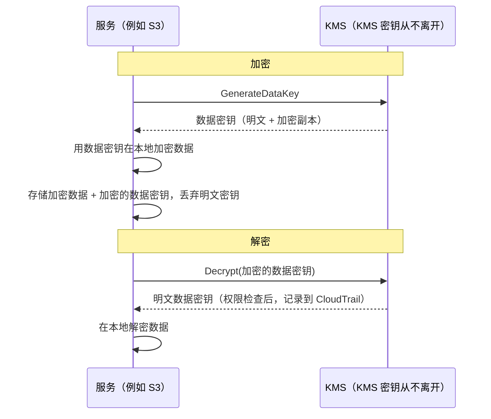

# 第16章：密钥、锁和秘密

这个 git 仓库有着追溯到两年前的数千次提交。Leo 已经滚动浏览了二十分钟，沿着一条线索穿过历史——寻找某个数据库连接字符串最初出现的时间。他差点错过了它。那是一个星期二的下午，夹在两次毫不起眼的提交之间，由一个早已离开公司的人推送的。

一个数据库密码。纯文本。就在历史记录里。

---

*上一章的网络控制现在已经很严密了。安全组限制了横向移动。NACL 屏蔽了已知的恶意 IP 段。边界已经被加固。但安全审计发现了一个边界无法修复的问题：一个在 git 历史中存活了六个月的凭证。边界安全假设内部的秘密是安全的。这一个不是。*

---

Leo 是在查看 git 历史时发现它的。一个数据库密码。六个月前以纯文本形式提交，提交者已经不在 Nimbus 工作了——它是一个 `.env` 文件的一部分，该文件在连接字符串下方两行处还包含了部署管道的 IAM 访问密钥。这次提交是公开的。密码此后已经更改——但他们并不能确定这一点。他们检查了这两个凭证曾经触及的每一个系统。花了四个小时。就是那天，Nimbus 决定停止把秘密放在代码里。

"我们有没有想过如果有人 fork 了仓库会怎样？"Priya 说。"Git 历史是永久的。即使我们改了密码，任何在修复之前克隆过仓库的人，本地历史里仍然有旧凭证。"

"我们查过了，"Leo 说。"密码三个月前就改了。所有系统都确认过。"

"那只是最低限度，"Priya 说。"那个凭证触及过的每一个系统都需要被审查。不只是你知道的那些。"

**四小时审计**

Leo 是在上午10点在 git 历史中发现泄露的 `.env` 文件的。到下午2点，他们对那个真正重要的问题有了答案：这两个凭证——数据库密码和与它一同提交的访问密钥——有没有被 Nimbus 系统之外的任何人使用过？

审计涵盖了四个类别。

**RDS 访问日志**：每一次到数据库的连接，都有时间戳并被记录。泄露的密码出现在三个连接字符串中——全部来自 Nimbus VPC 内的 EC2 实例，来源 IP 全部符合预期。没有外部连接。这个密码没有被用来从外部连接数据库。

**S3 访问日志**：泄露的访问密钥属于部署管道的 IAM 用户，该用户拥有 `nimbus-receipts` 桶的权限。Leo 查询了过去六个月的 S3 服务器访问日志。每一次访问都来自 `us-west-2` 的 EC2 实例，或来自 CloudFront 的源站抓取角色。没有异常。

**CloudTrail API 调用**：用泄露的访问密钥 ID 发起的每一次 AWS API 调用。Leo 在 CloudTrail 事件中按该密钥过滤。三百一十二个事件——全部是来自部署管道的例行 `s3:PutObject` 调用，全部来自同一个 IP，全部在工作时间内。这个密钥只从一个 IP 地址被使用过，而它与 CI/CD 服务器相匹配。

"而 CI/CD 服务器，"Priya 说，"在 VPC 内部。它必须通过 HTTPS 向外部端点外泄数据才行，而我们会在流日志里看到。"

"我们查过了，"Leo 说。"过去六个月里，那台服务器没有任何到非 AWS IP 的出站 HTTPS。"

**结论**：两个凭证都没有被 Nimbus 团队以外的任何人使用过。这次暴露是一个风险，而不是一次入侵。

"但我们无法绝对确定，"Priya 说。"基于日志，我们可以合理地有信心。但我们不能绝对确定。这个区别很重要。"

"什么能让我们确定？"

"凭证泄露之后没有任何东西能让你确定。你轮换凭证、审计访问、记录发现，然后带着更好的控制措施继续前进。确定性是得不到的。"

Tom 在对话期间一直在算账。"三个工程师四个小时的时间。按全口径成本算大约四千美元。再加上凭证轮换、文档编写、事件报告。"

"而且这只是调查，"Priya 说。"一次真正的入侵会高出几个数量级。监管通报。客户沟通。可能的罚款。"

"所以这四千美元的教训算便宜的，"Tom 说。

"相当便宜，"Priya 说。"我们别再重蹈覆辙。"

---

**两个问题：存储秘密和加密数据**

围绕敏感信息的安全性有两个截然不同的问题：

**存储凭证**（数据库密码、API 密钥、连接字符串）：这些应该存储在哪里？谁可以访问它们？如何在不重新部署应用程序的情况下轮换它们？

**加密数据**（客户信息、支付记录、个人身份信息）：如何确保即使有人未经授权访问你的数据库或 S3 桶，他们也无法读取数据？

AWS 为每个问题都有一个专用服务：

- **AWS Secrets Manager**：安全地存储和管理凭证
- **AWS KMS（密钥管理服务）**：管理用于加密和解密数据的加密密钥

把 Secrets Manager 想象成一个钥匙串：它保管着你的钥匙（凭证），让它们井井有条，并按计划轮换它们。把 KMS 想象成一个保险库：它保管的不是贵重物品本身——它保管的是打开保护贵重物品那把锁的钥匙。

**AWS Secrets Manager：不再有硬编码凭证**

Secrets Manager 是一个用于存储秘密的安全库：数据库凭证、API 密钥、OAuth 令牌、SSH 密钥，或任何敏感内容。

应用程序不是从环境变量或配置文件读取密码，而是在启动时（或需要时）调用 Secrets Manager API 来检索秘密。秘密从不触碰磁盘。它不会出现在你的代码中。它不在你的环境变量里。

流程如下：

**旧方式**：
```
DB_PASSWORD=supersecretpassword123  # in .env file or environment variable
```

**Secrets Manager 方式**：
```python
import boto3
client = boto3.client('secretsmanager')
secret = client.get_secret_value(SecretId='nimbus/production/db-password')
password = json.loads(secret['SecretString'])['password']
```

EC2 实例需要一个 IAM 角色，拥有针对该特定秘密调用 `secretsmanager:GetSecretValue` 的权限。其他任何服务都无法读取它。秘密永远不在代码中。

你可能会想：为什么不直接用环境变量？它们更简单——部署时设置，应用程序读取即可。环境变量看似隐蔽，但它们存储在你的部署配置、CI/CD 秘密存储中，可能在调试会话中被记录到日志，并且对任何能访问运行中进程的人可见。更重要的是，它们是静态的：一旦设置，在有人手动更新之前就不会改变。Secrets Manager 把凭证存储在一个加密的服务里，带有 IAM 访问控制、通过 CloudTrail 的完整审计日志和自动轮换。环境变量不会轮换。泄露的环境变量在有人手动更改之前一直有效。

**自动轮换：真正的力量**

Secrets Manager 最强大的功能不是存储秘密——而是自动轮换它们。

场景是这样的：每30天，Secrets Manager 生成一个新的数据库密码，在 RDS 中更新它，更新存储的秘密，而你的应用程序在下次需要时检索新密码。无需人工干预。无需部署。无需"我得记着轮换这个"。

轮换是作为 Lambda 函数实现的。AWS 为 RDS 数据库（MySQL、PostgreSQL、Aurora）提供模板。你可以为任何凭证类型自定义函数。

"那每个月要花多少钱？"Tom 问。

Secrets Manager 按秘密按月收费，加上每次 API 调用的费用。对于少量的数据库密码和 API 密钥，成本是每月几美元——与一次安全事件的成本相比可以忽略不计。

"上周那次泄露，"Priya 说，"调查和修复花了多少钱？"

Tom 沉默了片刻。"算上我的时间、你的时间、Leo 的周末……几千美元。"

"Secrets Manager 本可以在那个静态密钥被利用之前就发现它。而且它会自动轮换它。"

Tom 打开了定价页面。

**轮换期间发生了什么**

"等等——但我们*为什么*要那样做？"Maya 问。"如果数据库密码轮换了，应用程序会崩溃吗？它如何在不部署的情况下拿到新密码？"

这是一个合理的担忧。无中断的轮换需要细心。

Secrets Manager 的轮换分阶段进行——其设计就是为了防止"旧密码突然失效、应用程序崩溃"的场景：

**阶段1：创建新的秘密版本。**Secrets Manager 生成一个新密码，并将其存储为秘密的待定（pending）版本。当前版本仍然有效。

**阶段2：在服务上设置。**轮换 Lambda 调用数据库，将密码更新为新值。需要注意：使用默认的**单用户（single-user）**轮换策略时，会有一个短暂的瞬间——旧密码刚刚失效（PostgreSQL 的 `ALTER ROLE ... PASSWORD` 立即生效），而新版本还没有成为当前版本。要实现零停机轮换，Secrets Manager 支持**交替用户（alternating-users）**策略：两个权限完全相同的数据库用户，轮换总是更新*不活跃*的那一个然后再切换——活跃的凭证永远不会在使用中被失效。要记住的考试用语是"alternating users rotation strategy（交替用户轮换策略）"。

**阶段3：测试新秘密。**轮换 Lambda 通过用新密码进行连接来验证它是否可用。如果失败，轮换会被回滚。

**阶段4：完成。**Secrets Manager 将新版本标记为当前版本，并将旧版本降级为前一版本。前一版本会保留一个宽限期。

在宽限期内，两个版本都可以检索。如果你的应用程序缓存了旧秘密，还没有拿到新的，它仍然可以连接。它下次调用 `GetSecretValue` 时，会得到当前（新）版本。

"所以应用程序永远不需要重启，"Leo 说。

"不一定。如果你的应用程序在启动时缓存了秘密并且从不刷新，你需要要么按计划刷新它，要么在认证失败时重新获取秘密。"

"所以轮换 Lambda 和应用程序需要配合，"Maya 说。

"Secrets Manager 做它的那一半。你的应用程序代码需要做另一半：在需要时获取秘密，在认证失败时重新获取。"

Leo 更新了应用程序，捕获数据库认证异常，并在失败时先从 Secrets Manager 获取最新的秘密再重试。两行错误处理。轮换对用户变得不可见了。

---

**CI/CD 管道的秘密注入**

"我们有没有想过部署管道如何获取它需要的秘密？"Priya 问。"管道部署基础设施。它需要 AWS 凭证。它可能还需要用于迁移脚本的数据库连接字符串。"

Leo 解释了当前的设置：秘密存储为 GitHub Actions Secrets——在 GitHub 中静态加密，运行时作为环境变量注入。

"凭证在 GitHub 里，"Priya 说。

"是加密的。"

"在一个第三方系统里。一次 GitHub 入侵就会暴露我们所有的管道秘密。"

解决方案：部署管道通过 OIDC 联合身份验证（第14章讲过）向 AWS 进行认证，并在运行时从 Secrets Manager 检索它需要的任何秘密。GitHub 中不存储任何秘密。管道的 AWS 角色只有读取特定秘密的权限，别的什么都没有。

```yaml
# GitHub Actions workflow
- name: Get DB Migration Credentials
  env:
    AWS_DEFAULT_REGION: us-west-2
  run: |
    SECRET=$(aws secretsmanager get-secret-value \
      --secret-id nimbus/staging/db-migration \
      --query SecretString --output text)
    DB_URL=$(echo $SECRET | jq -r '.url')
    # 用 DB_URL 运行迁移——从不存储到文件
    flyway -url="$DB_URL" migrate
```

秘密被获取、在内存中使用、然后丢弃。它从不写入磁盘，从不存储在作业结束后仍然存在的环境变量里，从不出现在日志文件中。

"如果秘密被打印到日志里呢？"Leo 问。

"GitHub Actions 会自动遮盖配置为 GitHub Secrets 的秘密的值。但这个秘密不是 GitHub Secret——它来自 Secrets Manager。你需要手动遮盖它，或者更好的做法是，永远不要记录它。"

"所以纪律是：获取、使用、丢弃。永远不记录秘密。永远不把它们存进文件。"

"这种纪律，"Priya 说，"正是四小时审计证实我们一直没做到的。"


**AWS KMS：锁厂**

"等等——但我们*为什么*要那样做？"Maya 问。"为什么要一个单独的密钥管理服务？我们不能自己加密数据，然后把密钥存在 Secrets Manager 里吗？"

你确实可以把加密密钥存在 Secrets Manager 里。但那样的话，谁来控制对密钥的访问？什么来保证密钥被轮换？什么来向审计员证明密钥只被授权的服务使用过？KMS 回答了所有这些问题。它不只是存储——它是一个密钥生命周期管理服务，具有硬件支持的安全性、每个密钥的细粒度 IAM 策略，以及每次使用的完整审计记录。Secrets Manager 存储的是你连接系统所需的东西。KMS 保护的是系统本身。

AWS KMS（密钥管理服务）管理**密码学密钥**——用于加密和解密数据的秘密值。

类比：KMS 就像一家保管主钥匙的保险箱公司。你的数据（箱子里的东西）是加密的。只有有权限使用 KMS 密钥的人才能解密它。KMS 在 CloudTrail 中记录每个密钥的每次使用。

**客户主密钥（CMK）**——现在称为 KMS 密钥——按所有权分为三种类型：

**AWS 拥有的密钥**：AWS 拥有并在许多客户账户之间使用的密钥——你永远看不到它们，永远不为它们付费，它们也不出现在你的账户里。一些服务的默认设置使用它们（例如 DynamoDB 的默认加密）。

（有一个值得理清的区别：S3 的默认 **SSE-S3** 加密根本*不是* KMS 密钥模型——S3 完全在 KMS 之外自行管理它的 AES-256 密钥，没有可见的密钥，也没有密钥使用的审计记录。**SSE-KMS** 才是经过 KMS 的 S3 选项，使用 AWS 托管密钥 `aws/s3` 或客户管理的密钥。考试触发语："审计谁使用了加密密钥"或"控制轮换和密钥策略" → 使用客户管理密钥的 SSE-KMS——每次使用都会落到 CloudTrail 里。）

**AWS 托管密钥**：AWS 自动*在你的账户中*为 S3、EBS、RDS 等服务创建和管理密钥（命名形如 `aws/s3`）。你可以看到它并在 CloudTrail 中审计其使用，但你不能更改它的策略或轮换——AWS 每年自动轮换它。免费。

**客户管理密钥**：你在 KMS 中创建密钥，并控制它的每个方面：谁可以使用它、何时轮换、谁可以管理它。你可以启用自动密钥轮换，轮换周期可配置为90天到2,560天（7年）之间；默认轮换周期是365天（每年一次）。你还可以立即触发一次**按需轮换（on-demand rotation）**——在怀疑发生泄露之后非常有用，无需等待计划周期。注意：自动轮换只适用于使用 KMS 生成密钥材料的对称密钥——非对称密钥和导入的密钥材料无法自动轮换。成本：每个密钥每月1美元，加上每次 API 调用的费用。

如果你选择客户管理的 KMS 密钥，你就能完全控制轮换计划、访问策略和审计可见性，但你要为每个密钥按月付费，并承担密钥管理的责任；如果你选择 AWS 托管密钥，你就能以零运维开销获得加密、密钥本身不收费，但你无法自定义轮换计划或密钥策略——它们完全由 AWS 管理。

**AWS 服务中的加密：KMS 集成**

大多数 AWS 服务与 KMS 集成用于加密：

**S3**：在桶上启用"使用 KMS 的服务器端加密"。每个对象在静态时都用 KMS 密钥加密。读取对象需要同时对 S3 桶*和* KMS 密钥的权限。

**RDS**：在创建时启用加密。数据库存储、备份和快照都用 KMS 密钥加密。注意：无法在现有的未加密 RDS 实例上启用加密——你必须创建快照，复制快照并启用加密，然后恢复。

**EBS**：用 KMS 加密卷。从加密快照创建的新卷会自动加密。

**DynamoDB**：使用 KMS 的静态加密在所有表上默认启用。

**ElastiCache Redis**：用 KMS 对敏感缓存数据进行静态加密。

原则：数据应该在静态时（存储在磁盘上）和传输中（在网络上移动）都加密。KMS 处理静态加密。TLS/SSL（由 AWS 服务自动提供）处理传输加密。

**信封加密：KMS 实际如何工作**

这里有一个能帮助你理解 KMS 行为和考试题目的细节。

在大多数情况下，KMS 不直接加密你的数据。它使用**信封加密**：

1. KMS 生成一个**数据密钥**（一个唯一的对称密钥）
2. 服务使用数据密钥在本地加密你的数据（快速——对称加密）
3. 服务请求 KMS 加密数据密钥本身（使用你的 KMS 密钥）
4. 加密后的数据和加密后的数据密钥都被存储
5. 你的实际数据从不离开服务——只有数据密钥被送到 KMS 进行加密/解密

当你读取数据时：

1. 服务请求 KMS 解密数据密钥
2. KMS 检查权限，解密数据密钥，返回它
3. 服务使用解密后的数据密钥在本地解密你的数据



这意味着 KMS 可以处理非常大的数据，而无需将所有数据都通过 KMS API 传输。只有小小的密钥会送到 KMS。CloudTrail 记录每次 KMS API 调用——每一次加密和解密操作。

**KMS 密钥策略：访问模型**

"我们有没有想过如果 IAM 策略和密钥策略冲突会怎样？"Priya 问。"KMS 在 IAM 之上有它自己的访问控制。"

KMS 密钥有**密钥策略（key policies）**——附加在密钥本身上的基于资源的策略。它们与 IAM 策略不同，遵循不同的评估规则。

一个主体要使用 KMS 密钥，必须满足两个条件：

**第一**：密钥策略必须允许。如果密钥策略没有明确授予该主体访问权限，他们就不能使用这个密钥——无论他们的 IAM 策略怎么说。这与大多数 AWS 资源不同，那些资源仅凭 IAM 策略就足够了。

**第二**：该主体的 IAM 策略必须允许相应的 KMS 操作（例如 `kms:Decrypt`、`kms:GenerateDataKey`）。

两者都必须说"是"。任何一个说"否"，操作就会被拒绝。

AWS 为客户管理密钥创建的默认密钥策略包含一条语句，写着"根账户可以管理这个密钥"。这一点很重要：这意味着账户级别的 IAM 管理员总是可以授予对密钥的访问权限，即使密钥策略没有直接点名他们——因为根账户委托是存在的。

"那如果我们从密钥策略里删除根账户，"Leo 问，"IAM 策略对那个密钥就不起作用了？"

"正确。删除根账户委托是一种把密钥锁得极紧的方法，紧到只有密钥策略里点名的特定主体才能使用它——连账户管理员都不行。它也是一种不小心把自己锁在自己的密钥之外的方法。"

"我们能恢复吗？"

"只能联系 AWS Support。如果没有人能使用密钥，密钥策略又无法更新，那么用该密钥加密的数据实际上就无法访问了。"

"所以没有极其充分的理由，不要从密钥策略里删除根账户。"

"正确。"

---

**非对称密钥：签名与验证**

KMS 还支持非对称密钥对——一个公钥和一个私钥。

使用场景：

**数字签名**：你用私钥签署文档或 JWT 令牌。任何拥有公钥的人都可以验证签名来自私钥持有者，并且内容没有被篡改。

**公钥加密**：任何人都可以用公钥加密数据。只有私钥持有者才能解密。

对 Nimbus 来说，非对称密钥在他们为餐厅合作伙伴实现 webhook 签名系统时变得重要起来。当 Nimbus 向餐厅合作伙伴的服务器发送事件（一个新订单、一个状态更新）时，合作伙伴需要验证该事件确实来自 Nimbus，没有被伪造。

实现方式：

1. Nimbus 创建一个非对称 KMS 密钥（RSA 2048位，SIGN_VERIFY 算法）
2. 发送 webhook 时，Nimbus 调用 `kms:Sign`，用私钥对事件负载签名
3. 签名包含在 webhook 头部
4. Nimbus 发布公钥（可从 KMS 控制台下载）
5. 餐厅合作伙伴的服务器获取公钥，并用它验证每个传入 webhook 上的签名

私钥从不离开 KMS。Nimbus 从未接触过原始私钥材料。KMS 在它的硬件安全模块内部执行签名操作。

"所以即使有人攻陷了一台 Nimbus 服务器，"Rafael 说，"他们也无法伪造 webhook 签名。私钥在 KMS 里，不在任何服务器上。"

"正确。签名需要一次 KMS API 调用。每次 API 调用都记录在 CloudTrail 里。如果有人试图签署一个伪造事件，我们会看到那次 API 调用。"

---

**密钥删除的故事**

KMS 设置完成三个月后，Tom 犯了一个错误。

他当时在清理未使用的 AWS 资源——旧的 Lambda 函数、废弃的 S3 桶、被遗忘的 CloudWatch 仪表板。他动作很快。他不小心把一个 KMS 密钥安排了删除计划。

那个密钥是 `nimbus/prod/order-receipts`——用于加密订单收据 S3 桶的客户管理密钥。

"我昨天批量删除了十二个资源，没检查第十二个是什么，"Tom 平淡地说。他安排了删除就继续干别的去了。第二天早上复查自己的操作时，他才注意到这个错误。

他打开 KMS 控制台。密钥状态显示："待删除。7天后删除。"

他把它安排成了最短等待期。

"我们能取消吗？"他问。

Priya 调出了文档。"可以。在等待期内，密钥被禁用但没有被删除。你可以取消删除。"

Tom 在一分钟内取消了删除。密钥恢复到了活跃状态。

"七天是最短等待期，"Priya 说。"AWS 强制规定它，是因为如果一个密钥被删除，而数据是用它加密的，那些数据就永远没了。无法恢复。等待期给你时间意识到错误。"

"等待期应该设多长？"

"最长是三十天。对任何加密生产数据的密钥，用三十天。多出来的三周防意外保护，值得那一点点不便。"

Tom 把所有生产密钥的删除设置都更新成了三十天。他还设置了一个 CloudWatch 告警，在任何 KMS 密钥状态变为"待删除"时触发——这样下次有人（包括他自己）犯同样的错误时，团队会在五分钟内知道。

---

**Secrets Manager 与 Parameter Store**

AWS 还有 **Systems Manager Parameter Store**，用于存储配置值（不只是秘密）。Parameter Store 更便宜——标准参数免费。它也可以使用 KMS 存储加密参数。

需要轮换的秘密：Secrets Manager。

配置值和非敏感参数：Parameter Store（免费层非常慷慨）。

应用程序配置（端口号、功能标志、特定环境的设置）：Parameter Store。

| | Secrets Manager | SSM Parameter Store |
|---|---|---|
| 自动轮换 | 有（基于 Lambda） | 无 |
| 成本 | 约$0.40/秘密/月 | 免费（标准） |
| 加密 | 始终 | 可选（使用 KMS） |
| 版本控制 | 有 | 有 |
| 跨账户访问 | 有 | 有限 |
| 最适合 | 数据库密码、API 密钥 | 配置值、功能标志 |

## 门上的证书

秘密迁移完成两周后，Priya 在手机上查看 Nimbus 的预发布环境时，注意到了地址栏。

"不安全。"

她调出生产环境的 URL。一样。

"Leo，"她说着，把手机放到桌上。"我们是在跑 HTTP 吗？"

Leo 查了一下。"ALB 监听器在80端口。我们从来没设置过 HTTPS。"

"所以我们用户发出的每一个请求——每一次下单、每一次登录——都走的是未加密的 HTTP？"

"我们在 RDS 连接上有 TLS，"Leo 试着说。

"那是应用程序和数据库之间的传输数据。我说的是用户浏览器和我们的负载均衡器之间的传输数据。那完全没有加密。"

Tom 一直在听。"这是安全问题还是观感问题？"

"两者都是，"Priya 说。"未加密的 HTTP 意味着用户和我们服务器之间的任何网络——咖啡店的路由器、一家 ISP——都能读取流量。密码、订单详情、会话令牌。而且现代浏览器会用'不安全'警告用户。那会扼杀转化率。"

"所以我们需要一个 TLS 证书，"Maya 说。"那要多少钱？"

"不要钱，"Priya 说。"AWS Certificate Manager。"

**AWS Certificate Manager（ACM）**为配合 AWS 托管服务使用而签发免费的 TLS/SSL 证书：ALB、CloudFront 分发和 API Gateway。你不需要购买证书、维护续期日历，或接触私钥材料。ACM 处理整个证书生命周期。

ACM 签发的证书有效期为13个月。在它过期之前，ACM 会自动续期。如果续期成功，新证书会附加到你的负载均衡器或分发上，你无需任何操作。浏览器的挂锁保持绿色。你忘记设置的那个过期告警永远不会响。

**两种类型的 ACM 证书**：

**公有证书**由 Amazon 的证书颁发机构签发，被所有主流浏览器信任。配合 ALB、CloudFront 和 API Gateway 使用完全免费。你通过 DNS 或电子邮件验证域名所有权。

**私有证书**由 AWS Private CA 签发——一个你为内部服务运行的托管私有证书颁发机构（服务到服务的 mTLS、内部工具、VPN 客户端）。Private CA 有月度费用。

对 Nimbus 来说，公有证书是正确的选择。

**DNS 验证与电子邮件验证**：

Leo 打开 ACM 控制台，为 `eatnimbus.com` 和 `*.eatnimbus.com` 发起了证书申请。

"它在问我想如何验证所有权，"他说。"DNS 还是电子邮件。"

"DNS，"Priya 说。"永远选 DNS。"

使用 DNS 验证时，ACM 会向你的托管区域添加一条特定的 CNAME 记录。Route 53 可以自动完成这一步——控制台里一次点击。只要那条 CNAME 记录存在，ACM 就可以在无需任何人工操作的情况下自动续期证书。电子邮件验证会向域名的注册联系人发送一封邮件，并要求在每次证书续期时手动点击。那次点击会被忘记。DNS 验证不要求任何人记住任何事情。

"所以我添加一次 CNAME 记录，"Leo 说，"它就永远续期？"

"直到有人删除那条 CNAME 记录，"Priya 说。"别删那条 CNAME 记录。"

Leo 申请了证书，在 Route 53 中添加了验证 CNAME（ACM 主动提出自动完成），然后等了五分钟。证书状态变成了"已签发"。他把它附加到 ALB 443 端口的 HTTPS 监听器上，并在80端口添加了一条重定向规则，把所有 HTTP 流量送到 HTTPS。

Tom 刷新了生产环境的 URL。

挂锁出现了。

有一个值得标记的区域细节：证书是区域性资源，它必须和使用它的服务位于同一区域。对 ALB 来说，就是 ALB 所在的区域。对 **CloudFront** 来说，证书必须在 **`us-east-1`** 申请（或导入）——永远如此，无论你的源站在哪里运行——因为 CloudFront 是一个锚定在那里的全球服务。Leo 在第13章就已经在这上面绊过一跤；这也是一个可靠的考试知识点。

**ACM 证书唯一做不到的事**：

"我能下载证书吗？"Leo 问。"我想把它装到内部管理用的 EC2 实例上。"

"不能，"Priya 说。

免费的 ACM 公有证书无法导出。你不能下载私钥并把它安装到 EC2 实例、Nginx 服务器或任何 AWS 托管服务之外的东西上。私钥材料从不离开 ACM。这是有意为之——它防止私钥被泄露、被不安全地存储，或在证书过期时被遗忘。

对于需要可安装证书的使用场景——一台充当自定义代理的 EC2 实例、一台本地服务器——有三条路径：来自第三方机构的证书（例如 Let's Encrypt）、启用了证书导出的 AWS Private CA，或者——自2025年6月起——ACM 的付费**可导出公有证书**（签发时选择加入，按 FQDN 或通配符收费），其私钥*可以*导出在任何地方使用。

"对我们的 ALB 和 CloudFront 分发来说，"Priya 说，"ACM 正合适。免费、自动，而且我们从不接触密钥。"

## 优势与局限性

**AWS Secrets Manager**：

- 无需更改代码或部署的自动秘密轮换
- 每个秘密的细粒度 IAM 访问控制（每个秘密都是一个独立的 IAM 资源）
- 版本控制——轮换期间前一版本仍可访问，防止连接中断
- 通过 CloudTrail 审计——每次 `GetSecretValue` 调用都连同调用者身份一起记录
- 跨账户访问——一个账户的秘密可以共享给另一个账户的角色
- 成本：约$0.40/秘密/月 + API 调用（大约每10,000次 API 调用$0.05）

**AWS KMS**：

- 带完整审计记录的集中式密钥管理——每次加密和解密都被记录
- 客户管理密钥的可配置自动密钥轮换（90天到2,560天；默认365天）——旧密钥材料仍然能解密现有数据，新密钥材料加密新数据
- 每个密钥的细粒度 IAM 权限（密钥策略 + IAM 策略——两者都必须允许）
- 硬件安全模块（HSM）支持——密钥从不以明文形式离开 HSM
- 支持多区域密钥，用于灾难恢复场景
- 支持非对称密钥，用于数字签名和验证
- 成本：每个密钥每月$1 + 每10,000次 API 调用$0.03

**事情变得复杂的地方**：

- KMS 密钥策略与 IAM 策略分开（并同时评估）——调试访问被拒错误需要检查两者
- 静态加密必须提前规划——你无法就地加密现有的未加密 RDS 实例
- KMS 中的密钥删除有7-30天的等待期——一种安全机制，但在设置时容易忘记，意外触发也很危险
- 轮换要求应用程序代码在认证失败时处理重新获取秘密——Secrets Manager 轮换凭证，但应用程序必须把它接过来
- 在大规模时，Secrets Manager 成本随秘密数量和 API 调用量增长
- 默认密钥策略（包括根账户委托）至关重要，必须保留——删除它可能把管理员锁在密钥之外

## 摘要

花在追踪一个泄露凭证触及的每个系统上的四个小时，是 Secrets Manager 本可以避免的四个小时。自动轮换意味着被盗的凭证寿命很短。KMS 意味着即使有人拿到了数据，没有他们无权使用的密钥也读不了。而三十天的密钥删除等待期意味着一次意外删除可以在变成数据丢失事件之前被取消。

- 永远不要把凭证存储在代码、环境变量或提交到版本控制的配置文件中。
- **Secrets Manager** 安全地存储凭证并自动轮换它们。应用程序在运行时通过 API 获取秘密。
- **轮换**分阶段进行：创建新版本、在服务上更新、测试、提升。新旧版本会短暂地同时有效，防止轮换期间连接中断。
- **KMS** 管理加密密钥。大多数 AWS 服务与 KMS 集成用于静态加密。
- **信封加密**：KMS 加密的是密钥，而不是直接加密数据。服务用本地数据密钥加密数据，KMS 再加密这个数据密钥。只有小小的密钥会经过 KMS API。
- **客户管理的 KMS 密钥**：完全控制轮换（可配置90–2,560天，默认365天每年一次）、访问和审计（每月$1）。**AWS 托管密钥**：自动、无需配置、免费。
- **KMS 密钥策略**：密钥策略是与 IAM 协同工作的基于资源的策略。两者都必须说"是"。默认密钥策略中的根账户委托确保 IAM 管理员总是可以授予访问权限。
- **非对称密钥**：KMS 支持 RSA 和 ECC 密钥对，用于签名和验证。私钥从不离开 HSM。
- **密钥删除**：最短7天、最长30天的等待期。删除密钥意味着加密数据永久无法访问。生产密钥用30天，并监控待删除状态。
- **CI/CD 秘密**：使用 OIDC 联合身份验证在运行时从 Secrets Manager 获取。永远不要把秘密存储为 CI/CD 平台变量。

## 考试技巧

*SAA-C03 领域：设计安全架构（领域1，任务1.3）*

- **Secrets Manager vs SSM Parameter Store**：需要自动轮换的凭证用 Secrets Manager；一般配置用 Parameter Store。考试按轮换要求和成本敏感性区分它们。
- **KMS 密钥策略**：KMS 密钥有自己的密钥策略（基于资源的策略）。单凭 IAM 策略不能授予 KMS 密钥的访问权限——密钥策略必须明确允许。密钥策略和 IAM 策略都必须允许该操作。
- **加密 RDS**：无法在现有的未加密 RDS 实例上启用加密。流程是：创建快照 → 复制快照并启用加密 → 从加密快照恢复 → 将流量迁移到新实例。
- **EBS 加密**：新卷可以加密。加密卷的快照始终是加密的。未加密的卷不能直接加密——快照 + 复制 + 恢复。
- **CloudTrail + KMS**：每次 KMS API 调用都记录在 CloudTrail 中。这是一个关键的合规特性。当考试问如何审计谁解密了什么数据时，答案是 CloudTrail + KMS。
- **多区域 KMS 密钥**：将密钥材料复制到多个区域，这样解密无需跨区域 API 调用就能进行。考试将这用于带加密数据的多区域灾难恢复。
- **KMS vs CloudHSM**：KMS 是多租户的（由 AWS 管理）。CloudHSM 是只有你控制的专用硬件安全模块。考试信号："FIPS 140-2 三级"、"专用 HSM"、"客户管理的密码学操作" → CloudHSM。
- **信封加密**：KMS 生成一个数据密钥，服务用它在本地加密数据，KMS 再加密这个数据密钥。考试题目："为什么 KMS 不直接加密大量数据？" → 性能；信封加密让大数据留在本地。
- **非对称 KMS 密钥**：用于数字签名、JWT 验证或公钥加密。私钥从不离开 KMS。`kms:Sign` 是签名的 API 调用；`kms:Verify` 是验证的。
- **密钥删除等待期**：7-30天。在此期间，密钥被禁用、不可使用，但删除可以取消。删除之后，用该密钥加密的任何数据都将永久无法恢复。
- **ACM（AWS Certificate Manager）：**为配合 ALB、CloudFront 和 API Gateway 使用而签发免费的公有 TLS 证书。通过 DNS 验证自动续期。免费的公有证书无法导出其私钥——它们只存在于 AWS 内部（2025年起存在一个付费的*可导出公有证书*选项，可用于 EC2/本地环境）。考试触发语："负载均衡器或 CDN 上的 HTTPS" → ACM。

## 练习

**练习 1——回忆**

解释信封加密的概念。为什么 KMS 加密的是一个小型数据密钥，而不是直接加密你的应用程序数据？

*（提示：想想如果你有1GB的数据要加密，把1GB数据发送到远程 KMS 服务的性能影响会是什么。）*

**练习 2——SAA-C03 场景题**

*场景*：一家金融服务公司在 RDS MySQL 数据库中存储敏感的客户数据。新的合规要求规定：

1. 所有数据必须在静态时加密
2. 所有加密密钥的使用必须可审计
3. 加密密钥必须由客户控制（不由 AWS 管理）
4. 数据库密码必须每90天自动轮换

数据库是六个月前创建的，没有启用加密。哪组操作*最能*满足所有四个需求？

A) 在现有数据库上启用 RDS 加密；创建客户管理的 KMS 密钥；配置带90天轮换的 Secrets Manager  
B) 创建现有数据库的快照；使用客户管理的 KMS 密钥复制快照并启用加密；从加密快照恢复；配置带90天轮换的 Secrets Manager  
C) 用 AWS 托管密钥创建新的加密 RDS 实例；从旧实例迁移数据；配置带90天轮换的 Secrets Manager  
D) 使用 AWS 托管密钥在现有数据库上启用 RDS 静态加密；配置带90天轮换的 Secrets Manager

**提示 1**：你无法在现有的未加密 RDS 实例上直接启用加密。

**提示 2**："客户控制的"密钥意味着客户管理的 KMS 密钥，而不是 AWS 托管密钥。

**提示 3**：快照复制流程是迁移到加密 RDS 的标准路径。

**答案**：B

**解析**：RDS 加密无法在现有实例上启用。标准方法是：对现有实例创建快照 → 使用客户管理的 KMS 密钥复制快照并启用加密（满足需求1、2和3）→ 从加密快照恢复。客户管理的 KMS 密钥在 CloudTrail 中自动记录所有使用（审计），并让加密密钥处于你的控制之下。Secrets Manager 处理自动的90天密码轮换（满足需求4）。

**为什么不是 A？** 你无法在现有的未加密 RDS 实例上就地启用加密。

**为什么不是 C？** AWS 托管密钥不满足"客户控制"的需求（需求3）。

**为什么不是 D？** 与 A 相同的问题（无法就地启用），而且 AWS 托管密钥不满足需求3。

*SAA-C03 领域：设计安全架构——任务1.3*

**练习 3——架构挑战** *（可选）*

Nimbus 需要存储以下敏感数据：

- 生产 RDS 实例的数据库密码
- Stripe API 秘密密钥（用于支付处理）
- 用于加密 DynamoDB 中客户订单历史的对称加密密钥
- 每家餐厅的配置值（API 端点、功能标志——不敏感）

你会为每一项使用哪种 AWS 服务或方法？你会对每一项应用什么轮换策略？

*（没有唯一正确答案。目标是练习将安全工具与使用场景匹配。）*

## 彩蛋场景

"我已经部署了——哦。"Leo 在开发环境还在用旧环境变量的时候，就把生产环境的秘密迁移到了 Secrets Manager。开发环境坏了。他不得不手动回滚开发环境的配置。

"先预发布，"Priya 说。"再生产。"

"我知道，"Leo 说。

秘密迁移完成了。

数据库密码：Secrets Manager，每30天轮换一次。

API 密钥：Secrets Manager，配一个调用支付提供商 API 生成新密钥的轮换 Lambda。

客户订单数据：用客户管理的 KMS 密钥加密。

旧凭证：已停用。旧配置文件：已删除。旧的 GitHub Actions secrets：已移除。

"我们现在已经准备好迎接审计了，"Priya 说。

"定义一下'准备好迎接审计'，"Maya 说。

"如果合规审计员要求我们证明代码中没有硬编码凭证、基础设施中没有暴露的凭证，我们可以向他们展示：每个秘密都在 Secrets Manager 里，每个加密密钥都在 KMS 里，每次访问都记录在 CloudTrail 里。"

"上次有人检查 CloudTrail 日志是什么时候？"

一阵停顿。

"我每周都检查，"Priya 说。

"那如果出现了不寻常的东西，我们怎么会知道？"

"那个，"Priya 说着合上了她的笔记本电脑，"是下一场对话。"

下一章：站在 Nimbus 和互联网之间的三层防御。
