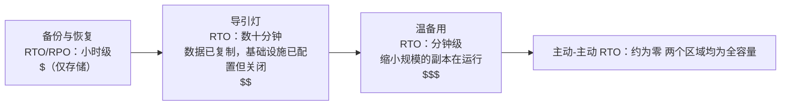

# 第18章：当事情出错时

晚上11点17分，灯灭了。

不是在 Nimbus 的办公室——Leo 在家里，坐在沙发上，笔记本电脑半合着。灯灭在俄勒冈州一个他从未去过的数据中心，在一栋他从未见过的大楼里，在一个满是他从未碰过的服务器的房间里。他还不知道。在远处某个地方的备用发电机启动之前，有那么一刻——仅仅一刻——是彻底的寂静。那种黑暗，黑到你分不清自己的眼睛是睁着还是闭着。

然后 Slack 通知来了。

---

第17章的监控系统就位之后，团队感受到了某种类似自信的东西。告警在触发。仪表板是绿色的。日志流进 CloudWatch。他们花了三周时间，把可见性接进了 Nimbus 基础设施的每一个角落。

没有人大声说出来的——监控防不住的——是可见性和韧性是两码事。你可以极其细致地看着某个东西失败。看着它，并不能阻止它。

这个教训在一个星期四的晚上11点23分到来了。

---

Leo 收到了 Slack 通知。

"us-west-2——数据中心集群故障——服务降级。"

他打开了 AWS 控制台。其中一个可用区里的 EC2 实例显示状态检查失败。他的 Auto Scaling Group 检测到了不健康的实例，正在启动替换——在同一个区里。

在那个正在失败的集群里。

新实例也无法启动。它们处在同一个硬件故障区域中。

"负载均衡器正在向两个 AZ 路由流量，"Leo 对着空气说。"我们一半的流量正在去往无法工作的实例。"

他打开 EC2 控制台开始点击。在"负载均衡器"下面，应用负载均衡器把两个目标组都显示为健康——因为健康检查在80端口上通过，连那些正在失败的实例都能响应这个检查。它们只是无法处理真实的请求。

他尝试把失败的 AZ 从目标组里移除。控制台接受了更改。但被配置为保持平衡的 Auto Scaling Group 立即开始尝试替换被终止的实例——在那个失败的区里。

Leo 盯着屏幕。他刚刚让事情变得更糟了。

他调出 ASG 配置。"在可用区之间平衡容量"的设置是开启的。在正常运行时这是好的设计。此刻它正在主动跟他作对。

他把 ASG 改成只使用健康的区。应用了更改。

控制台显示更改为"In Service"。

三分钟后，第一批健康的替换实例起来了。

负载均衡器开始路由流量。错误率从52%降到4%。剩下的4%是那些落到最后几个仍在排空连接的不健康实例上的请求。

到晚上11点45分——故障开始二十二分钟后——流量稳定了。

在他注意到并手动把 ASG 切换到只使用健康区之前，有二十二分钟的服务降级。

"这事发生是因为所有东西都在一个 AZ 里，"第二天早上 Priya 说。

"不，"Leo 说。"我在两个 AZ 都有实例。问题在于替换实例是在那个失败的 AZ 里生成的。"

"那数据库呢？"

Leo 停住了。

"RDS 主实例在那个失败的区里，"他说。"Multi-AZ 其实是尽职了——它在大约九十秒内故障转移到了健康区的备用实例。但我们的应用服务器一直保持着已经死掉的连接，并重试缓存的 IP 地址，而不是重新解析端点的 DNS 名称。数据库在11点25分就健康了。直到我重启了连接池，我们的应用才干净地重新连上。"

二十二分钟的服务降级变成了三十八分钟。

八个月前 Leo 设置 Auto Scaling Group 时，他勾选了"在 AZ 之间平衡容量"的设置，觉得这就够了。"不会有事的，"他当时跟 Maya 说。"AWS 会自动处理 AZ 那些事。"AWS 会处理这一点上他说对了——但他对"自动"意味着什么理解错了。

"如果我们一切都配置正确，"第二天早上 Maya 问，"会发生什么？真实故障中正确的 Multi-AZ 设置长什么样？"

Leo 思考了这个问题。从晚上11点45分起他就一直在想。

在那个假设的正确设置中：ASG 会拥有看的是 ALB 健康状态的实例健康检查——而不只是 EC2 状态。当 AZ 失败时，那些实例上的健康检查会在30秒内失败。ASG 会检测到这些失败并立即开始启动替换——而当一个 AZ 里的启动持续失败时，该组会把容量转移到其余健康的区里，而不是跟那个失败的区较劲。

负载均衡器会在同样的30秒内把失败 AZ 的目标移出轮换。流量会集中到健康的 AZ。

至于数据库：Multi-AZ 故障转移本身是起作用的——缺的是客户端的纪律。重连时重新解析端点 DNS 名称（而不是缓存 IP）的连接池、短的 DNS 缓存 TTL，以及重试逻辑。有了这些，一次 RDS 故障转移就是60–120秒的小波动，而不是16分钟的长尾。

客户可见的总影响：数据库故障转移期间60-90秒的延迟升高。而不是38分钟的级联错误。

"我们拥有挺过这次的全部基础设施，"Leo 说。"我们只是把它配置错了。"

这句话比那次事故本身更难说出口。

**电网类比**

想想你家是怎么获得电力的。电力不是来自一根从单台发电机拉出的电线。它来自电网——一个由发电机、变电站和输电线路组成、互为后备的网络。如果一个变电站着火，其他变电站会绕过它重新输送电力。你不会注意到。灯一直亮着。

AWS 可用区的工作方式是一样的。AWS 没有让一切都依赖一个巨大的数据中心，而是把你的资源分布在多个物理上分隔的设施中。如果一个设施停电或发生硬件故障，其他设施继续运行。流量自动重新路由。你的应用程序保持在线——因为从来不存在一根可以被剪断的单独的线。

这就是 **Multi-AZ 架构**：把你的资源分布在物理上分隔的设施中，让一次故障永远不会拖垮一切。

Multi-Region 是更高一层：想象在一个完全不同的城市有备用发电机。如果整个本地电网瘫痪，远程城市接管。设置起来更复杂，但对灾难性故障更有韧性。

你可能会想：如果 Multi-AZ 不过是把资源分散到两个数据中心，为什么 AWS 不把它设为一切的默认值？答案是成本。Multi-AZ 大约让基础设施翻倍——而对于开发环境或低流量的内部工具，这笔额外开销不值得。但对于生产工作负载，问题就反过来了：如果你没有它，你能承担得起那段停机时间吗？

**失败的词汇表**

在为韧性设计之前，你需要用来描述你的设计所对抗的东西的词汇。

"我们到底怎么衡量自己是否足够有韧性？"Priya 问。

"两个数字，"Leo 说。"我们能宕机多久，以及我们能丢多少数据。"

**可用性**：系统处于运行状态的时间百分比。"四个九"（99.99%）意味着每年不到52分钟的停机时间。"五个九"（99.999%）意味着每年大约5分钟。

**RTO（恢复时间目标）**：系统在成为业务问题之前可以宕机多久？如果你的 RTO 是4小时，你有4小时来恢复服务，否则 SLA 就被违反了。

**RPO（恢复点目标）**：你能承受丢失多少数据？如果你的 RPO 是1小时，你可以容忍在灾难性故障中丢失最多一小时的数据。故障前最后一小时写入的所有内容都没了。

**容错**：在某个组件失败时继续（在某种程度上）运行的能力。

**灾难恢复（DR）**：从灾难性故障中恢复的过程——数据中心火灾、区域范围的中断、意外的大规模删除。

这五个概念驱动着本章的每一个架构决策。

**RTO 和 RPO 是业务决策，不是技术决策**

数字本身没有"由谁来定"重要。工程师可以猜一个 RTO。业务相关方知道一次30分钟的宕机实际上要花多少钱。

考虑两家技术栈相同的公司：

一家处理券商交易的金融科技公司：RTO 为4分钟，RPO 为零。一个在交易时段宕机四分钟的交易系统可能错过数千笔交易。每笔错过的交易都有直接的美元价值。零数据丢失不是哲学问题——丢掉一笔已确认的交易意味着合规问题和客户诉讼。实现这一点的架构成本：带同步复制的主动-主动 Multi-AZ，六位数的年度基础设施预算。

一个餐厅订餐平台：RTO 为30分钟，RPO 为5分钟。晚餐高峰期30分钟的宕机确实很痛、损失真金白银。但丢失故障前最后5分钟的订单，意味着一小撮客户需要重新下单——烦人，但不是灾难。实现这一点的架构成本：温备用 Multi-AZ，金融科技预算的一个零头。

"等等——但*为什么*一个餐厅平台会接受5分钟的数据丢失？"Leo 解释这个时 Maya 问。"那不还是在丢客户订单吗？"

"问题在于防止那点数据丢失的成本是否超过它的价值，"Leo 说。"把 RPO 从5分钟降到0需要跨区域的同步复制。那是一笔可观的成本和工程投入。对于我们这个规模的餐厅应用，5分钟的 RPO 是正确的权衡。"

教训：RTO 和 RPO 不是技术下限。它们是用数字表达的业务权衡。设定它们需要工程团队（知道什么是可实现的）和业务相关方（知道什么是可接受的）共同参与。

**Multi-AZ：在可用区故障中存活**

可用区（AZ）是区域内物理上分隔的数据中心。AZ 被设计为相互独立：独立的供电、独立的冷却、独立的网络基础设施。但它们足够近，彼此之间的网络延迟只有1-2毫秒。

**Multi-AZ 部署**把你的资源分布在一个区域内的两个或更多 AZ 中。如果一个 AZ 失败：

- 负载均衡器停止向失败 AZ 中的不健康实例路由流量
- Auto Scaling Group 替换实例——但是在*健康*的 AZ 里
- RDS 故障转移到健康 AZ 中的备用实例

Leo 的错误：他的 Auto Scaling Group 没有被配置为把替换实例限制在健康的 AZ 里。它被配置为维持各 AZ 之间的平衡。当那个区失败时，ASG 试图通过在那里启动替换实例来平衡实例数量——就在那个正在失败的区里。

修复方法：把 ASG 配置为只往健康的 AZ 里启动，并始终保持至少两个活跃的 AZ。

更深层的教训：在故障在生产中发生之前，先测试你的故障场景。

如果你选择 Multi-AZ，你得到自动故障转移和接近零的 RPO——但你在为一套正常运行时不承载任何流量的基础设施付费。那个备用 RDS 实例始终在运行、始终在复制，而在主实例失败之前从不回答任何查询。这就是权衡：即使什么都没坏，可靠性也要花钱。

**混沌工程：第一次演练实际是什么样的**

Nimbus 的第一次混沌工程演练，并不像文档说的那么干净利落。

Leo 执行了运维手册的第2步：强制一次 RDS Multi-AZ 故障转移。他使用了 AWS CLI：

```
aws rds reboot-db-instance \
    --db-instance-identifier nimbus-prod \
    --force-failover
```

命令立即返回。Leo 开始计时。

T+0s：故障转移启动。RDS 控制台显示主实例状态为"rebooting"。

T+18s：应用日志开始出现数据库连接错误。连接池在尝试旧的主实例，而它已经不再是主实例了。

T+34s：RDS 控制台显示状态为"backing-up"。新的主实例正在被提升。DNS CNAME（数据库端点）正在被更新。

T+52s：应用日志重新开始显示成功的连接。连接池已经在旧主实例上耗尽了重试次数，重新连接到了 CNAME，它现在指向新的主实例。

T+4:17：所有连接重新建立。错误率归零。

总计：4分17秒。

"那是257秒的数据库不可用，"Tom 说。"我们餐厅合作伙伴的平板会显示4分钟的转圈。"

"我们的 SLA 写的是5分钟，"Leo 说。

"所以我们通过了，"Priya 说。"勉强。"

"两个观察，"Tom 说。"第一：我们能通过，是因为我们的 RTO 承诺定得宽松，而不是因为我们的架构特别快。第二：是连接池的重试行为给我们多争取了那34秒。如果应用在10秒后就放弃了，我们就失败了。"

Leo 更新了运维手册，记录下实测的时间。下个季度的目标：通过调整连接池参数和应用的健康检查逻辑，把故障转移检测时间从52秒降到30秒以下。

"混沌工程不是一次性的测试，"Priya 说。"它是一个反馈循环。你测试，你拿到真实数字，你改进，再测试。"

六个月后，他们第三次跑这个故障转移测试时，恢复时间是1分44秒。不是因为 RDS 变快了——是因为他们调好了应用。

**模拟故障：混沌工程**

"我们怎么知道我们的 Multi-AZ 设置真的有效？"Maya 问。

"我们故意把东西弄坏，"Leo 说。

"等等——但我们*为什么*要那样做？"Maya 说。"为什么不直接相信 AWS 文档说它有效？"

"因为文档描述的是服务如何工作。它不描述*你的配置*如何工作。这是两码事。"

Priya 向前倾了倾身。"我们有没有想过当负载均衡器健康检查和 ASG 健康检查意见不一致时会怎样？负载均衡器可能把一个实例移出轮换，但 ASG 认为这个实例是健康的，不去替换它。我们就会有一部分对负载均衡器不可见的容量。"

"那正是混沌工程会发现的那类问题，"Leo 说。

这听起来很鲁莽。实际上这是一个团队能做的最负责任的事。

**测试 RTO 承诺**

关于 RTO 有一个让人不舒服的真相：大多数团队设定了 RTO，然后从不测试自己是否真的能达到它。

30分钟的 RTO 不是保证。它是目标。知道你能否达成的唯一办法，就是模拟故障、给恢复计时。

晚上11点23分那次事故之后，Nimbus 团队承诺每个季度测试每一种故障模式。不只是手动测——还要有书面的验收标准。从 AZ 故障中恢复必须在10分钟内完成。从 RDS 故障转移中恢复必须在5分钟内完成。从备份恢复数据库（备份-恢复式 DR 测试）必须在2小时内完成。

这些数字来自和餐厅合作伙伴的对话，他们说晚餐高峰期10分钟以内的宕机"很痛但可以接受"。超过30分钟就是要谈合同的事了。

"SLA 谈判应该发生在你设定 RTO 之前，"Maya 说。"而不是之后。"

她没说错。他们做反了。他们先在内部定了 RTO，然后才意识到需要拿它去对照业务真正的要求。

设定 RTO 和 RPO 的正确顺序：业务需求第一，满足它的架构第二，验证它的测试第三。大多数团队从架构开始倒着推。数字因此遭殃。

**混沌工程**是有意向你的系统注入故障、以验证它能正确处理这些故障的实践。你故意终止一个 EC2 实例。你手动对 RDS 实例做故障转移。你把一个子网从负载均衡器那里隔断。

如果系统在你的 RTO 之内自动恢复，你的设计就是有效的。

如果没有，你是在一个受控环境中学到了这一点——而不是在凌晨2点的生产事故中。

对 Nimbus 而言：Leo 写了一份运维手册（一份成文的操作程序），用于测试每个故障场景。每个季度，他们会故意让一个组件失败，并测量恢复时间。如果恢复时间超过了 RTO，他们就修正设计。

**Multi-Region：在区域级故障中存活**

大多数 AWS 故障影响的是可用区，而不是整个区域。区域级故障很罕见——但它们会发生。

在区域级故障中（或者对于在世界各地都需要极低延迟的全球应用程序），**Multi-Region** 是答案：把你的应用程序部署到两个或更多 AWS 区域。

Multi-Region 引入了根本性的复杂性：

**数据复制**：你的数据库需要跨区域保持同步。任何写入 us-east-1 的数据最终必须到达 eu-west-1。"最终"就是问题所在——在时间差期间，各区域对世界的视图略有不同。

**主动-被动 vs 主动-主动**：

- **主动-被动**：一个区域承载所有流量。另一个是温备用。故障时，DNS 把流量切换到备用。更简单，但备用闲置着，而且昂贵。
- **主动-主动**：两个区域同时承载流量。构建更复杂（需要为并发写入做冲突解决），但全球延迟更低，没有闲置资源。

主动-主动听起来很诱人，直到你认真思考写操作。如果一个客户在 us-east-1 下单，与此同时餐厅在 eu-west-1 更新菜单，而两个区域之间发生了网络分区，哪个写入获胜？这就是实践中的 CAP 定理：在分布式系统中，发生网络分区时，你必须在一致性（两个区域对相同数据达成一致）和可用性（两个区域在意见不一时仍继续接受请求）之间做选择。主动-主动并不消除这个选择。它要求你在数据模型中明确地做出这个选择。

对 Nimbus 而言：主动-被动。他们不想为菜单和订单数据中的并发写入冲突费脑筋。在现阶段，一个单一的权威主区域更简单也更安全。

**故障转移时间**：DNS 更改需要时间传播（取决于 TTL）。在传播窗口期间，一些用户仍然会打到失败的区域。为极低的 RTO 做设计，需要提前预热备用区域，并在计划切换之前最小化 TTL。

**Route 53 DNS 故障转移：DR 的网络层**

在进入完整的 DR 策略谱系之前，值得先理解 DNS 如何融入故障转移——因为它往往才是真正在区域之间切换流量的那个东西。

**Amazon Route 53** 支持基于健康检查的路由。你配置：

1. 一个监控你的主端点的健康检查（通常是一个健康时返回200的 HTTP 端点）
2. 一条指向你的主区域的主 DNS 记录
3. 一条指向你的 DR 区域的次（故障转移）DNS 记录

当 Route 53 检测到主端点的健康检查失败时，它会自动把 DNS 响应切换到次记录。此时解析你域名的用户得到的就是 DR 区域的 IP。

"那如果有人试图在故障转移窗口期间闯进来呢？"Priya 问。"我们域名的 SSL 证书——它在两个区域都有效吗，还是 HTTPS 会断？"

"证书需要在两个区域都配置好，"Leo 确认道。"如果你用的是 ACM（AWS Certificate Manager），那意味着要在每个区域各自独立申请一份证书。"

Route 53 故障转移的运作机制：

- 健康检查每30秒从全球多个 AWS 位置运行
- 连续3次失败（90秒）后，Route 53 把端点标记为不健康
- DNS 响应立即切换到故障转移记录
- 但是：DNS TTL 仍然适用。如果你的 TTL 是300秒，已经缓存了主 IP 的客户端会继续打到失败的区域，最长可达5分钟

这就是为什么降低 TTL 是灾前准备的一部分。你不能在事故期间改 TTL（更改来不及传播）。TTL 的更改必须在需要之前提前几天或几周完成，这样故障发生时，解析器缓存已经在用短 TTL 了。

"所以降低 DNS TTL 不是一个恢复动作，"Leo 说。"它是一个预先布局的动作。"

"我们做了吗？"Maya 问。

他们没有。

那次对话之后，Leo 把 eatnimbus.com 的 TTL 从300秒降到了60秒。这个更改不花一分钱，却把他们最坏情况的故障转移时间从可能的8分钟改善到了不足3分钟。

**灾难恢复策略：一个谱系**

有四种常见的 DR 策略，从最便宜（恢复最慢）排到最昂贵（恢复最快）：



**备份与恢复**（小时级 RPO/RTO）：

- 把一切备份到另一个区域的 S3
- 灾难发生时：从零开始配置基础设施，从备份恢复
- 成本：非常低（你只为存储付费）
- 恢复时间：数小时

**导引灯（Pilot Light）**（分钟到1小时级 RPO/RTO）：

- 持续复制数据，并在 DR 区域保持核心基础设施*已配置但处于关闭状态*——模板、AMI、停止的或零规模的资源。没有任何东西承载流量；只有数据复制是"点着的"（那就是导引灯）
- 核心数据被复制（DR 区域里的 RDS 只读副本）
- 灾难发生时：启动/扩容 DR 区域的计算资源，把只读副本提升为主实例，切换 DNS
- （与下面的温备用对比：温备用里，应用的一个缩小规模的副本是真的*在运行*的）
- 成本：中等（你为数据复制和已配置但关闭的资源付费，而不是为运行中的计算付费）
- 恢复时间：数十分钟

**温备用（Warm Standby）**（秒到分钟级 RPO/RTO）：

- 在 DR 区域运行完整应用的一个缩小规模版本
- 完全可运行，但容量缩减
- 灾难发生时：扩容，切换 DNS
- 成本：更高（始终以缩减规模运行完整技术栈）
- 恢复时间：分钟级

**主动-主动 / 多站点**（接近零的 RPO/RTO）：

- 两个或更多区域均为全容量，同时承载流量
- 不需要恢复——如果一个区域失败，流量自动路由到另一个
- 成本：最高（两套全规模的完整部署）
- 恢复时间：秒级（仅 DNS 传播）

有一个服务把这个谱系的中段自动化了：**AWS Elastic Disaster Recovery（DRS）**持续地把你的服务器——本地或 EC2——逐块复制到一个低成本的暂存区，并能在灾难来袭时在几分钟内启动完整的恢复实例。实际上，它是一个*托管的导引灯*：以接近备份-恢复的价格获得接近温备用的恢复时间。考试信号："用托管 DR 服务为基于服务器的工作负载把停机时间和数据丢失降到最低" → Elastic Disaster Recovery。

对现阶段的 Nimbus 而言：温备用。他们负担不起主动-主动，但备份与恢复对他们的业务需求来说又太慢了。

**Amazon RDS：Multi-AZ vs 只读副本 vs 多区域**

这三者各不相同，却经常被混淆：

| 特性 | Multi-AZ | 只读副本 | 多区域只读副本 |
|---------------|------------------------------|------------------|---------------------------|
| 目的 | 高可用性（故障转移） | 读取扩展 | 读取扩展 + DR |
| 数据同步 | 同步 | 异步 | 异步 |
| 故障转移 | 自动 | 手动提升 | 手动提升 |
| 可读？ | 否（备用是被动的） | 是 | 是 |
| 跨区域？ | 否（同一区域） | 是（可选） | 是 |
| 用于 | HA，RPO~0 | 读取负载 | 灾难恢复 |

关键洞察：Multi-AZ 备用是**同步的**——对主实例的每次写入都要先在备用上得到确认，写入才会被确认。这意味着如果主实例失败，没有数据丢失。RPO = 0。

只读副本是**异步的**——存在复制延迟。如果主实例失败，你提升一个只读副本，你可能丢失几秒或几分钟的最近写入。RPO > 0。

**Aurora Global Database：面向生产的多区域**

对于需要真正多区域韧性的团队，**Aurora Global Database** 改变了这道算术题。另一个区域里的标准 RDS 只读副本使用异步复制，延迟通常以秒计——这意味着一次区域故障会丢失那几秒的写入。Aurora Global Database 使用专用的复制基础设施，在主区域和次区域之间实现低于1秒的复制延迟。

团队在事故复盘中讨论它时，Leo 调出了这份对比：

- 标准 RDS 跨区域只读副本：复制延迟通常为1-10秒，重负载下可达数分钟。提升为独立数据库需要数分钟，并涉及手动步骤。
- Aurora Global Database 次区域：复制延迟通常低于1秒。从次区域提升为主区域不到1分钟。

"那意味着如果 us-west-2 整个挂掉，"Leo 解释道，"我们的潜在数据丢失不到1秒，并且能在一分钟内开始从 us-east-1 提供服务。"

"那每个月要花多少钱？"Tom 立刻问。

比标准 Multi-AZ 贵。Aurora Global Database 为跨区域复制增加按写入 I/O 计的费用。以 Nimbus 当前的量，它会在现有 Aurora 成本之上每月增加40-60美元。

"这就是权衡，"Leo 说。"为速度付钱。或者接受标准跨区域只读副本更慢的提升过程和略高的 RPO。"

目前，Nimbus 留在了温备用。Aurora Global Database 进了下一轮融资的架构愿望清单。

"同一个故障转移窗口，往下一层看，"Priya 说。"证书我们覆盖到了。现在是凭证——它们在一个实例上轮换。备用那边同步了吗？"

Leo 调出了文档。这是个好问题。RDS Multi-AZ 复制的是数据，不是秘密的配置——Secrets Manager 的轮换必须作为故障转移运维手册的一部分来测试。

## 优势与局限性

**Multi-AZ**：

- 生产工作负载必不可少——单 AZ 是单点故障
- AWS 服务对它支持良好（RDS、ElastiCache、EKS、ALB 都支持 Multi-AZ）
- 与它提供的保护相比，成本开销相对较低
- AZ 故障是 AWS 故障中最常见的类别——Multi-AZ 覆盖了最可能发生的场景

**Multi-Region**：

- 正确实现很复杂，尤其是数据库
- 数据驻留/主权要求可能确实需要它（欧盟用户数据必须留在欧盟）
- 全球用户的延迟收益来自路由，而非多区域本身（静态内容用 CloudFront）
- 大多数组织不需要主动-主动；大多数对温备用投入不足
- 多区域温备用的成本不小，但没有它时一次区域故障的代价可能高得多

**什么时候可以跳过 Multi-AZ**（少数情形）：

- 可以接受停机的开发和预发布环境
- 没有 SLA 要求、真正非关键的内部工具
- 失败后可以直接重跑的批处理工作负载

跳过 Multi-AZ 的压力几乎总是来自成本。在接受那个论点之前，算一算可能的故障模式的代价：客户流失、SLA 违约金、恢复所需的工程时间。在大多数生产环境中，Multi-AZ 在第一次把你从凌晨3点的告警中拯救出来时，就已经回本了。

## 摘要

第17章的监控工作让故障变得可见。这一章讲的是让基础设施在故障中存活下来。两者都重要；缺了任何一个，另一个都不够。

那个周四晚上的 Nimbus 事故造成了38分钟的服务降级。三个配置错误叠加在一起：ASG 没有把失败的 AZ 排除在替换启动之外，RDS 备用恰好在失败的区里，而且在生产环境依赖它之前，没有人测试过故障转移流程。

三个问题都能在一个下午修好。这次事故让这些修复变得紧迫——而"最佳实践文档"从来没能做到这一点。

这就是支持混沌工程的最诚实理由：不在于它是严谨的工程实践（虽然它是），而在于它能把那些看似纸上谈兵的配置错误暴露出来——直到某个夜晚，俄勒冈的一个数据中心发生硬件故障。

- **RTO**（恢复时间目标）：你能宕机多久。**RPO**（恢复点目标）：你能丢失多少数据。
- **Multi-AZ** 在一个区域内的可用区之间分布资源。防御 AZ 故障。
- **Multi-Region** 部署在多个 AWS 区域。防御区域级故障，并以更低的延迟服务全球用户。
- DR 策略（从最便宜到最贵）：备份与恢复 → 导引灯 → 温备用 → 主动-主动。
- RDS Multi-AZ 备用：同步、自动故障转移、区域内 RPO = 0。只读副本：异步、手动提升、RPO > 0。
- 在故障在生产中发生之前，有意地测试它们（混沌工程）。

## 考试技巧

*SAA-C03 领域：设计弹性架构（领域2，任务2.2）*

- **RTO vs RPO**：预计考试会给你需求（"该组织最多能容忍1小时停机和零数据丢失"），然后让你选择正确的 DR 策略。映射：零数据丢失 = 同步复制 = Multi-AZ 或主动-主动。1小时停机 = 备份与恢复太慢；温备用可能可行。
- **Multi-AZ RDS vs 只读副本**：考试会区分 HA（Multi-AZ）和读取扩展（只读副本）。Multi-AZ 备用不可读。只读副本可以（手动）提升为主实例用于 DR。
- **导引灯 vs 温备用**：导引灯只有最少的基础设施在运行（只有数据复制）。温备用有一个缩小规模但功能完整的应用在运行。区别在于你能多快扩容。
- **Aurora Global Database**：Aurora 特有的多区域主动-被动功能。主区域承载写入；次区域以<1秒的复制延迟承载读取。故障转移时，次区域可以在<1分钟内被提升。考试信号："Aurora、多区域、RTO < 1分钟"。
- **AWS Backup**：面向 EBS、RDS、DynamoDB、EFS、Storage Gateway 的集中备份服务。考试在备份与恢复场景中使用它。
- **Elastic Disaster Recovery（DRS）**："为服务器（本地或 EC2）提供最少停机/数据丢失的托管 DR"、"不用自己搭的导引灯" → DRS（持续的块级复制 + 按需启动恢复）。
- **Route 53 故障转移**：DR 的 DNS 层。主健康检查失败 → Route 53 路由到次端点。传播时间意味着这不是即时的。

## 练习

**练习 1——回忆**

解释 RTO 和 RPO 之间的区别。为什么一个组织可能有低 RTO（不能宕机太久）却有高 RPO（可以容忍丢失最近的数据）？

*（提示：想一种业务，其中快速服务客户比保住每一笔交易更重要。）*

**练习 2——SAA-C03 场景题**

*场景*：一家医疗保健公司在 `us-east-1` 的一个 PostgreSQL 兼容数据库上运行患者记录系统。监管要求规定，系统必须能在**完整的区域级中断**中存活，RPO 以**秒**计（接近零数据丢失），RTO 低于30分钟。在主区域内部，不可接受任何数据丢失。

哪种架构*最能*满足这些需求？

A) `us-east-1` 的 RDS Multi-AZ，加上每日自动备份到 `us-west-2` 的 S3  
B) `us-east-1` 的 RDS Multi-AZ，加上 `us-west-2` 中配置为手动提升的只读副本  
C) `us-east-1` 的 RDS，加上 `us-west-2` 中带主动-主动复制的温备用  
D) 主区域在 `us-east-1`、次区域在 `us-west-2` 的 Aurora Global Database

**提示 1**：把两个范围分开看。在区域*内部*，RPO = 0 意味着同步复制（Multi-AZ——而 Aurora 的存储层在3个 AZ 之间是同步的）。*跨*区域时，所有现实可行的选项都是异步复制——问题在于延迟有多小。

**提示 2**：RTO = 30分钟意味着你有时间做一次受控的提升。你不需要完全自动的毫秒级故障转移。

**提示 3**：比较各选项的跨区域 RPO：每日备份（小时级）、RDS 跨区域只读副本（秒到分钟级，重负载下无上界）、Aurora Global Database（通常低于1秒）。

**答案**：D

**解析**：Aurora Global Database 在存储层向次区域复制，典型延迟低于一秒——满足区域级灾难时"以秒计的 RPO"——并且次区域可以在不到一分钟内被提升，远在30分钟的 RTO 之内。在主区域内部，Aurora 的存储在三个 AZ 之间同步复制，满足区域内零丢失的要求。**记住这个细微差别**：Aurora Global 跨区域是*异步的*——它的跨区域 RPO 是*接近*零，从来不是恰好为零。如果考题要求绝对的 RPO = 0，那对应的是*同步*复制（Multi-AZ，单区域）——没有任何标准的跨区域选项能提供它。

**为什么不是 A？** 每日 S3 备份给出的跨区域 RPO 最长可达24小时。区域故障时那是数小时的患者数据丢失。

**为什么不是 B？** RDS 跨区域只读副本使用标准异步复制，其延迟在重负载下可能无限增长——"几秒"可能变成几分钟。可行，但当存在一个具备亚秒级、存储层复制的选项时，它就不是*最佳*答案。

**为什么不是 C？** 跨区域的 PostgreSQL"主动-主动复制"不是标准的 RDS 功能。这个选项描述的是一种需要大量定制工程的能力。

*SAA-C03 领域：设计弹性架构——任务2.2*

**练习 3——架构挑战** *（可选）*

Nimbus 被选中为西雅图的一个大型美食节提供订餐服务。在72小时内，他们预计流量是平时的50倍，并且对停机零容忍（美食节主办方的合同对活动期间任何停机都规定了经济处罚）。

专门为这个美食节窗口设计一个 DR 策略。你会在那72小时内切换到主动-主动吗？你会如何预先测试故障转移？你的 RTO 会是多少，以及在活动之前如何验证它？

*（没有唯一正确答案。目标是练习针对特定 SLA 需求设计 DR。）*

## 彩蛋场景

Leo 构建了混沌工程运维手册。

每个季度，在一个计划好的维护窗口内，团队会：

1. 终止一个 AZ 中的一个 EC2 实例，观察 ASG 是否正确地在健康的区里替换它
2. 手动强制一次 RDS Multi-AZ 故障转移，验证应用程序在60秒内重新连接
3. 通过调整 ASG 的可用区来模拟一次完整的 AZ 故障
4. 把一周前的备份恢复到一个新的 RDS 实例，验证数据看起来正确

第一次演练——那次勉强卡进5分钟 SLA 的4分17秒故障转移——已经让他们看清了余量有多薄。

"如果我们没达标，合同里有经济处罚，"Tom 说。

"那我们就需要让它更快，"Leo 说。然后他开始阅读一种承诺以秒计、而非以分钟计完成故障转移的托管数据库的文档。

下一章：让 Nimbus 的每个部分都能按自己的节奏工作的取号机。
