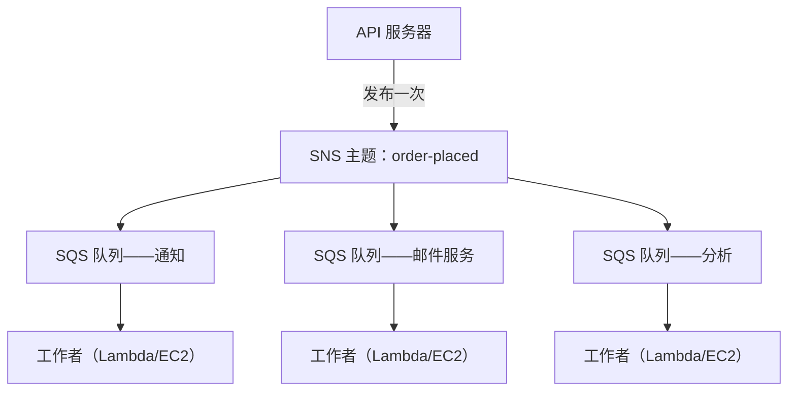

# 第19章：取号机

取号机是一场悄无声息的革命。取一个号，等待叫号。排队变成了队列。人们可以坐下。服务台以自己的节奏工作。没有人阻塞任何人。

在取号机出现之前，你必须站着排队。你在队伍中的位置依赖于你人在现场。等待时你什么别的都做不了。而且如果队伍最前面的人很慢，后面的所有人都停滞了。

取号机把"到达"和"服务"分开了。你到达，取一个号，系统记住你的位置。你可以去坐下。服务台以它能应付的任何节奏处理号码。如果柜台暂时关闭，新来的人仍然能取到号。他们等待。工作没有消失——它在排队。

这个小发明是人类系统中最古老的解耦例子之一。到本章结束时，Nimbus 将建成它自己的取号机——用软件——而它之所以需要一台，要从一个周五晚上的十六分钟宕机说起。

---

团队挺过了那次 AZ 故障。Leo 修好了混沌工程流程，运维手册也很扎实。流量恢复了，并且重新开始增长——实际上比以前更快。Leo 深夜在读的 Aurora 文档，仍然领先于 Nimbus 实际所处的位置好几个章节。

但随着流量增长和更多餐厅入驻，一种不同类型的瓶颈开始显现。不在基础设施里。在应用程序代码本身。那条在每小时200单时运转良好的请求链，在800单时开始显出吃力。

然后，14号那个晚上来了。

---

事情是从分析仪表板开始的。一个周五的下午6点47分，一次对分析服务的部署引入了一个超时 bug。该服务的响应时间从平时的200毫秒变成了8秒。

订单流程是同步的。每个订单都要等分析服务完成才向顾客确认。随着负载增加，8秒变成了12秒。API 的连接池开始被等待分析步骤完成的请求填满。

下午6点53分，连接池达到上限。新请求开始立即失败——不是因为订单无法处理，而是因为没有可用的连接来开始处理它。

"分析服务拖垮了订单流程，"第二天早上 Leo 看着日志说。"它们俩八竿子打不着。分析服务只是计算仪表板而已。"

"但它们在同一条请求链里，"Priya 说。

"十六分钟的宕机，"Maya 说。"还有三个顾客被重复扣款。"

重复扣款比宕机更糟。在连接池饱和的混乱中，重试机制对一些实际上已经成功的请求触发了——支付步骤完成了，然后请求在返回之前超时，重试又把支付执行了一遍。同一张卡，同一个金额，两次扣款。

"重试机制本来是来帮忙的，"Leo 说。

"它往错误的方向帮了忙，"Priya 说。"而且我们有没有想过，当我们试图给那些顾客退款时会发生什么？退款流程用的是同一条已经出过故障的订单流程。"

十六分钟的宕机和三次重复扣款。这就是同步请求链的业务代价。

---

Nimbus 有一个在订单火爆之前感觉不到是问题的问题。

每次下单时，API 服务器必须：

1. 把订单保存到数据库
2. 向餐厅的平板发送通知
3. 向顾客发送确认邮件
4. 更新餐厅的分析仪表板
5. 记录事件用于计费

在一个繁忙的熟食柜台，收银台的人不会等切肉的人切完才去接待下一位顾客。他们接下订单，递给厨房，然后开始服务下一个人。厨房按自己的节奏处理订单。顾客得到更快的服务。厨房不会被突然的高峰压垮。如果厨房有慢的时候，订单会堆积在柜台后面，而不是在收银台引发错误。

这就是那个类比。Nimbus 没有柜台和厨房之分。它是一个人按顺序做完所有事，顾客才能离开。

而在14号那天，切肉的人出了问题。于是柜台停了。于是后面的每个顾客都在等。厨房、收银台、顾客——全都因为链条中的一个环节变慢而暂停了。

解决办法不是让切肉变快。解决办法是把步骤分开。在收银台接单，递出一张票，让厨房去干活。

"我们是紧耦合的，"Priya 说。"任何一个下游步骤失败，整个订单就失败。我们有没有想过，如果分析服务被攻陷，开始消费畸形的消息会怎样？整个订单失败——因为我们在等它。"

"如果我们可以保存订单、立即向顾客确认，"Leo 说，"然后在后台处理其余的呢？"

"那就是一个队列，"Priya 说。

关键的洞察：顾客不需要知道分析仪表板在他们收到确认之前已经更新了。他们需要知道的是订单已被接收。这是两回事。同步链把它们混为一谈了。

**解耦模型**

这就是**解耦**：把接受工作的组件与处理工作的组件分开。

Nimbus 订单流程中的所有步骤都必须在 API 能够响应顾客之前同步完成。如果邮件服务很慢（有时确实如此），顾客就要等。如果分析仪表板宕机了（有时确实如此），订单就失败。

14号的级联故障恰好演示了这件事为什么重要。分析服务与顾客的订单是否被接受毫无关系。但因为它坐在同一条同步链里，它的失败成了所有人的失败。

在软件系统中，这个队列通常是一个消息代理（message broker）——一个从生产者接收消息并把它们投递给消费者的服务。

你可能会想：既然订单流程现在是异步的，顾客怎么知道自己的订单真的被接收了？答案在架构设计里：API 把订单保存到数据库（同步——这是权威的确认依据），然后把事件发布到队列。顾客的确认基于数据库写入成功，而不是基于下游服务完成。如果邮件服务很慢，顾客早就拿到了确认。邮件只是一个锦上添花的后续。

**Amazon SQS：队列**

**Amazon SQS（Simple Queue Service，简单队列服务）**是 AWS 的托管消息队列服务。它持久地存储消息，直到它们被消费者处理。

基本流程：

1. **生产者**（API 服务器）把一条消息放进队列：`{ "orderId": "ORD-5532", "restaurantId": "47", "items": [...] }`
2. API 立即响应顾客："订单已确认！"
3. **消费者**（独立的工作者服务）从队列读取消息并处理它们：发送餐厅通知、发送确认邮件、更新分析

顾客体验：即时确认。下游处理：异步进行，按工作者的节奏。

**SQS 关键概念**

**消息可见性超时**：当消费者从 SQS 读取一条消息时，该消息会在一段时间内（默认：30秒）对其他消费者变为*不可见*。这给了消费者处理它的时间。如果消费者成功完成，它删除该消息。如果消费者崩溃，可见性超时到期，消息重新变得可见，由另一个消费者重试。

这确保了至少一次（at-least-once）投递：每条消息至少会被处理一次，即使某个消费者在处理中途失败。

你可能会想：消息在被处理时不可见，但如果消费者崩溃了消息没被删除，它会不会被处理两次？会的——这就叫至少一次投递。它意味着每个消费者都必须被设计成能够多次收到同一条消息而不引发问题。一封重复的订单确认邮件让人烦。一笔重复的扣款则是一张客服工单。请据此设计你的消费者。

可见性超时必须长于你预期的最长处理时间。如果处理通常需要20秒、偶尔需要90秒，而你的可见性超时是30秒，那么那次偶尔的90秒处理在 SQS 看来就像一次失败。消息重新变得可见。第二个消费者把它捡了起来。现在两个工作者在处理同一条消息。如果你的处理不是幂等的，你就有麻烦了。

一个常见错误：把可见性超时设成平均处理时间。正确做法：设成第99百分位处理时间，再加安全余量。如果 P99 处理时间是45秒，把可见性超时设为90秒。

**死信队列（DLQ）**：如果一条消息处理失败太多次（可配置——例如5次重试），SQS 会把它移到死信队列。你检查 DLQ 来理解消息为什么在失败，而不会丢失它们。

DLQ 是你了解生产环境里到底什么在失败的地方。没有它，失败的消息就直接消失了，你没有任何办法去调查。

SQS 迁移三周后，Leo 注意到通知服务的 DLQ 里积累了23条消息。他一直没有去看 DLQ（他正确地设置了它，然后就假定它会一直保持为空）。

他取出一条消息，查看负载：

```json
{
  "orderId": "ORD-9821",
  "restaurantId": "12",
  "customerMessage": "Extra spicy please 🌶️🔥",
  "timestamp": "2024-01-18T19:43:11Z"
}
```

表情符号。餐厅通知服务在向餐厅的老式平板 API 发送之前，把消息负载按 Latin-1 编码。表情符号字符——在 UTF-8 中每个占四个字节——被损坏了，导致平板 API 拒绝该请求。消息会重试、再失败、再重试、再失败。5次重试之后，SQS 把它移进了 DLQ。

"全部23条消息的顾客备注字段里都有表情符号，"Leo 说。

"所以每个在订单备注里加了表情符号的顾客，他们的备注都无声地没能送到餐厅，"Maya 说。

"是的。"

"持续了多久？"

Leo 查了最老一条消息的时间戳。"三周。"

Priya 沉默了。"那如果有人发现，在订单备注里加个表情符号就会造成一次无声的失败呢？你可以带着表情符号下单，保证餐厅永远看不到那条说明。然后投诉送错了餐。"

没有人利用过这个漏洞。但这是该问的问题。

Leo 修复了编码 bug。然后他写了一个脚本，把 DLQ 里全部23条搁浅的消息重放了一遍。餐厅们收到了他们（三周前的）加辣表情符号说明。顾客们从来不知道。

教训：DLQ 必须被主动监控，而不是设置完就遗忘。一个不断增长的 DLQ 是某个东西在反复失败的无声信号。

**队列类型**：

**标准队列**：最大吞吐量（每秒消息数无限制）。投递顺序是尽力而为（不保证）。至少一次投递（极少数情况下，一条消息可能被投递两次）。

**FIFO 队列**：严格的先进先出排序。恰好一次**处理**——在5分钟窗口内基于 `MessageDeduplicationId` 去重。排序保证以*每个* `MessageGroupId` 为单位：同一组内的消息按顺序到达；不同的组可以并行处理，这正是 FIFO 实现扩展的方式。基准吞吐量为批处理下每秒3,000条消息（不批处理为300条）；启用**高吞吐模式**后，通过在消息组之间分区，可以提升到每秒数万条。在顺序很重要时使用 FIFO（金融交易、顺序的状态变更）。

如果你需要最大吞吐量并能容忍偶尔的重复消息，用 SQS 标准队列——但你必须把每个消费者都设计成能处理重复而不引发问题。如果你需要严格排序和恰好一次处理，用 SQS FIFO——并且要好好设计你的 `MessageGroupId`，因为并行度（以及吞吐量）来自拥有许多组。

对 Nimbus 而言，大多数队列用的是标准队列。计费队列使用 FIFO，以确保扣费按顺序处理。

**队列深度自动扩展：让工作者数量匹配积压**

SQS 最强大的应用之一，是把队列深度用作 Auto Scaling 的触发器。你不再基于 CPU 或内存扩缩容，而是基于有多少工作在等待。

对 Nimbus 的通知服务而言：SQS 队列深度（等待处理的消息数量）被接到了运行通知工作者的 ECS 服务的 Application Auto Scaling 策略上。

策略：当队列中每个工作者任务对应的消息超过50条时，增加一个任务。当队列中每个工作者任务对应的消息少于10条时，减少一个任务。

实际效果：当周五晚高峰涌入1,200个订单时，通知队列深度飙升，工作者集群在3分钟内从2个任务扩展到了8个任务。到午夜，队列清空，集群回到了2个。

"那每个月要花多少钱？"Tom 看着 Auto Scaling 的图表问。

"Auto Scaling 本身不额外收费，"Leo 说。"但周五晚上3个小时多跑6个 ECS 任务——这是有分量的。"

Tom 算了算。"那些高峰大约每月14美元。而以前，我们是按全价持续跑着8个任务？"

"是的。"

"所以我们在需要时为突发付费，其他时候什么都不付。"

这就是队列深度扩展模式：队列成为吸收流量峰值的缓冲区，工作者集群通过扩展来排空缓冲区。用户感受不到变慢——订单被接受时他们就立即拿到了确认。工作者只是要多花一点时间追上进度。而且因为你不再7x24小时按峰值容量运行，成本显著降低。

**Amazon SNS：广播者**

**Amazon SNS（Simple Notification Service，简单通知服务）**是一种发布/订阅（pub/sub）消息服务。与一个生产者对一个消费者（队列）不同，SNS 支持一条消息同时投递给*许多*订阅者。

模型：

1. 一个**发布者**向一个 SNS **主题（topic）**发送消息
2. 该主题的所有**订阅者**同时收到消息（扇出，fan-out）

订阅者可以是：

- SQS 队列（把消息推入队列做异步处理）
- Lambda 函数（直接触发函数）
- HTTP/HTTPS 端点（webhook 投递）
- 电子邮件地址
- SMS（手机号码）

对 Nimbus 而言，订单下达事件被发布到一个名为 `order-events` 的 SNS 主题：

- 餐厅通知服务订阅（在自己的 SQS 队列上接收）
- 邮件服务订阅（在自己的 SQS 队列上接收）
- 分析服务订阅（在自己的 SQS 队列上接收）
- 计费服务订阅（在自己的 FIFO SQS 队列上接收）

一个订单事件。四个订阅者。全部同时收到通知。各自按自己的节奏处理。

"所以 SNS 是广播通告，"Maya 说，"SQS 是每个团队按自己速度处理通告的收件箱。那为什么两个都要用？为什么不让所有人直接订阅 SNS 主题？"

"因为 SNS 的直接投递是发完就忘的，"Leo 说。"如果 SNS 触发时分析服务宕机了，那条消息就没了。在中间放一个 SQS 队列，消息会一直等到服务恢复。"

"正是，"Priya 说。"SNS/SQS 扇出是标准模式。"

**SNS/SQS 扇出模式**

这种组合——一个 SNS 主题供给多个 SQS 队列——是 AWS 中最重要的架构模式之一：



每个队列都是独立的。分析服务可以很慢——它的队列堆积，但通知和邮件服务继续运行，不受影响。如果分析服务宕机，它的消息就在队列里等着，直到它恢复。什么都不会丢失。

这就是关键特性：**独立失败**。一个消费者的问题不会传播到其他消费者。

**消息过滤：不是每条消息都要发给每个订阅者**

随着系统增长，你不会希望每个订阅者都处理每条消息。如果一个分析服务只关心已完成的订单，它就不应该收到关于支付处理失败的消息。

**SNS 消息过滤**允许订阅者指定过滤策略——只投递匹配特定属性的消息。

餐厅通知服务带着过滤条件订阅：只要 `status = "confirmed"` 的消息。

错误告警服务带着过滤条件订阅：只要 `status = "failed"` 的消息。

每个订阅者只得到它需要的东西。

没有过滤的话，每个订阅者都会收到每条消息，并且必须自己忽略不相关的。这浪费处理资源、浪费钱（SQS 按消息收费），还引入噪音。一个没有过滤的高流量订单系统会用成功的订单淹没错误告警队列——让真正的失败难以被发现。

过滤策略长这样：

```json
{
  "status": ["confirmed"],
  "region": ["us-west-2", "us-east-1"]
}
```

这个订阅者只接收 status 为"confirmed"**且** region 为"us-west-2"或"us-east-1"之一的消息。不匹配策略的消息根本不会被投递到这个订阅者的队列——它们甚至到不了 SQS。

"所以过滤发生在 SNS 层，"Priya 说，"在消息被写入 SQS 之前？"

"正确。餐厅通知服务的 SQS 队列只会见到它需要处理的消息。"

"那如果有人试图通过向 SNS 主题发布一条专门构造的、能匹配所有订阅者过滤条件的消息来搞破坏呢？"Priya 问。

SNS 主题有一个 IAM 资源策略：只有订单 API 服务（通过它的 IAM 角色）被允许发布。SNS 访问策略和 SQS 队列策略构成了访问控制层——过滤只用于路由，不是安全机制。

**何时用 SQS、何时用 SNS**

**只用 SQS**：一个生产者，一个消费者（或同一队列上多个竞争的消费者）。消息需要被处理一次，按顺序（FIFO）或不按顺序（标准）。工作者队列模式——一个队列，多个工作者从中消费。

**只用 SNS**：发完就忘的通知。推送到邮件、SMS 或 HTTP 端点。不需要给消息排队——通知一下，然后继续。

**SNS + SQS（扇出）**：一个事件，多个独立的消费者。每个消费者拥有自己的队列、独立处理、可以独立失败。

## SNS FIFO 主题

上面关于 SNS 的一切用的都是标准主题——它们的吞吐量实际上没有上限，几乎同时投递给各订阅者，对绝大多数使用场景来说足够了。

但标准 SNS 主题不保证顺序。如果你按顺序发布十条消息，订阅者收到的顺序可能略有不同。对 Nimbus 的订单通知来说没有关系——分析更新比确认邮件早到零点几秒无所谓。

但在某些场景下，这很要紧。考虑一个金融分类账：如果两个事件——先一笔贷记、后一笔借记——以相反的顺序投递，那么即使两个事件最终都被正确处理，处理过程中的余额计算也会是错的。

**SNS FIFO 主题**把与 SQS FIFO 队列相同的原则应用到扇出模型上。消息按它们被发布的精确顺序投递给订阅者，且每条消息恰好投递一次。

权衡是：SNS FIFO 主题的基准吞吐量与 SQS FIFO 类似（每个主题每秒3,000条消息；每个消息组每秒300条——2025年起提供高吞吐模式，可以高出许多），并且它只能向 **SQS 队列**扇出——FIFO 队列，或自2023年起的标准队列。订阅一个标准队列对不在乎顺序的消费者（例如一条分析数据流）很有用，但排序和恰好一次**只有**进入 FIFO 队列时才能端到端地保持。你不能用 SNS FIFO 主题投递到 HTTP 端点或电子邮件地址。

对 Nimbus 的计费管道而言——一系列定价更新必须按顺序应用到餐厅账户——计费 SNS 主题从标准迁移到了 FIFO。SQS 计费队列本来就是 FIFO。这个扇出现在能保证：一个涨价事件永远不会先于它所依赖的计费周期开始事件到达计费处理器。

> **考试技巧——SNS FIFO**
>
> 如果场景要求跨多个订阅者的**有序扇出投递**，答案是 **SNS FIFO**。标准 SNS 不保证顺序。SNS FIFO 只能向 SQS 队列扇出——要让排序和恰好一次端到端保持，订阅者必须是 SQS **FIFO** 队列（标准队列订阅是允许的，但会退化为尽力而为的排序和至少一次投递）。默认吞吐量为每个主题每秒3,000条——如果场景描述的是高得多的流量*并且*要求严格排序，那是一个提示，应该考虑替代架构（例如 Kinesis，后面的章节会讲）。

## 当遗留队列不肯松手时

Nimbus 即将完成它迄今为止最大的一笔收购：Barato，一个拥有200家餐厅、运营上领先两年的外卖竞争对手。工程团队安排了一次集成规划电话会。

通话进行了二十分钟，Leo 就沉默了。

"他们的订单处理系统，"他说。"跑在什么上面？"

"ActiveMQ，"电话那头的 Barato 工程师说。"本地部署的代理。应用是 Java 的。从2018年起一直在跑。所有东西都说 AMQP。"

"AMQP，"Leo 说。

"对。"

他看着屏幕上的架构图。Nimbus 跑的是 SQS 和 SNS。SQS 不说 AMQP。SNS 不说 AMQP。而 Barato 的应用程序只说这一种语言。

"重写它至少要六个月，"通话结束后 Leo 对团队说。"这是最低估计。"

"我们不能为此把收购推迟六个月，"Maya 说。

"我们也不能在 AWS 里跑一个裸金属的 ActiveMQ 代理，"Priya 补充道。"我们有没有想过从安全和可靠性的角度看那是什么样子？一个自管理的消息代理，坐在生产环境里，没有托管补丁、没有自动故障转移，还连着我们的基础设施？"

"有一个托管选项，"Leo 缓缓说道。他们说话的时候他一直在查资料。"Amazon MQ。"

**Amazon MQ：托管代理**

**Amazon MQ** 是面向 Apache ActiveMQ 和 RabbitMQ 的托管消息代理服务。它运行的是你现有的那种代理——你的应用程序多年来一直连接的同一种代理——但作为托管的 AWS 服务。AWS 负责底层基础设施：配置、补丁、故障转移、备份。

让 Amazon MQ 区别于 SQS 和 SNS 的关键特性：它说遗留消息代理所说的协议。AMQP、STOMP、MQTT、OpenWire、NMS。这些协议 SQS 和 SNS 根本听不懂。

对于 Barato 的集成，方案很直接。AWS 会运行一个配置为 ActiveMQ 的 Amazon MQ 代理。Barato 的 Java 应用程序会被指向新的代理端点，而不是本地的那个。应用侧的改动：用新的连接字符串更新一个配置文件。就这些。应用程序不需要知道自己在和一个托管的云端代理对话，而不是 Barato 办公室里的一台服务器。

"等一下，"Maya 说。"如果我们最终要把他们整合进 Nimbus，难道不应该从一开始就把他们迁到 SQS 上吗？"

"因为迁移路径是存在的，"Leo 说。"而且值得认真做——最终会做。但现在，我们需要 Barato 在三十天内、而不是六个月内在 AWS 基础设施上运转起来。Amazon MQ 能让应用程序跑起来而不改动应用程序。然后我们就有时间把 SQS 迁移当作一个从容规划的项目，而不是收购的一项手忙脚乱的前置条件。"

"那每个月要花多少钱？"Tom 问。

那个 Amazon MQ 代理——为了可靠性配置成一个主/备对——对于适合 Barato 流量的代理来说，在每月200美元的量级。和六个月重写时间的成本相比，这没什么可争的。

Priya 批准了这个方案，附带一个条件：Amazon MQ 实例要放在私有子网里，安全组规则只允许来自 Barato 应用服务器的连接。不暴露到公网。启用审计日志。

迁移用了十二天。第十三天，Barato 的应用程序连上了 Amazon MQ。第十四天，它在 AWS 基础设施上处理了第一个订单，没有改动一行代码。

---

> **考试技巧——Amazon MQ**
>
> *SAA-C03 领域：设计弹性架构（领域2）*
>
> 考试用单一一条轴线区分 Amazon MQ 与 SQS 和 SNS：**协议兼容性**。如果场景描述一个已经在用某个消息代理、说某种特定协议的应用程序，答案几乎肯定是 Amazon MQ。
>
> 关键信号：**"ActiveMQ"、"RabbitMQ"、"AMQP"、"STOMP"、"MQTT"、"OpenWire"**，或任何等同于**"无需更改应用程序代码"**的措辞。看到这些短语，答案就是 Amazon MQ——不是 SQS，也不是 SNS。
>
> 如果场景描述的是需要解耦的*新*应用程序，或者没有提到遗留代理或特定协议，就用 SQS/SNS。
>
> 还有一个信号："将现有的本地消息代理迁移到 AWS"。如果应用需要继续用同样的协议和同一类代理对话，Amazon MQ 就是直接搬迁（lift-and-shift）的答案。

## 优势与局限性

**为什么 SQS 和 SNS 强大**：

- SQS 提供持久、可靠的消息投递——消息存储在多个 AZ 中
- 解耦使生产者服务和消费者服务可以独立扩展和独立部署
- 死信队列确保没有消息在失败时无声丢失
- SNS 扇出模式允许在不改动生产者的情况下添加新的消费者

**事情变得复杂的地方**：

- 至少一次投递意味着消费者必须是*幂等的*——把同一条消息处理两次不应该引发问题（重复订单、重复扣款）
- FIFO 队列更贵，并有吞吐量限制
- 跨多个队列和服务调试失败的消息需要良好的日志和可观测性
- 消息排序的保证是有限的——如果跨多个服务的严格排序很重要，设计会变得复杂

**幂等性：一次实战深潜**

幂等性听起来很抽象——直到你有三个顾客被重复扣款。

如果一个操作运行多次产生的结果与运行一次相同，它就是**幂等的**。扣款操作天然不是幂等的：执行两次就扣两次。一个幂等的扣款操作会在尝试扣款之前，先检查这笔扣款是否已经处理过。

模式是这样的：每条消息携带一个唯一 ID（订单 ID，或一个单独的消息 ID）。处理之前，消费者查询一个存储（DynamoDB 很适合干这个），看这个消息 ID 是否已经被成功处理过。如果是：什么也不做，删除消息。如果不是：处理、记录该 ID、删除消息。

```python
def process_charge(message):
    order_id = message['orderId']
    
    # 幂等性检查
    if already_processed(order_id):
        logger.info(f"Order {order_id} already charged, skipping duplicate")
        return  # 消息将从队列中删除
    
    # 执行扣款
    charge_result = payment_service.charge(
        amount=message['amount'],
        card_token=message['cardToken'],
        idempotency_key=order_id  # 同时传递给支付处理器
    )
    
    # 记录我们已经处理过这一条
    mark_as_processed(order_id, charge_result)
```

幂等键也应该传递给支持它的下游服务（支付处理器、邮件系统）。例如 Stripe 接受一个 `Idempotency-Key` 头，即使同一个 API 调用被发起两次，也能防止重复扣款。

"那关联 ID 呢？"Priya 问。"当一条消息穿过多个服务时，我们怎么追踪是哪个请求引发了哪个下游动作？"

**关联 ID：跨服务追踪**

当顾客下单时，请求会流经：API → SNS → SQS → 通知工作者 → 餐厅平板 API → SQS → 邮件工作者 → SES。

如果没有关联 ID，当餐厅平板 API 在第6步返回错误时，每个服务的日志都记录了事件，但没有任何办法把它从头追溯到具体哪个顾客的订单。

**关联 ID（correlation ID）**是附加在原始请求上、并在每次服务交互中传递下去的唯一标识符。每个服务都把关联 ID 写进自己的日志。

当 Priya 在 CloudWatch 里搜索某个特定的关联 ID 时，她能得到属于那一个订单处理过程的、跨所有服务的每一行日志。

"有一个注意事项，"Priya 说。"关联 ID 是从外部进来的。有人能不能注入一个恶意 ID 来扰乱我们的日志？"

关联 ID 是内部使用的——它们不影响处理逻辑，只影响日志。对它们做清洗（仅字母数字、固定长度）可以防止日志输出中的注入攻击。

**什么时候解耦是错误的选择**

"等等——但我们*为什么*不把所有东西都解耦呢？"Maya 问。

这是个合理的问题。如果解耦能防止级联故障、让系统更有韧性，为什么不处处使用它？

因为解耦有代价。而且存在那些代价超过收益的场景。

**当你需要即时一致性时**：如果一笔支付必须先确认订单才能继续——并且用户正盯着屏幕等结果——你就不能把支付放进异步队列，在还不知道扣款是否成功之前就返回一个确认。第一笔扣款完成之前，用户可能已经下了第二单。对于响应依赖于结果的操作，异步解耦行不通。

**当工作流本质上是顺序的时**：如果第3步必须看到第2步的结果才能做决策，它们就不能从队列里并行运行。硬把它们塞进队列会造出一个别扭的结果传递机制，最后往往比同步版本更复杂。

**当消息排序至关重要且流量很低时**：SQS 标准队列不保证顺序。SQS FIFO 保证，但默认批处理下封顶在每秒3,000条消息（高吞吐模式能大幅提升）。如果你有一个低流量、严格有序的工作流，一个简单的同步队列（比如数据库行锁）可能更简单也更可靠。

**当开销超过收益时**：一个只有一个用户、没有 SLA 的小型内部工具，多半不需要扇出的 SNS 主题和 DLQ。监控队列和 DLQ 的运维开销是真实存在的。让架构的规模匹配问题的规模。

问题不是"我应该解耦这个吗？"而是"这种耦合的代价是什么，解耦减少的代价是否多于它增加的代价？"

## 摘要

解耦是第18章的韧性原则应用到内部架构上：正如 Multi-AZ 消除基础设施中的单点故障一样，SQS 和 SNS 消除请求链中的单点故障。

- **解耦**把产生工作的组件与处理工作的组件分开。
- **SQS** 在消费者缓慢、离线或正在扩容时，给生产者一个持久的地方存放工作。
- **SNS** 让一个事件抵达多个独立的消费者，而发布者无需知道他们是谁。
- **SNS + SQS 扇出**让每个下游服务按自己的节奏处理同一个事件。
- **DLQ、幂等性和关联 ID** 是让异步系统可调试、而不是神秘莫测的运维纪律。
- **不要盲目解耦**：同步工作流、即时一致性要求和低风险小工具，可能不值得增加运维面。

## 考试技巧

*SAA-C03 领域：设计弹性架构（领域2，任务2.1）*

- **SQS 标准 vs FIFO**：考试按排序和投递保证区分。"必须按顺序处理" → FIFO。"最大吞吐量" → 标准。
- **队列深度自动扩展**："基于队列深度扩展工作者" → 把 SQS 指标（ApproximateNumberOfMessagesVisible）与 Application Auto Scaling 或 ECS 服务自动扩展配合使用。
- **可见性超时**：至少一次投递的关键概念。如果消费者失败，消息在超时后重新可见。考试场景："消息被处理了两次" → 可见性超时太短（消费者处理所需时间超过了超时）。
- **死信队列**：N 次重试失败后的消息被移到这里。考试场景："确保没有消息丢失，即使处理反复失败" → DLQ。
- **SNS 扇出**：一个事件触发多个消费者的经典考试模式。"下单通知必须同时触发邮件、短信和库存更新" → 带 SQS 订阅的 SNS 主题。
- **SQS + Lambda**：Lambda 可以配置为轮询一个 SQS 队列，并对每个消息批次触发。考试把这用于大规模的事件驱动处理。
- **SQS 长轮询**：消费者不再每隔几秒轮询一次（短轮询，浪费 API 调用），长轮询会为一条消息等待最多20秒。降低成本和虚假的空响应。
- **SQS 扩展客户端库**：对于超过队列负载上限的消息（默认256KB；自2025年起可提升至1MB），使用 SQS Extended Client Library，它把消息正文存到 S3，通过 SQS 发送一个引用。考试仍然把256KB当作 SQS 的上限——"SQS 消息太大" → Extended Client Library + S3。
- **SNS 消息过滤**：订阅者只接收匹配其过滤策略的消息。考试场景："只把匹配特定条件的通知发送给某个订阅者" → SNS 消息过滤。
- **注意**：SNS/SQS 扇出也出现在领域3关于高吞吐异步处理架构的场景里。要为韧性和性能两类题目都掌握这个模式。
- **Amazon MQ 信号**："ActiveMQ"、"RabbitMQ"、"AMQP"、"STOMP"、"MQTT"、"OpenWire"，或"无需更改应用程序代码" → Amazon MQ，不是 SQS。如果场景说的是需要解耦的新应用程序 → SQS/SNS。
- **SNS FIFO vs 标准**：标准 SNS 不保证顺序。如果场景要求**有序扇出** → SNS FIFO 主题供给 SQS FIFO 队列。记住：SNS FIFO 不能投递到 HTTP 端点或邮件——只能投递到 SQS 队列（FIFO 用于排序/恰好一次；标准队列订阅可行，但会降级为尽力而为的排序和至少一次投递）。

## 练习

**练习 1——回忆**

解释 SNS/SQS 扇出模式。为什么这个模式使用 SQS 队列，而不是让各服务直接用 HTTP 端点订阅 SNS 主题？

*（提示：想想如果 SNS 发布消息时某个 HTTP 端点正好宕机会发生什么。）*

**练习 2——SAA-C03 场景题**

*场景*：一个电商平台每小时处理10,000个订单。当订单下达时，系统必须：（1）把订单存储到数据库，（2）扣减库存，（3）发送确认邮件，（4）更新分析仪表板。目前，所有四个步骤同步进行——如果分析服务很慢，顾客就要等。团队希望改善面向顾客的响应时间，同时确保不丢失任何订单。

哪种架构*最能*满足这个需求？

A) 使用 SQS FIFO 队列按顺序处理全部四个步骤  
B) 让 API 保存订单并立即向顾客确认；向一个 SNS 主题发布事件；让库存、邮件和分析服务通过 SQS 队列订阅  
C) 使用并行的 EC2 实例同时、同步地处理每个步骤  
D) 使用带请求验证的 API Gateway 来加速订单处理

**提示 1**：顾客的确认应该是即时的。哪些步骤必须在响应之前发生，哪些可以在之后发生？

**提示 2**：分析服务很慢不应该影响邮件或库存服务。

**提示 3**：SNS 扇出允许全部三个下游服务同时接收事件。

**答案**：B

**解析**：API 把订单保存到数据库（同步——必须在确认之前完成），并立即返回确认。然后它向一个 SNS 主题发布 `order-placed` 事件。库存、邮件和分析服务各自通过独立的 SQS 队列订阅。它们按自己的节奏处理——如果分析很慢，它的队列会增长，但其他服务不受影响。如果任何服务失败，它的消息保留在 SQS 队列中并被重试；达到配置的失败重试次数后，它们被移到 DLQ。

**为什么不是 A？** FIFO 队列按顺序处理消息——这对同步变慢的问题没有帮助。而且顺序处理意味着分析慢仍然会阻塞邮件。

**为什么不是 C？** "并行的 EC2 实例同步处理"仍然要求所有步骤完成后才能响应顾客。增加实例解决不了同步耦合。

**为什么不是 D？** API Gateway 能加速 API 路由和验证，但不解耦下游的处理步骤。

*SAA-C03 领域：设计弹性架构——任务2.1*

**练习 3——架构挑战** *（可选）*

Nimbus 正在为餐厅合作伙伴构建一个通知系统。当顾客下单时，餐厅需要通过以下渠道收到通知：

- 他们的平板应用（推送通知）
- 一套厨房显示系统（向他们本地硬件发送 HTTP webhook）
- 一条后备 SMS（如果平板通知失败）

平板通知服务是可靠的。厨房 webhook 有时会宕掉（餐厅打烊时会关掉硬件）。SMS 只应在平板通知失败时触发。

使用 SNS 和 SQS 设计这个架构。你会如何处理"只有平板失败才发 SMS"的需求？当厨房 webhook 离线时，你如何确保它不会阻塞平板通知？

再考虑一下：如果 webhook 的平均响应时间是2秒，但硬件慢的餐厅可能需要30秒，那么厨房 webhook 投递适合什么样的可见性超时？什么样的 DLQ 策略能在 webhook 重试耗尽后触发 SMS 后备？

*（没有唯一正确答案。目标是练习带条件路由的扇出设计。）*

## 彩蛋场景

新的订单流程上线了。

Leo 是在一个周二下午部署的，事先没有跑完整的负载测试。"不会有事的，"他当时对 Priya 说。"架构是扎实的。"

顾客们下了单。API 在95毫秒内响应。确认即刻出现在他们的手机上。

幕后：四个服务在异步处理。分析服务有一个 bug，会在菜品名称包含某些特殊字符的订单上崩溃。它的队列在两小时内积压到了3,200条消息。

顾客们从未察觉。

当 Leo 修复了 bug、分析服务重启后，它在18分钟内处理完了积压。没有数据丢失。DLQ 是空的。

他刷新了 CloudWatch 仪表板。队列深度：0。已处理消息：3,200。错误：0（修复之后）。

"这正是14号那天本该有的样子，"他说。"分析出了问题。队列把它吸收了。其他一切照常运转。"

"这就是解耦的意义，"Priya 说。

"那每个月要花多少钱？"Tom 问，他已经在定价页面上了。

"按我们目前的量，SQS 大约每月十二美元。"他盯着屏幕。"我以为会更多。"

他脸上是那种发现一个意外便宜的东西竟然还意外好用时的表情。

"把 DLQ 告警设置好，"Priya 提醒 Leo。"我们可不想再来三周的无声失败。"

"已经设好了，"Leo 说。

这一次他真的做了。

下一章：只在有人敲门时才运行的函数——没人敲门时一分钱也不花。
